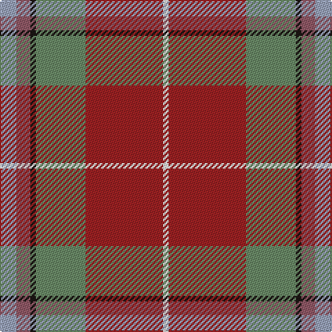

In pattern [WRGKRY](/patterns/wrgkry/).

This was sourced from register-of-tartans.  It is a [6 stripes tartan](/stripes/stripes6/).

Original link https://www.tartanregister.gov.uk/tartanDetails.aspx?ref=10243

## Thread count
N/12 LT10 K4 G36 DR56 W/4

## Palette
Each colour and its ΔE from the base-6 reference it is a variant of.

| Colour | Shade | Base | ΔE (OKLab) |
|---|---|---|---|
| DR | <code style="background-color:#9D2123;">#9D2123</code> `#9D2123` | R <code style="background-color:#CC0000;">#CC0000</code> | 0.09 |
| G | <code style="background-color:#6A8A67;">#6A8A67</code> `#6A8A67` | G <code style="background-color:#006100;">#006100</code> | 0.19 |
| K | <code style="background-color:#1C1714;">#1C1714</code> `#1C1714` | K <code style="background-color:#000000;">#000000</code> | 0.21 |
| LT | <code style="background-color:#905966;">#905966</code> `#905966` | R <code style="background-color:#CC0000;">#CC0000</code> | 0.15 |
| N | <code style="background-color:#99A3BA;">#99A3BA</code> `#99A3BA` | Y <code style="background-color:#F2BF00;">#F2BF00</code> | 0.23 |
| W | <code style="background-color:#F9F5EF;">#F9F5EF</code> `#F9F5EF` | W <code style="background-color:#F7F7F7;">#F7F7F7</code> | 0.01 |

# Sample pattern

## Nearest tartans

The nearest existing variants by ΔTartan distance.

1. [Pubcrawlers, The](/setts/s7/w3r4g2r22b5ra16y3x2~b1e1e1e-g1b3b1d-r846247-ra680d0d-wdfdfdf-ydfaf00/) — ΔT 1.01
1. [Barbour Dress](/setts/s7/r4b2r21ba11w2ra20rb3x2~b4c3428-ba141e46-rb07430-ra888888-rbc8002c-wf8f8f8/) — ΔT 1.16
1. [Dundhuin Ladies (Personal)](/setts/s6/b6ba5k2g18r28w2x2~b1474b4-ba780078-g006818-k101010-ra00048-we0e0e0/) — ΔT 1.18
1. [Battle of Bannockburn, The](/setts/s8/r1b1r9g6ba2bb3r2y1x4~b441800-ba5c8ca8-bb1474b4-g006818-rc80000-ybc8c00/) — ΔT 1.19
1. [Scottish American Soc. of Michigan](/setts/s6/r48b16y5g17w8ga3x2~b1474b4-g006818-ga604000-rc80000-we0e0e0-ybc8c00/) — ΔT 1.24
1. [Windy Meadows](/setts/s6/g11b2r4y1ra2ba2x4~b5f749c-ba1e2025-g5d321f-ra32d18-ra905966-yf8e38c/) — ΔT 1.24
1. [Battle of Bannockburn, The](/setts/s8/r1g1r9ga6y2b3r2ya1x4~b248192-g413f28-ga5d7f40-rf00c4c-y62b0be-yad3a916/) — ΔT 1.26
1. [Duminiak (Trevose, Pennsylvania)](/setts/s6/g47w6r24w3b5y3x2~b433a5a-g6a5e47-rb62531-we5e0d2-ye0a126/) — ΔT 1.26
1. [Spragg (Name)](/setts/s7/r2g16ra1r2ra12y1b1x2~b5c8ca8-g048888-r901c38-rac80000-ye8c000/) — ΔT 1.27
1. [Un-named Dutch](/setts/s7/b2r10b10ra3r2y24w2x2~b5c5c5c-r880000-ra888888-wf8f8f8-ya0a0a0/) — ΔT 1.29

## Neighbour map

Every grey dot is one of 15726 variants placed by the first two principal components of the ΔTartan feature space (44% of its variance). Red is this tartan; blue dots are its nearest — click one to open its page.

<svg viewBox="0 0 640 380" role="img" style="max-width:100%;height:auto;border:1px solid #e0e0e0;border-radius:4px;display:block" xmlns="http://www.w3.org/2000/svg"><image href="/nn/cloud.v1.png" width="640" height="380"/><a href="/setts/s7/w3r4g2r22b5ra16y3x2~b1e1e1e-g1b3b1d-r846247-ra680d0d-wdfdfdf-ydfaf00/"><circle cx="237.0" cy="161.8" r="4" fill="#3465a4"><title>Pubcrawlers, The</title></circle></a><a href="/setts/s7/r4b2r21ba11w2ra20rb3x2~b4c3428-ba141e46-rb07430-ra888888-rbc8002c-wf8f8f8/"><circle cx="188.4" cy="163.7" r="4" fill="#3465a4"><title>Barbour Dress</title></circle></a><a href="/setts/s6/b6ba5k2g18r28w2x2~b1474b4-ba780078-g006818-k101010-ra00048-we0e0e0/"><circle cx="238.8" cy="155.7" r="4" fill="#3465a4"><title>Dundhuin Ladies (Personal)</title></circle></a><a href="/setts/s8/r1b1r9g6ba2bb3r2y1x4~b441800-ba5c8ca8-bb1474b4-g006818-rc80000-ybc8c00/"><circle cx="222.3" cy="163.6" r="4" fill="#3465a4"><title>Battle of Bannockburn, The</title></circle></a><a href="/setts/s6/r48b16y5g17w8ga3x2~b1474b4-g006818-ga604000-rc80000-we0e0e0-ybc8c00/"><circle cx="243.1" cy="140.7" r="4" fill="#3465a4"><title>Scottish American Soc. of Michigan</title></circle></a><a href="/setts/s6/g11b2r4y1ra2ba2x4~b5f749c-ba1e2025-g5d321f-ra32d18-ra905966-yf8e38c/"><circle cx="276.7" cy="182.8" r="4" fill="#3465a4"><title>Windy Meadows</title></circle></a><a href="/setts/s8/r1g1r9ga6y2b3r2ya1x4~b248192-g413f28-ga5d7f40-rf00c4c-y62b0be-yad3a916/"><circle cx="224.5" cy="157.4" r="4" fill="#3465a4"><title>Battle of Bannockburn, The</title></circle></a><a href="/setts/s6/g47w6r24w3b5y3x2~b433a5a-g6a5e47-rb62531-we5e0d2-ye0a126/"><circle cx="335.1" cy="164.4" r="4" fill="#3465a4"><title>Duminiak (Trevose, Pennsylvania)</title></circle></a><a href="/setts/s7/r2g16ra1r2ra12y1b1x2~b5c8ca8-g048888-r901c38-rac80000-ye8c000/"><circle cx="298.3" cy="149.9" r="4" fill="#3465a4"><title>Spragg (Name)</title></circle></a><a href="/setts/s7/b2r10b10ra3r2y24w2x2~b5c5c5c-r880000-ra888888-wf8f8f8-ya0a0a0/"><circle cx="250.2" cy="166.9" r="4" fill="#3465a4"><title>Un-named Dutch</title></circle></a><circle cx="257.5" cy="159.2" r="5" fill="#c00000"/></svg>

ID: /setts/s6/y6r5k2g18ra28w2x2~g6a8a67-k1c1714-r905966-ra9d2123-wf9f5ef-y99a3ba/
