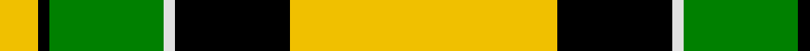

In pattern [YKGWKY](/patterns/ykgwky/).

This was sourced from weddslist.  It is a [6 stripes tartan](/stripes/stripes6/).

Original link http://www.weddslist.com/cgi-bin/tartans/pg.pl?source=sts

## Thread count
Y/10 K3 G30 LN3 K30 Y/70

## Palette
Each colour and its ΔE from the base-6 reference it is a variant of.

| Colour | Shade | Base | ΔE (OKLab) |
|---|---|---|---|
| G | <code style="background-color:#008000;">#008000</code> `#008000` | G <code style="background-color:#006100;">#006100</code> | 0.10 |
| K | <code style="background-color:#000000;">#000000</code> `#000000` | K <code style="background-color:#000000;">#000000</code> | 0.00 |
| LN | <code style="background-color:#E0E0E0;">#E0E0E0</code> `#E0E0E0` | W <code style="background-color:#F7F7F7;">#F7F7F7</code> | 0.07 |
| Y | <code style="background-color:#F0C000;">#F0C000</code> `#F0C000` | Y <code style="background-color:#F2BF00;">#F2BF00</code> | 0.00 |

# Sample pattern

## Nearest tartans

The nearest existing variants by ΔTartan distance.

1. [Jacobite #2](/setts/s6/y70k30w3g30k3y10~g005020-k101010-we0e0e0-ye8c000/) — ΔT 0.40
1. [Brandon Manitoba Trade Tartan Tartan Number: 1884. Earliest known date: pre 1997 From Dalgleish as Hamilton of Brandon. There is a similarity to Cape Breton. And to Paton's Jacobite. See products available Copyright © Blair Urquhart, Comrie, 2015](/setts/s6/y83k35w3g35k3y10~g006818-k101010-we0e0e0-ye8c000/) — ΔT 1.20
1. [Pollock](/setts/s7/g3r16w4k6g28r1g3~g008000-k000000-rc00000-we0e0e0~x2/) — ΔT 1.32
1. [Billy Apple® Yellow](/setts/s4/g1k8y13r1~g006818-k101010-rdc0000-yffe600~x6/) — ΔT 1.40
1. [MacDuck, Final version](/setts/s6/k4r5k2y21g8k2~g008000-k000000-rc00000-yf0c000~x2/) — ΔT 1.46
1. [Billy Apple - Yellow](/setts/s4/g1k8y13r1~g006818-k101010-rc80000-yfccc00~x6/) — ΔT 1.48
1. [MacDuck (Corporate)](/setts/s6/k4r5k2y21g8k2~g006818-k101010-rc80000-ye8c000~x2/) — ΔT 1.54
1. [Brandon, Manitoba](/setts/s6/g83k35w3ga35k3y10~g908000-ga008000-k000000-we0e0e0-yf0c000/) — ΔT 1.64
1. [Livingstone Wedding Dress](/setts/s11/g26r5k1r2k1r5g16r5w16g2w8~g008000-k000000-rc00000-we0e0e0~x2/) — ΔT 1.78
1. [MacMillan, Society of Glasgow](/setts/s9/r16k3r16g44k3g8k3y20k4~g008000-k000000-rc00000-yf0c000~x2/) — ΔT 1.81

## Neighbour map

Every grey dot is one of 15726 variants placed by the first two principal components of the ΔTartan feature space (44% of its variance). Red is this tartan; blue dots are its nearest — click one to open its page.

<svg viewBox="0 0 640 380" role="img" style="max-width:100%;height:auto;border:1px solid #e0e0e0;border-radius:4px;display:block" xmlns="http://www.w3.org/2000/svg"><image href="/nn/cloud.v1.png" width="640" height="380"/><a href="/setts/s6/y70k30w3g30k3y10~g005020-k101010-we0e0e0-ye8c000/"><circle cx="286.5" cy="151.5" r="4" fill="#3465a4"><title>Jacobite #2</title></circle></a><a href="/setts/s6/y83k35w3g35k3y10~g006818-k101010-we0e0e0-ye8c000/"><circle cx="240.8" cy="125.0" r="4" fill="#3465a4"><title>Brandon Manitoba Trade Tartan Tartan Number: 1884. Earliest known date: pre 1997 From Dalgleish as Hamilton of Brandon. There is a similarity to Cape Breton. And to Paton's Jacobite. See products available Copyright © Blair Urquhart, Comrie, 2015</title></circle></a><a href="/setts/s7/g3r16w4k6g28r1g3~g008000-k000000-rc00000-we0e0e0~x2/"><circle cx="320.4" cy="145.0" r="4" fill="#3465a4"><title>Pollock</title></circle></a><a href="/setts/s4/g1k8y13r1~g006818-k101010-rdc0000-yffe600~x6/"><circle cx="282.1" cy="190.8" r="4" fill="#3465a4"><title>Billy Apple® Yellow</title></circle></a><a href="/setts/s6/k4r5k2y21g8k2~g008000-k000000-rc00000-yf0c000~x2/"><circle cx="216.7" cy="174.1" r="4" fill="#3465a4"><title>MacDuck, Final version</title></circle></a><a href="/setts/s4/g1k8y13r1~g006818-k101010-rc80000-yfccc00~x6/"><circle cx="288.9" cy="192.1" r="4" fill="#3465a4"><title>Billy Apple - Yellow</title></circle></a><a href="/setts/s6/k4r5k2y21g8k2~g006818-k101010-rc80000-ye8c000~x2/"><circle cx="226.5" cy="177.1" r="4" fill="#3465a4"><title>MacDuck (Corporate)</title></circle></a><a href="/setts/s6/g83k35w3ga35k3y10~g908000-ga008000-k000000-we0e0e0-yf0c000/"><circle cx="247.5" cy="135.9" r="4" fill="#3465a4"><title>Brandon, Manitoba</title></circle></a><a href="/setts/s11/g26r5k1r2k1r5g16r5w16g2w8~g008000-k000000-rc00000-we0e0e0~x2/"><circle cx="268.5" cy="125.4" r="4" fill="#3465a4"><title>Livingstone Wedding Dress</title></circle></a><a href="/setts/s9/r16k3r16g44k3g8k3y20k4~g008000-k000000-rc00000-yf0c000~x2/"><circle cx="213.4" cy="152.2" r="4" fill="#3465a4"><title>MacMillan, Society of Glasgow</title></circle></a><circle cx="278.2" cy="149.0" r="5" fill="#c00000"/></svg>

ID: /setts/s6/y70k30w3g30k3y10~g008000-k000000-we0e0e0-yf0c000/
