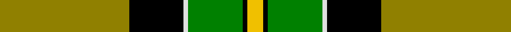
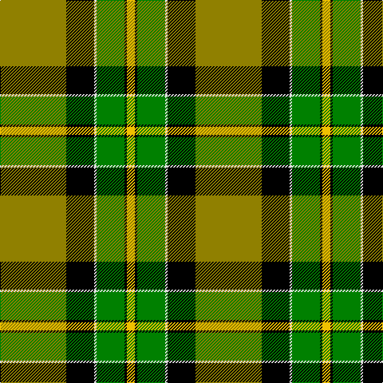

This page is one **sett** — a single exact thread-count. It belongs to the [tartan](/tartans/y83k35w3g35k3ly10/)
(the same proportion at any scale), whose colour order is pattern [GKWGKY](/stripes/gkwgky/).

Sourced from weddslist.  It is a [6 stripe tartan](/stripes/stripes6/).

Original link http://www.weddslist.com/cgi-bin/tartans/pg.pl?source=sts

## Thread count
LG/83 K35 LN3 G35 K3 Y/10

## Palette

Palette: <strong>Tartan Register</strong> <small style="color:#888">(2 of 5 colours)</small>
<table><thead><tr><th>Colour</th><th>Threads</th><th>Shade</th><th>Base</th><th>OKLCh</th></tr></thead><tbody><tr><td>LG/</td><td style="text-align:right;font-variant-numeric:tabular-nums">83</td><td><code style="background-color:#908000;">#908000</code> <small style="color:#888">#908000</small></td><td>G <code style="background-color:#006100;">#006100</code></td><td><small style="color:#888">oklch(59.6% 0.124 100.6)</small></td></tr><tr><td>K</td><td style="text-align:right;font-variant-numeric:tabular-nums">35</td><td><code style="background-color:#000000;">#000000</code> <small style="color:#888">#000000</small></td><td>K <code style="background-color:#000000;">#000000</code></td><td><small style="color:#888">oklch(0.0% 0.000 0.0)</small></td></tr><tr><td>LN</td><td style="text-align:right;font-variant-numeric:tabular-nums">3</td><td><code style="background-color:#E0E0E0;">#E0E0E0</code> <small style="color:#888">#E0E0E0</small></td><td>W <code style="background-color:#F7F7F7;">#F7F7F7</code></td><td><small style="color:#888">oklch(90.7% 0.000 89.9)</small></td></tr><tr><td>G</td><td style="text-align:right;font-variant-numeric:tabular-nums">35</td><td><code style="background-color:#008000;">#008000</code> <small style="color:#888">#008000</small></td><td>G <code style="background-color:#006100;">#006100</code></td><td><small style="color:#888">oklch(52.0% 0.177 142.5)</small></td></tr><tr><td>K</td><td style="text-align:right;font-variant-numeric:tabular-nums">3</td><td><code style="background-color:#000000;">#000000</code> <small style="color:#888">#000000</small></td><td>K <code style="background-color:#000000;">#000000</code></td><td><small style="color:#888">oklch(0.0% 0.000 0.0)</small></td></tr><tr><td>Y/</td><td style="text-align:right;font-variant-numeric:tabular-nums">10</td><td><code style="background-color:#F0C000;">#F0C000</code> <small style="color:#888">#F0C000</small></td><td>Y <code style="background-color:#F2BF00;">#F2BF00</code></td><td><small style="color:#888">oklch(82.7% 0.169 90.5)</small></td></tr></tbody></table>

# Sample pattern

## Nearest tartans

The nearest existing variants by ΔTartan distance, with this tartan at the top so the swatches line up against it.

ΔTartan

Tartan

Sett

—

<a href="/ttd/edit/#slug=y83k35w3g35k3ly10">Brandon, Manitoba</a> <a class="nn-out" href="/setts/s6/y83k35w3g35k3ly10/" title="open its dictionary page">↗</a>

0.88

<a href="/ttd/edit/#slug=o84k35w3g35k3ly10">Brandon (Manitoba)</a> <a class="nn-out" href="/setts/s6/o84k35w3g35k3ly10/" title="open its dictionary page">↗</a>

0.90

<a href="/ttd/edit/#slug=o84k35lr3g35k3ly10">Brandon (Manitoba) (District)</a> <a class="nn-out" href="/setts/s6/o84k35lr3g35k3ly10/" title="open its dictionary page">↗</a>

1.21

<a href="/ttd/edit/#slug=ly83k35w3g35k3ly10">Brandon Manitoba Trade Tartan Tartan Number: 1884. Earliest known date: pre 1997 From Dalgleish as Hamilton of Brandon. There is a similarity to Cape Breton. And to Paton's Jacobite. See products available Copyright © Blair Urquhart, Comrie, 2015</a> <a class="nn-out" href="/setts/s6/ly83k35w3g35k3ly10/" title="open its dictionary page">↗</a>

1.30

<a href="/ttd/edit/#slug=g3r16w4k6g28r1g3~x2">Pollock</a> <a class="nn-out" href="/setts/s7/g3r16w4k6g28r1g3~x2/" title="open its dictionary page">↗</a>

1.40

<a href="/ttd/edit/#slug=lo16k7w1g7k1ly3~x4">Hamilton of Brandon (Fashion)</a> <a class="nn-out" href="/setts/s6/lo16k7w1g7k1ly3~x4/" title="open its dictionary page">↗</a>

1.49

<a href="/ttd/edit/#slug=ly4k1dg16k16r1w3~x2">MacLamroc</a> <a class="nn-out" href="/setts/s6/ly4k1dg16k16r1w3~x2/" title="open its dictionary page">↗</a>

1.49

<a href="/ttd/edit/#slug=g21w2g21k17dg12dp6k2w1~x2">Hibernian F. C. (2004) (C orporate)</a> <a class="nn-out" href="/setts/s8/g21w2g21k17dg12dp6k2w1~x2/" title="open its dictionary page">↗</a>

1.55

<a href="/ttd/edit/#slug=m5dg27o2g25ly7dg3m3~x2">Kilkenny</a> <a class="nn-out" href="/setts/s7/m5dg27o2g25ly7dg3m3~x2/" title="open its dictionary page">↗</a>

1.55

<a href="/ttd/edit/#slug=g25k8y10r1y3~x4">Herbage</a> <a class="nn-out" href="/setts/s5/g25k8y10r1y3~x4/" title="open its dictionary page">↗</a>

1.58

<a href="/ttd/edit/#slug=ly70k30w3dg30k3ly10">Jacobite #2</a> <a class="nn-out" href="/setts/s6/ly70k30w3dg30k3ly10/" title="open its dictionary page">↗</a>

## Neighbour map

Every grey dot is one of 14299 variants placed by the first two principal components of the ΔTartan feature space (44% of its variance). Red is this tartan; blue dots are its nearest — click one to open its page.

<svg viewBox="0 0 640 380" role="img" style="max-width:100%;height:auto;border:1px solid #e0e0e0;border-radius:4px;display:block" xmlns="http://www.w3.org/2000/svg"><image href="/nn/cloud.v1.png" width="640" height="380"/><a href="/setts/s6/o84k35w3g35k3ly10/"><circle cx="260.8" cy="131.6" r="4" fill="#3465a4"><title>Brandon (Manitoba)</title></circle></a><a href="/setts/s6/o84k35lr3g35k3ly10/"><circle cx="263.3" cy="133.1" r="4" fill="#3465a4"><title>Brandon (Manitoba) (District)</title></circle></a><a href="/setts/s6/ly83k35w3g35k3ly10/"><circle cx="242.6" cy="121.1" r="4" fill="#3465a4"><title>Brandon Manitoba Trade Tartan Tartan Number: 1884. Earliest known date: pre 1997 From Dalgleish as Hamilton of Brandon. There is a similarity to Cape Breton. And to Paton's Jacobite. See products available Copyright © Blair Urquhart, Comrie, 2015</title></circle></a><a href="/setts/s7/g3r16w4k6g28r1g3~x2/"><circle cx="322.3" cy="141.5" r="4" fill="#3465a4"><title>Pollock</title></circle></a><a href="/setts/s6/lo16k7w1g7k1ly3~x4/"><circle cx="216.0" cy="162.8" r="4" fill="#3465a4"><title>Hamilton of Brandon (Fashion)</title></circle></a><a href="/setts/s6/ly4k1dg16k16r1w3~x2/"><circle cx="212.8" cy="162.7" r="4" fill="#3465a4"><title>MacLamroc</title></circle></a><a href="/setts/s8/g21w2g21k17dg12dp6k2w1~x2/"><circle cx="236.0" cy="160.2" r="4" fill="#3465a4"><title>Hibernian F. C. (2004) (C orporate)</title></circle></a><a href="/setts/s7/m5dg27o2g25ly7dg3m3~x2/"><circle cx="202.7" cy="165.0" r="4" fill="#3465a4"><title>Kilkenny</title></circle></a><a href="/setts/s5/g25k8y10r1y3~x4/"><circle cx="301.9" cy="181.5" r="4" fill="#3465a4"><title>Herbage</title></circle></a><a href="/setts/s6/ly70k30w3dg30k3ly10/"><circle cx="288.1" cy="145.6" r="4" fill="#3465a4"><title>Jacobite #2</title></circle></a><circle cx="249.9" cy="133.5" r="5" fill="#c00000"/></svg>

ID: /setts/s6/y83k35w3g35k3ly10/
