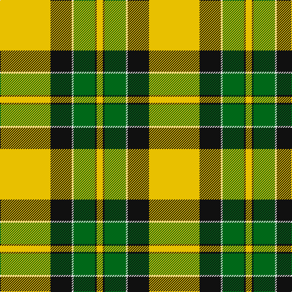

In pattern [YKGWKY](/patterns/ykgwky/).

This was sourced from house-of-tartan.  It is a [6 stripes tartan](/stripes/stripes6/).

Original link http://www.house-of-tartan.scotland.net/house/TartanViewjs.asp?colr=Def&tnam=1884

## Thread count
Y/83 K35 LN3 G35 K3 Ya/10

## Palette
Each colour and its ΔE from the base-6 reference it is a variant of.

| Colour | Shade | Base | ΔE (OKLab) |
|---|---|---|---|
| G | <code style="background-color:#006818;">#006818</code> `#006818` | G <code style="background-color:#006400;">#006400</code> | 0.02 |
| K | <code style="background-color:#101010;">#101010</code> `#101010` | K <code style="background-color:#000000;">#000000</code> | 0.17 |
| LN | <code style="background-color:#E0E0E0;">#E0E0E0</code> `#E0E0E0` | W <code style="background-color:#F4F4F0;">#F4F4F0</code> | 0.06 |
| Y | <code style="background-color:#E8C000;">#E8C000</code> `#E8C000` | Y <code style="background-color:#E8C000;">#E8C000</code> | 0.00 |
| Ya | <code style="background-color:#E8C000;">#E8C000</code> `#E8C000` | Y <code style="background-color:#E8C000;">#E8C000</code> | 0.00 |

# Sample pattern

## Nearest tartans

The nearest existing variants by ΔTartan distance.

1. [Jacobite #2](/setts/s6/y70k30w3g30k3y10-g005020-k101010-we0e0e0-ye8c000/) — ΔT 1.14
1. [Jacobite](/setts/s6/y70k30w3g30k3y10-g008000-k000000-we0e0e0-yf0c000/) — ΔT 1.20
1. [Brandon, Manitoba](/setts/s6/g83k35w3ga35k3y10-g908000-ga008000-k000000-we0e0e0-yf0c000/) — ΔT 1.20
1. [Fraser Yellow Tartan Tartan Number: 1709. Earliest known date: pre 2003 Similar to Vestiarium Scoticum See products available Copyright © Blair Urquhart, Comrie, 2015](/setts/s7/r4w4y54g28y4b28y4-b2c2c80-g006818-rc80000-we0e0e0-ye8c000/) — ΔT 1.40
1. [Fraser, Yellow](/setts/s7/r4w4y54g28y4b28y4-b304080-g008000-rc00000-we0e0e0-yf0c000/) — ΔT 1.41
1. [Fraser Yellow](/setts/s7/r4w4y54g28y4b28y4-b2c4084-g005020-rdc0000-we0e0e0-ye8c000/) — ΔT 1.42
1. [Red Rum Commemorative Tartan Tartan Number: 1217. Earliest known date: 1982 Red Remony See products available Copyright © Blair Urquhart, Comrie, 2015](/setts/s7/k4y60g8w4g28r26y4-g006818-k101010-r880000-we0e0e0-ye8c000/) — ΔT 1.53
1. [Manitoba](/setts/s8/b6g2b2g41ba6g2r21y6-b3c82af-ba002814-g309c18-rdc0000-ye8c000/) — ΔT 1.58
1. [Fiander, Julian (Personal)](/setts/s9/r12g4w42y4k16y4g64w2k6-g006818-k101010-rc80000-wfcfcfc-ye8c000/) — ΔT 1.62
1. [Brandon (Manitoba)](/setts/s6/r84k35w3g35k3y10-g146400-k000000-ra06400-wffffff-ydcc000/) — ΔT 1.62

## Neighbour map

Every grey dot is one of 15726 variants placed by the first two principal components of the ΔTartan feature space (44% of its variance). Red is this tartan; blue dots are its nearest — click one to open its page.

<svg viewBox="0 0 640 380" role="img" style="max-width:100%;height:auto;border:1px solid #e0e0e0;border-radius:4px;display:block" xmlns="http://www.w3.org/2000/svg"><image href="/nn/cloud.v1.png" width="640" height="380"/><a href="/setts/s6/y70k30w3g30k3y10-g005020-k101010-we0e0e0-ye8c000/"><circle cx="287.1" cy="148.2" r="4" fill="#3465a4"><title>Jacobite #2</title></circle></a><a href="/setts/s6/y70k30w3g30k3y10-g008000-k000000-we0e0e0-yf0c000/"><circle cx="278.9" cy="145.5" r="4" fill="#3465a4"><title>Jacobite</title></circle></a><a href="/setts/s6/g83k35w3ga35k3y10-g908000-ga008000-k000000-we0e0e0-yf0c000/"><circle cx="246.9" cy="133.9" r="4" fill="#3465a4"><title>Brandon, Manitoba</title></circle></a><a href="/setts/s7/r4w4y54g28y4b28y4-b2c2c80-g006818-rc80000-we0e0e0-ye8c000/"><circle cx="220.9" cy="143.1" r="4" fill="#3465a4"><title>Fraser Yellow Tartan Tartan Number: 1709. Earliest known date: pre 2003 Similar to Vestiarium Scoticum See products available Copyright © Blair Urquhart, Comrie, 2015</title></circle></a><a href="/setts/s7/r4w4y54g28y4b28y4-b304080-g008000-rc00000-we0e0e0-yf0c000/"><circle cx="226.9" cy="144.7" r="4" fill="#3465a4"><title>Fraser, Yellow</title></circle></a><a href="/setts/s7/r4w4y54g28y4b28y4-b2c4084-g005020-rdc0000-we0e0e0-ye8c000/"><circle cx="222.0" cy="143.6" r="4" fill="#3465a4"><title>Fraser Yellow</title></circle></a><a href="/setts/s7/k4y60g8w4g28r26y4-g006818-k101010-r880000-we0e0e0-ye8c000/"><circle cx="192.6" cy="123.4" r="4" fill="#3465a4"><title>Red Rum Commemorative Tartan Tartan Number: 1217. Earliest known date: 1982 Red Remony See products available Copyright © Blair Urquhart, Comrie, 2015</title></circle></a><a href="/setts/s8/b6g2b2g41ba6g2r21y6-b3c82af-ba002814-g309c18-rdc0000-ye8c000/"><circle cx="286.3" cy="126.2" r="4" fill="#3465a4"><title>Manitoba</title></circle></a><a href="/setts/s9/r12g4w42y4k16y4g64w2k6-g006818-k101010-rc80000-wfcfcfc-ye8c000/"><circle cx="212.9" cy="87.6" r="4" fill="#3465a4"><title>Fiander, Julian (Personal)</title></circle></a><a href="/setts/s6/r84k35w3g35k3y10-g146400-k000000-ra06400-wffffff-ydcc000/"><circle cx="258.2" cy="132.3" r="4" fill="#3465a4"><title>Brandon (Manitoba)</title></circle></a><circle cx="240.4" cy="123.1" r="5" fill="#c00000"/></svg>

ID: /setts/s6/y83k35w3g35k3y10-g006818-k101010-we0e0e0-ye8c000/
