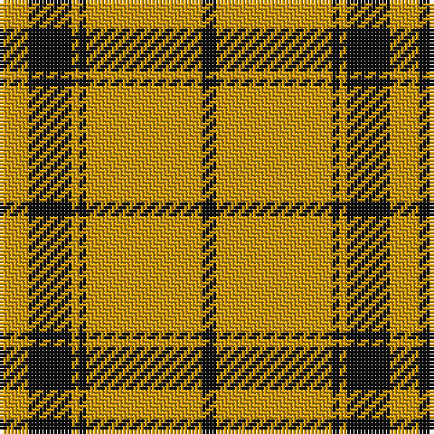

In pattern [KYKYKY](/patterns/kykyky/).

This was sourced from register-of-tartans.  It is a [6 stripes tartan](/stripes/stripes6/).

Original link https://www.tartanregister.gov.uk/tartanDetails.aspx?ref=2986

## Attestations

This cloth appears in 2 source records; the oldest owns this page.

- 01/01/2002 — Monoch Airline (register-of-tartans, [record](https://www.tartanregister.gov.uk/tartanDetails.aspx?ref=2986))
- pre 2002 — Monoch Airline (Corporate) (tartans-authority, [record](http://www.tartansauthority.com/tartan-ferret/display/4213/))

## Thread count
DY/8 K12 DY2 K2 DY32 K/4

## Palette
Each colour and its ΔE from the base-6 reference it is a variant of.

| Colour | Shade | Base | ΔE (OKLab) |
|---|---|---|---|
| DY | <code style="background-color:#D09800;">#D09800</code> `#D09800` | Y <code style="background-color:#E8C000;">#E8C000</code> | 0.11 |
| K | <code style="background-color:#101010;">#101010</code> `#101010` | K <code style="background-color:#000000;">#000000</code> | 0.17 |

# Sample pattern

## Nearest tartans

The nearest existing variants by ΔTartan distance.

1. [Yellow Pencil](/setts/s8/g96y18g12y18g24y8g4y32-g5b3a15-yf5b92f/) — ΔT 1.19
1. [Menzies Brown & White Trade Tartan Tartan Number: 1752. Earliest known date: 1984 Nothing See products available Copyright © Blair Urquhart, Comrie, 2015](/setts/s8/g62w10g4w10g8w6g4w14-g604000-we0e0e0/) — ΔT 1.33
1. [Coca Cola (Corporate)](/setts/s5/w15g15w15g80r6-g604000-rc80000-wd4e8f4/) — ΔT 1.40
1. [Coca Cola](/setts/s5/w14g14w14g80r6-g604000-rc80000-wd4e8f4/) — ΔT 1.42
1. [Loughheed (Personal)](/setts/s8/b12y12b16b8y72b4y8b8-b4c0000-ydc943c/) — ΔT 1.44
1. [Schranz-Gritte](/setts/s10/y6k4y8k10y48k10y8k4y6k4-k101010-yd87c00/) — ΔT 1.45
1. [Schranz-Gritte (Corporate)](/setts/s6/y48k10y8k4y6k4-k101010-yd87c00/) — ΔT 1.46
1. [Volkswagen Orange Trim](/setts/s6/g6y6k20y52k6y6-g289c18-k101010-yd87c00/) — ΔT 1.52
1. [Volkswagen Orange Trim (Fashion)](/setts/s6/y156k60y18g18y18k18-g289c18-k101010-yd87c00/) — ΔT 1.52
1. [Perry Ancient (Personal)](/setts/s5/y150k52k6y8k12-k101010-ye8c000/) — ΔT 1.52

## Neighbour map

Every grey dot is one of 15726 variants placed by the first two principal components of the ΔTartan feature space (44% of its variance). Red is this tartan; blue dots are its nearest — click one to open its page.

<svg viewBox="0 0 640 380" role="img" style="max-width:100%;height:auto;border:1px solid #e0e0e0;border-radius:4px;display:block" xmlns="http://www.w3.org/2000/svg"><image href="/nn/cloud.v1.png" width="640" height="380"/><a href="/setts/s8/g96y18g12y18g24y8g4y32-g5b3a15-yf5b92f/"><circle cx="439.4" cy="172.2" r="4" fill="#3465a4"><title>Yellow Pencil</title></circle></a><a href="/setts/s8/g62w10g4w10g8w6g4w14-g604000-we0e0e0/"><circle cx="430.0" cy="172.4" r="4" fill="#3465a4"><title>Menzies Brown &amp; White Trade Tartan Tartan Number: 1752. Earliest known date: 1984 Nothing See products available Copyright © Blair Urquhart, Comrie, 2015</title></circle></a><a href="/setts/s5/w15g15w15g80r6-g604000-rc80000-wd4e8f4/"><circle cx="446.9" cy="200.1" r="4" fill="#3465a4"><title>Coca Cola (Corporate)</title></circle></a><a href="/setts/s5/w14g14w14g80r6-g604000-rc80000-wd4e8f4/"><circle cx="457.0" cy="198.8" r="4" fill="#3465a4"><title>Coca Cola</title></circle></a><a href="/setts/s8/b12y12b16b8y72b4y8b8-b4c0000-ydc943c/"><circle cx="448.7" cy="165.8" r="4" fill="#3465a4"><title>Loughheed (Personal)</title></circle></a><a href="/setts/s10/y6k4y8k10y48k10y8k4y6k4-k101010-yd87c00/"><circle cx="448.9" cy="175.0" r="4" fill="#3465a4"><title>Schranz-Gritte</title></circle></a><a href="/setts/s6/y48k10y8k4y6k4-k101010-yd87c00/"><circle cx="516.1" cy="198.5" r="4" fill="#3465a4"><title>Schranz-Gritte (Corporate)</title></circle></a><a href="/setts/s6/g6y6k20y52k6y6-g289c18-k101010-yd87c00/"><circle cx="388.4" cy="198.8" r="4" fill="#3465a4"><title>Volkswagen Orange Trim</title></circle></a><a href="/setts/s6/y156k60y18g18y18k18-g289c18-k101010-yd87c00/"><circle cx="388.4" cy="198.8" r="4" fill="#3465a4"><title>Volkswagen Orange Trim (Fashion)</title></circle></a><a href="/setts/s5/y150k52k6y8k12-k101010-ye8c000/"><circle cx="430.3" cy="153.4" r="4" fill="#3465a4"><title>Perry Ancient (Personal)</title></circle></a><circle cx="448.7" cy="194.1" r="5" fill="#c00000"/></svg>

ID: /setts/s6/y8k12y2k2y32k4-k101010-yd09800/
