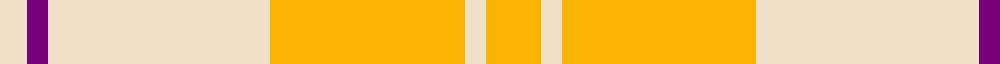
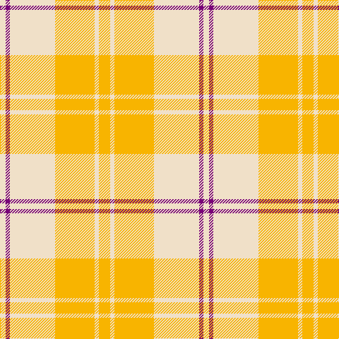

In pattern [WBWYWY](/patterns/wbwywy/).

This was sourced from tartans-authority.  It is a [6 stripes tartan](/stripes/stripes6/).

Original link http://www.tartansauthority.com/tartan-ferret/display/7605/

## Attestations

This cloth appears in 3 source records; the oldest owns this page.

- March 2008 — Ailsa, Gold (Dance) (tartans-authority, [record](http://www.tartansauthority.com/tartan-ferret/display/7605/))
- undated — Ailsa Gold (register-of-tartans, [record](https://www.tartanregister.gov.uk/tartanDetails.aspx?ref=5629))
- undated — Ailsa Gold Fashion Tartan Tartan Number: 7605. Earliest known date: March 2008 One of a series of dancer's tartans for the House of Edgar's in-house collection designed by Kirsty Anderson. See products available Copyright © Blair Urquhart, Comrie, 2015 (house-of-tartan, [record](http://www.house-of-tartan.scotland.net/house/TartanViewjs.asp?colr=Def&tnam=7605))

## Thread count
W/8 P6 W64 Y56 W6 Y/16

## Palette
Each colour and its ΔE from the base-6 reference it is a variant of.

| Colour | Shade | Base | ΔE (OKLab) |
|---|---|---|---|
| P | <code style="background-color:#780078;">#780078</code> `#780078` | B <code style="background-color:#2A418A;">#2A418A</code> | 0.17 |
| W | <code style="background-color:#F0E0C8;">#F0E0C8</code> `#F0E0C8` | W <code style="background-color:#F7F7F7;">#F7F7F7</code> | 0.07 |
| Y | <code style="background-color:#F8B400;">#F8B400</code> `#F8B400` | Y <code style="background-color:#F2BF00;">#F2BF00</code> | 0.03 |

# Sample pattern

## Nearest tartans

The nearest existing variants by ΔTartan distance.

1. [Ailsa Yellow Fashion Tartan Tartan Number: 7604. Earliest known date: March 2008 One of a series of dancer's tartans for the House of Edgar's in-house collection designed by Kirsty Anderson. See products available Copyright © Blair Urquhart, Comrie, 2015](/setts/s6/y8w3y28w32b3w4~b780078-wf0e0c8-yfce058~x2/) — ΔT 1.21
1. [Glufree](/setts/s8/y8r2y8g1r6y3g4y2~g649848-re87878-yf8e38c~x4/) — ΔT 2.10
1. [Cairngorm Trade Tartan Tartan Number: 1314. Earliest known date: 1985 A sample of this tartan was recorded by the Scottish Tartans Society during the period 1970 to 1990. See products available Copyright © Blair Urquhart, Comrie, 2015](/setts/s6/b2w2y7wa14b2w2~b5c5c5c-we0e0e0-wac0c0c0-ye8c000~x2/) — ΔT 2.17
1. [Cairngorm](/setts/s6/b2w2y7wa14b2w2~b505050-we0e0e0-wac0c0c0-yf0c000~x2/) — ΔT 2.34
1. [Ailsa, Pink (Dance)](/setts/s6/r8w3r28w32k3w4~k101010-re87878-wf0e0c8~x2/) — ΔT 2.42
1. [Maguire Clan Family Tartan Tartan Number: 6812. Earliest known date: 2005 The first Scottish Maguire as recorded with Lord Lyon. The design is based on MacQuarrie and was created by FE Maguire at the House of Tartan in Comrie, Perthshire. The tartan is intended for the use of all Scottish Maguires. See products available Copyright © Blair Urquhart, Comrie, 2015](/setts/s10/r29g2r2g2r6y21r6g2r2g2~g009468-re86000-ye8c000~x4/) — ΔT 2.50
1. [Prince of Orange](/setts/s4/b6y28r20b3~b5480b0-r806050-yff8500~x2/) — ΔT 2.55
1. [Llama (Fashion)](/setts/s10/g2w19y2w2g3w3g3y6ya25w2~g745000-wf0e0d0-yfc8070-yab8a880~x2/) — ΔT 2.57
1. [North American Sheep Breeders Association](/setts/s7/r2w1y17r14w15r2w2~r888888-wf8e8d8-ya08858~x2/) — ΔT 2.58
1. [Lochnagar Trade Tartan Tartan Number: 1771. Earliest known date: pre 2003 Colours represents the Scottish hills, the water, and the heather. See products available Copyright © Blair Urquhart, Comrie, 2015](/setts/s6/w1b1wa7r4wa1w1~b780078-r888888-we0e0e0-wac0c0c0~x4/) — ΔT 2.60

## Neighbour map

Every grey dot is one of 15726 variants placed by the first two principal components of the ΔTartan feature space (44% of its variance). Red is this tartan; blue dots are its nearest — click one to open its page.

<svg viewBox="0 0 640 380" role="img" style="max-width:100%;height:auto;border:1px solid #e0e0e0;border-radius:4px;display:block" xmlns="http://www.w3.org/2000/svg"><image href="/nn/cloud.v1.png" width="640" height="380"/><a href="/setts/s6/y8w3y28w32b3w4~b780078-wf0e0c8-yfce058~x2/"><circle cx="399.3" cy="231.6" r="4" fill="#3465a4"><title>Ailsa Yellow Fashion Tartan Tartan Number: 7604. Earliest known date: March 2008 One of a series of dancer's tartans for the House of Edgar's in-house collection designed by Kirsty Anderson. See products available Copyright © Blair Urquhart, Comrie, 2015</title></circle></a><a href="/setts/s8/y8r2y8g1r6y3g4y2~g649848-re87878-yf8e38c~x4/"><circle cx="348.6" cy="240.5" r="4" fill="#3465a4"><title>Glufree</title></circle></a><a href="/setts/s6/b2w2y7wa14b2w2~b5c5c5c-we0e0e0-wac0c0c0-ye8c000~x2/"><circle cx="276.2" cy="216.8" r="4" fill="#3465a4"><title>Cairngorm Trade Tartan Tartan Number: 1314. Earliest known date: 1985 A sample of this tartan was recorded by the Scottish Tartans Society during the period 1970 to 1990. See products available Copyright © Blair Urquhart, Comrie, 2015</title></circle></a><a href="/setts/s6/b2w2y7wa14b2w2~b505050-we0e0e0-wac0c0c0-yf0c000~x2/"><circle cx="262.2" cy="210.9" r="4" fill="#3465a4"><title>Cairngorm</title></circle></a><a href="/setts/s6/r8w3r28w32k3w4~k101010-re87878-wf0e0c8~x2/"><circle cx="341.2" cy="201.1" r="4" fill="#3465a4"><title>Ailsa, Pink (Dance)</title></circle></a><a href="/setts/s10/r29g2r2g2r6y21r6g2r2g2~g009468-re86000-ye8c000~x4/"><circle cx="446.3" cy="170.5" r="4" fill="#3465a4"><title>Maguire Clan Family Tartan Tartan Number: 6812. Earliest known date: 2005 The first Scottish Maguire as recorded with Lord Lyon. The design is based on MacQuarrie and was created by FE Maguire at the House of Tartan in Comrie, Perthshire. The tartan is intended for the use of all Scottish Maguires. See products available Copyright © Blair Urquhart, Comrie, 2015</title></circle></a><a href="/setts/s4/b6y28r20b3~b5480b0-r806050-yff8500~x2/"><circle cx="330.3" cy="258.8" r="4" fill="#3465a4"><title>Prince of Orange</title></circle></a><a href="/setts/s10/g2w19y2w2g3w3g3y6ya25w2~g745000-wf0e0d0-yfc8070-yab8a880~x2/"><circle cx="265.4" cy="151.3" r="4" fill="#3465a4"><title>Llama (Fashion)</title></circle></a><a href="/setts/s7/r2w1y17r14w15r2w2~r888888-wf8e8d8-ya08858~x2/"><circle cx="274.0" cy="196.9" r="4" fill="#3465a4"><title>North American Sheep Breeders Association</title></circle></a><a href="/setts/s6/w1b1wa7r4wa1w1~b780078-r888888-we0e0e0-wac0c0c0~x4/"><circle cx="317.9" cy="224.8" r="4" fill="#3465a4"><title>Lochnagar Trade Tartan Tartan Number: 1771. Earliest known date: pre 2003 Colours represents the Scottish hills, the water, and the heather. See products available Copyright © Blair Urquhart, Comrie, 2015</title></circle></a><circle cx="385.9" cy="222.5" r="5" fill="#c00000"/></svg>

ID: /setts/s6/y8w3y28w32b3w4~b780078-wf0e0c8-yf8b400~x2/
