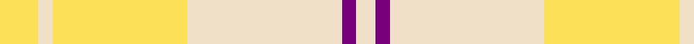

In pattern [WBWYWY](/patterns/wbwywy/).

This was sourced from house-of-tartan.  It is a [6 stripes tartan](/stripes/stripes6/).

Original link http://www.house-of-tartan.scotland.net/house/TartanViewjs.asp?colr=Def&tnam=7604

## Thread count
LY/16 W6 LY56 W64 P6 W/8

## Palette
Each colour and its ΔE from the base-6 reference it is a variant of.

| Colour | Shade | Base | ΔE (OKLab) |
|---|---|---|---|
| LY | <code style="background-color:#FCE058;">#FCE058</code> `#FCE058` | Y <code style="background-color:#F2BF00;">#F2BF00</code> | 0.08 |
| P | <code style="background-color:#780078;">#780078</code> `#780078` | B <code style="background-color:#2A418A;">#2A418A</code> | 0.17 |
| W | <code style="background-color:#F0E0C8;">#F0E0C8</code> `#F0E0C8` | W <code style="background-color:#F7F7F7;">#F7F7F7</code> | 0.07 |

# Sample pattern

## Nearest tartans

The nearest existing variants by ΔTartan distance.

1. [Ailsa, Gold (Dance)](/setts/s6/y8w3y28w32b3w4~b780078-wf0e0c8-yf8b400~x2/) — ΔT 1.21
1. [Cairngorm Trade Tartan Tartan Number: 1314. Earliest known date: 1985 A sample of this tartan was recorded by the Scottish Tartans Society during the period 1970 to 1990. See products available Copyright © Blair Urquhart, Comrie, 2015](/setts/s6/b2w2y7wa14b2w2~b5c5c5c-we0e0e0-wac0c0c0-ye8c000~x2/) — ΔT 2.56
1. [Masai Shuka 13 (Artefact)](/setts/s6/w25wa5r1wa1r1wa20~rc80000-w98c8e8-waf8e4e4~x4/) — ΔT 2.64
1. [Amazon](/setts/s8/w8wa30w60wa15y2wa2y2wa5~wfcfcfc-wac0c0c0-yd87c00~x2/) — ΔT 2.68
1. [Cairngorm](/setts/s6/b2w2y7wa14b2w2~b505050-we0e0e0-wac0c0c0-yf0c000~x2/) — ΔT 2.88
1. [Glufree](/setts/s8/y8r2y8g1r6y3g4y2~g649848-re87878-yf8e38c~x4/) — ΔT 2.89
1. [Lochnagar Trade Tartan Tartan Number: 1771. Earliest known date: pre 2003 Colours represents the Scottish hills, the water, and the heather. See products available Copyright © Blair Urquhart, Comrie, 2015](/setts/s6/w1b1wa7r4wa1w1~b780078-r888888-we0e0e0-wac0c0c0~x4/) — ΔT 2.91
1. [Desert in Bloom](/setts/s8/y3ya12y12w3ya2yb26y3ya1~wf8f8f8-yf88410-yae8c000-yba89448~x2/) — ΔT 2.97
1. [Poulter SG 105 (Fashion)](/setts/s13/y25ya8y8ya8y8ya46w46g8w46ya46y46ya8y8~g289c18-we0e0e0-y9cccb4-yaec8048/) — ΔT 3.00
1. [North American Sheep Breeders Association](/setts/s7/r2w1y17r14w15r2w2~r888888-wf8e8d8-ya08858~x2/) — ΔT 3.04

## Neighbour map

Every grey dot is one of 15726 variants placed by the first two principal components of the ΔTartan feature space (44% of its variance). Red is this tartan; blue dots are its nearest — click one to open its page.

<svg viewBox="0 0 640 380" role="img" style="max-width:100%;height:auto;border:1px solid #e0e0e0;border-radius:4px;display:block" xmlns="http://www.w3.org/2000/svg"><image href="/nn/cloud.v1.png" width="640" height="380"/><a href="/setts/s6/y8w3y28w32b3w4~b780078-wf0e0c8-yf8b400~x2/"><circle cx="385.9" cy="222.5" r="4" fill="#3465a4"><title>Ailsa, Gold (Dance)</title></circle></a><a href="/setts/s6/b2w2y7wa14b2w2~b5c5c5c-we0e0e0-wac0c0c0-ye8c000~x2/"><circle cx="276.2" cy="216.8" r="4" fill="#3465a4"><title>Cairngorm Trade Tartan Tartan Number: 1314. Earliest known date: 1985 A sample of this tartan was recorded by the Scottish Tartans Society during the period 1970 to 1990. See products available Copyright © Blair Urquhart, Comrie, 2015</title></circle></a><a href="/setts/s6/w25wa5r1wa1r1wa20~rc80000-w98c8e8-waf8e4e4~x4/"><circle cx="448.9" cy="197.2" r="4" fill="#3465a4"><title>Masai Shuka 13 (Artefact)</title></circle></a><a href="/setts/s8/w8wa30w60wa15y2wa2y2wa5~wfcfcfc-wac0c0c0-yd87c00~x2/"><circle cx="483.5" cy="170.1" r="4" fill="#3465a4"><title>Amazon</title></circle></a><a href="/setts/s6/b2w2y7wa14b2w2~b505050-we0e0e0-wac0c0c0-yf0c000~x2/"><circle cx="262.2" cy="210.9" r="4" fill="#3465a4"><title>Cairngorm</title></circle></a><a href="/setts/s8/y8r2y8g1r6y3g4y2~g649848-re87878-yf8e38c~x4/"><circle cx="348.6" cy="240.5" r="4" fill="#3465a4"><title>Glufree</title></circle></a><a href="/setts/s6/w1b1wa7r4wa1w1~b780078-r888888-we0e0e0-wac0c0c0~x4/"><circle cx="317.9" cy="224.8" r="4" fill="#3465a4"><title>Lochnagar Trade Tartan Tartan Number: 1771. Earliest known date: pre 2003 Colours represents the Scottish hills, the water, and the heather. See products available Copyright © Blair Urquhart, Comrie, 2015</title></circle></a><a href="/setts/s8/y3ya12y12w3ya2yb26y3ya1~wf8f8f8-yf88410-yae8c000-yba89448~x2/"><circle cx="377.5" cy="176.1" r="4" fill="#3465a4"><title>Desert in Bloom</title></circle></a><a href="/setts/s13/y25ya8y8ya8y8ya46w46g8w46ya46y46ya8y8~g289c18-we0e0e0-y9cccb4-yaec8048/"><circle cx="229.7" cy="211.8" r="4" fill="#3465a4"><title>Poulter SG 105 (Fashion)</title></circle></a><a href="/setts/s7/r2w1y17r14w15r2w2~r888888-wf8e8d8-ya08858~x2/"><circle cx="274.0" cy="196.9" r="4" fill="#3465a4"><title>North American Sheep Breeders Association</title></circle></a><circle cx="399.3" cy="231.6" r="5" fill="#c00000"/></svg>

ID: /setts/s6/y8w3y28w32b3w4~b780078-wf0e0c8-yfce058~x2/
