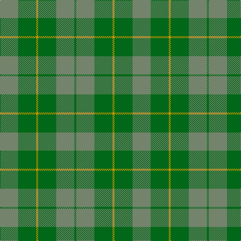

In pattern [GGGYGG](/stripes/gggygg/).

This was sourced from register-of-tartans.  It is a [6 stripe tartan](/stripes/stripes6/).

Original link https://www.tartanregister.gov.uk/tartanDetails.aspx?ref=3869

## Register references

External register numbers recorded for this tartan.

- Scottish Register of Tartans: [3869](https://www.tartanregister.gov.uk/tartanDetails.aspx?ref=3869)
- Scottish Tartans Authority (ITI): 5311

## Thread count
N/36 G36 DY4 G36 N36 G/4

## Palette
Each colour and its ΔE from the base-6 reference it is a variant of.

| Colour | Shade | Base | ΔE (OKLab) |
|---|---|---|---|
| DY | <code style="background-color:#D09800;">#D09800</code> `#D09800` | Y <code style="background-color:#F2BF00;">#F2BF00</code> | 0.12 |
| G | <code style="background-color:#006818;">#006818</code> `#006818` | G <code style="background-color:#006100;">#006100</code> | 0.02 |
| N | <code style="background-color:#74846C;">#74846C</code> `#74846C` | G <code style="background-color:#006100;">#006100</code> | 0.20 |

# Sample pattern

## Nearest tartans

The nearest existing variants by ΔTartan distance.

1. [Spring Morning (Fashion)](/setts/s4/g1y9g9lo1~x4/) — ΔT 1.22
1. [Confederate Artillery (Military)](/setts/s6/r2g12o3g8o14g2~x2/) — ΔT 1.58
1. [MacKinnon Hunting Clan Tartan Tartan Number: 917. Earliest known date: 1960 The modern hunting MacKinnon is based on the sett published in the Vestiarium Scoticum in 1842. The change is simply from red in the V.S. to brown in the modern version. The result was registered with Lord Lyon in 1960. See products available Copyright © Blair Urquhart, Comrie, 2015](/setts/s7/g1dy8g8r1g8dy8w1~x2/) — ΔT 1.76
1. [Harmony, 11](/setts/s6/o6g2o29g29o2g6~x2/) — ΔT 1.83
1. [Canadian Fancy](/setts/s6/g4o25g6t12g12t3~x2/) — ΔT 1.84
1. [MacKinnon, hunting](/setts/s7/g1o8g8r1g8o8w1~x4/) — ΔT 1.89
1. [Park (Estate Check)](/setts/s6/y4dg18dg6dg6dg24ly3~x2/) — ΔT 1.96
1. [MacKinnon Hunting #3](/setts/s12/dy8w1dy8g8r1g8dy8g1dy8g8r1g8~x8/) — ΔT 2.04
1. [Bright of Garth (Personal)](/setts/s5/g7y6n7y1n2~x6/) — ΔT 2.04
1. [MacKinnon Hunting](/setts/s7/dg1dy8dg8r1dg8dy8w1~x2/) — ΔT 2.04

## Neighbour map

Every grey dot is one of 14299 variants placed by the first two principal components of the ΔTartan feature space (44% of its variance). Red is this tartan; blue dots are its nearest — click one to open its page.

<svg viewBox="0 0 640 380" role="img" style="max-width:100%;height:auto;border:1px solid #e0e0e0;border-radius:4px;display:block" xmlns="http://www.w3.org/2000/svg"><image href="/nn/cloud.v1.png" width="640" height="380"/><a href="/setts/s4/g1y9g9lo1~x4/"><circle cx="413.6" cy="313.0" r="4" fill="#3465a4"><title>Spring Morning (Fashion)</title></circle></a><a href="/setts/s6/r2g12o3g8o14g2~x2/"><circle cx="385.1" cy="298.1" r="4" fill="#3465a4"><title>Confederate Artillery (Military)</title></circle></a><a href="/setts/s7/g1dy8g8r1g8dy8w1~x2/"><circle cx="353.1" cy="281.6" r="4" fill="#3465a4"><title>MacKinnon Hunting Clan Tartan Tartan Number: 917. Earliest known date: 1960 The modern hunting MacKinnon is based on the sett published in the Vestiarium Scoticum in 1842. The change is simply from red in the V.S. to brown in the modern version. The result was registered with Lord Lyon in 1960. See products available Copyright © Blair Urquhart, Comrie, 2015</title></circle></a><a href="/setts/s6/o6g2o29g29o2g6~x2/"><circle cx="480.9" cy="285.3" r="4" fill="#3465a4"><title>Harmony, 11</title></circle></a><a href="/setts/s6/g4o25g6t12g12t3~x2/"><circle cx="315.3" cy="294.4" r="4" fill="#3465a4"><title>Canadian Fancy</title></circle></a><a href="/setts/s7/g1o8g8r1g8o8w1~x4/"><circle cx="335.1" cy="268.0" r="4" fill="#3465a4"><title>MacKinnon, hunting</title></circle></a><a href="/setts/s6/y4dg18dg6dg6dg24ly3~x2/"><circle cx="377.3" cy="303.3" r="4" fill="#3465a4"><title>Park (Estate Check)</title></circle></a><a href="/setts/s12/dy8w1dy8g8r1g8dy8g1dy8g8r1g8~x8/"><circle cx="358.1" cy="283.9" r="4" fill="#3465a4"><title>MacKinnon Hunting #3</title></circle></a><a href="/setts/s5/g7y6n7y1n2~x6/"><circle cx="301.9" cy="334.8" r="4" fill="#3465a4"><title>Bright of Garth (Personal)</title></circle></a><a href="/setts/s7/dg1dy8dg8r1dg8dy8w1~x2/"><circle cx="371.2" cy="295.8" r="4" fill="#3465a4"><title>MacKinnon Hunting</title></circle></a><circle cx="402.3" cy="322.2" r="5" fill="#c00000"/></svg>

ID: /setts/s6/y9g9lo1g9y9g1~x4/
