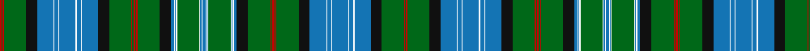

**Bands:** [RGRGKBWBWBWBWBKGRGRGRGKBWBWGWBWBWBWGWBWBKGRGRGRGKBWBWBWBWBKGRG](/stripes/rgrgkbwbwbwbwbkgrgrgrgkbwbwgwbwbwbwgwbwbkgrgrgrgkbwbwbwbwbkgrg/) · **Stripes:** [R G R G K B W B W B W B W B K G R G R G R G K B W B W G W B W B W B W G W B W B K G R G R G R G K B W B W B W B W B K G R G](/stripes/stripes62/) R G R G K B W B W B W B W B K G R G R G R G K B W B W G W B W B W B W G W B W B K G R G R G R G K B W B W B W B W B K G R G

This was sourced from register-of-tartans.  It is a [62 band tartan](/bands/bands62/).

Original link https://www.tartanregister.gov.uk/tartanDetails.aspx?ref=4309

## Register references

External register numbers recorded for this tartan.

- Scottish Register of Tartans: [4309](https://www.tartanregister.gov.uk/tartanDetails.aspx?ref=4309)
- Scottish Tartans Authority (ITI): 6351

## Thread count
R/4 Ga2 R2 Ga44 K22 B32 W2 B8 W2 B32 W2 B8 W2 B32 K22 Ga44 R2 Ga2 R4 Ga2 R2 Ga44 K22 B6 W2 B2 W2 Ga44 W2 B2 W2 B6 W2 B2 W2 Ga44 W2 B2 W2 B6 K22 Ga44 R2 Ga2 R4 Ga2 R2 Ga44 K22 B32 W2 B8 W2 B32 W2 B8 W2 B32 K22 Ga44 R2 Ga/2

## Palette
Each colour and its ΔE from the base-6 reference it is a variant of.

| Colour | Shade | Base | ΔE (OKLab) |
|---|---|---|---|
| B | <code style="background-color:#1474B4;">#1474B4</code> `#1474B4` | B <code style="background-color:#2A418A;">#2A418A</code> | 0.15 |
| G | <code style="background-color:#408060;">#408060</code> `#408060` | G <code style="background-color:#006100;">#006100</code> | 0.14 |
| Ga | <code style="background-color:#006818;">#006818</code> `#006818` | G <code style="background-color:#006100;">#006100</code> | 0.02 |
| K | <code style="background-color:#101010;">#101010</code> `#101010` | K <code style="background-color:#000000;">#000000</code> | 0.17 |
| R | <code style="background-color:#C80000;">#C80000</code> `#C80000` | R <code style="background-color:#CC0000;">#CC0000</code> | 0.01 |
| W | <code style="background-color:#FCFCFC;">#FCFCFC</code> `#FCFCFC` | W <code style="background-color:#F7F7F7;">#F7F7F7</code> | 0.01 |

## Nearest tartans

The nearest existing variants by ΔTartan distance.

1. [Peter Pan Corporate Tartan Tartan Number: 5505. Earliest known date: pre 1998 Designed by Lochcarron for the Great Ormond Street Hospital for Sick Children. J.M.Barrie donated all the rights to Peter Pan to the Hospital in 1929, confirmed in his will in 1937. The royalties go to the Hospital to support its work. Sample in STA Johnston Collection. Design registration cover renewed through Peter MacDonald in July/August 2002. See products available Copyright © Blair Urquhart, Comrie, 2015](/setts/s38/db22g2g2g2g2g2db6k3g14db1g4db1g2g2g2g2g1db1k1r2~x2/) — ΔT 1.51
1. [Unidentified (R.J.Forsyth)](/setts/s35/r2k6g2k2g14k1ly1r1k1r1k3b9k1ly2k1g11k1b2k1g11k1w2k1b9k1r1k1r1ly1k1g14k2g2k6r2~x2/) — ΔT 1.76
1. [Cockburn #4](/setts/s60/r5k2g30k2ly5k2db31k2w5k2db31k6g2k2g2k2g86k2g2k2g2k6db31k2w5k2db31k6g25k2r5/) — ΔT 1.76
1. [Ayre Personal Tartan Tartan Number: 6305. Earliest known date: 1819 This is Wilsons No. 038 (1819) and has been adopted by David Ayre of Kilmarnock as a private family tartan. See #805. See products available Copyright © Blair Urquhart, Comrie, 2015](/setts/s38/g82k2g2k2g2k8db28k2w6k2db28k2ly6k2g32k2r5k2g15w6/) — ΔT 1.84
1. [Duncan of Sketraw Clan Tartan Tartan Number: 6497. Earliest known date: 2005 January A modified version of an unidentified tartan No. 331 from the 1930s. This new version is for John Duncan of Sketraw, and is approved by the Clan Duncan Society See products available Copyright © Blair Urquhart, Comrie, 2015](/setts/s32/k6g2k2g14k1ly2k1b5r1b5k1w2k1g14k1b2k1g14k1w2k1b5r1b5k1ly2k1g14k2g2k6r2~x2/) — ΔT 1.86
1. [Stewart of Bute](/setts/s32/g34k2b2k2g34r3k34r2k34r3b33k2g2k2g2k2b33~x2/) — ΔT 1.93
1. [Lawson, Robin (Personal)](/setts/s52/dt1dg10dt4w1dt4dg10r1dt4t3lo1dt1lo1dt1lo1dt1lo1dt1lo1dt1lo1dt1lo1dt1lo1dt5r20w2dg3lo3dg3w2dg20dt4t4w2t4dt4dg10r3dg3lo2dg3r3dg10dt1t1dt1t7r2t7dt1t1~x2/) — ΔT 1.99
1. [Hislop Hunting (Personal)](/setts/s34/db3k2db1k2db3lo1g3k2g2k6g2k6g2k2g24r2g4r2g24k2g2k6g2k6g2k2g3lo1db3k2db1k2db3g2~x2/) — ΔT 2.02
1. [Stewart Hunting](/setts/s26/g37ly3g37k9db4k2db3k2db31g4db31k2db3k2db4k9g37r3g37db9g4db31g4db31g4db9/) — ΔT 2.03
1. [Hawick](/setts/s33/k2lo2k3w2k2g16r2g24r2g16k2w2k3lo2k4db4k4lo2k3w2k2db12r2db12g12r2g12k2w2k3lo2k4db2~x2/) — ΔT 2.04

## Neighbour map

Every grey dot is one of 14299 variants placed by the first two principal components of the ΔTartan feature space (44% of its variance). Red is this tartan; blue dots are its nearest — click one to open its page.

<svg viewBox="0 0 640 380" role="img" style="max-width:100%;height:auto;border:1px solid #e0e0e0;border-radius:4px;display:block" xmlns="http://www.w3.org/2000/svg"><image href="/nn/cloud.v1.png" width="640" height="380"/><a href="/setts/s38/db22g2g2g2g2g2db6k3g14db1g4db1g2g2g2g2g1db1k1r2~x2/"><circle cx="190.1" cy="56.6" r="4" fill="#3465a4"><title>Peter Pan Corporate Tartan Tartan Number: 5505. Earliest known date: pre 1998 Designed by Lochcarron for the Great Ormond Street Hospital for Sick Children. J.M.Barrie donated all the rights to Peter Pan to the Hospital in 1929, confirmed in his will in 1937. The royalties go to the Hospital to support its work. Sample in STA Johnston Collection. Design registration cover renewed through Peter MacDonald in July/August 2002. See products available Copyright © Blair Urquhart, Comrie, 2015</title></circle></a><a href="/setts/s35/r2k6g2k2g14k1ly1r1k1r1k3b9k1ly2k1g11k1b2k1g11k1w2k1b9k1r1k1r1ly1k1g14k2g2k6r2~x2/"><circle cx="187.1" cy="77.0" r="4" fill="#3465a4"><title>Unidentified (R.J.Forsyth)</title></circle></a><a href="/setts/s60/r5k2g30k2ly5k2db31k2w5k2db31k6g2k2g2k2g86k2g2k2g2k6db31k2w5k2db31k6g25k2r5/"><circle cx="263.5" cy="14.0" r="4" fill="#3465a4"><title>Cockburn #4</title></circle></a><a href="/setts/s38/g82k2g2k2g2k8db28k2w6k2db28k2ly6k2g32k2r5k2g15w6/"><circle cx="254.6" cy="16.2" r="4" fill="#3465a4"><title>Ayre Personal Tartan Tartan Number: 6305. Earliest known date: 1819 This is Wilsons No. 038 (1819) and has been adopted by David Ayre of Kilmarnock as a private family tartan. See #805. See products available Copyright © Blair Urquhart, Comrie, 2015</title></circle></a><a href="/setts/s32/k6g2k2g14k1ly2k1b5r1b5k1w2k1g14k1b2k1g14k1w2k1b5r1b5k1ly2k1g14k2g2k6r2~x2/"><circle cx="207.6" cy="85.2" r="4" fill="#3465a4"><title>Duncan of Sketraw Clan Tartan Tartan Number: 6497. Earliest known date: 2005 January A modified version of an unidentified tartan No. 331 from the 1930s. This new version is for John Duncan of Sketraw, and is approved by the Clan Duncan Society See products available Copyright © Blair Urquhart, Comrie, 2015</title></circle></a><a href="/setts/s32/g34k2b2k2g34r3k34r2k34r3b33k2g2k2g2k2b33~x2/"><circle cx="229.5" cy="107.9" r="4" fill="#3465a4"><title>Stewart of Bute</title></circle></a><a href="/setts/s52/dt1dg10dt4w1dt4dg10r1dt4t3lo1dt1lo1dt1lo1dt1lo1dt1lo1dt1lo1dt1lo1dt1lo1dt5r20w2dg3lo3dg3w2dg20dt4t4w2t4dt4dg10r3dg3lo2dg3r3dg10dt1t1dt1t7r2t7dt1t1~x2/"><circle cx="157.1" cy="40.2" r="4" fill="#3465a4"><title>Lawson, Robin (Personal)</title></circle></a><a href="/setts/s34/db3k2db1k2db3lo1g3k2g2k6g2k6g2k2g24r2g4r2g24k2g2k6g2k6g2k2g3lo1db3k2db1k2db3g2~x2/"><circle cx="321.2" cy="83.4" r="4" fill="#3465a4"><title>Hislop Hunting (Personal)</title></circle></a><a href="/setts/s26/g37ly3g37k9db4k2db3k2db31g4db31k2db3k2db4k9g37r3g37db9g4db31g4db31g4db9/"><circle cx="259.7" cy="112.0" r="4" fill="#3465a4"><title>Stewart Hunting</title></circle></a><a href="/setts/s33/k2lo2k3w2k2g16r2g24r2g16k2w2k3lo2k4db4k4lo2k3w2k2db12r2db12g12r2g12k2w2k3lo2k4db2~x2/"><circle cx="174.0" cy="86.4" r="4" fill="#3465a4"><title>Hawick</title></circle></a><circle cx="219.2" cy="54.4" r="5" fill="#c00000"/></svg>

ID: /setts/s62/b3w1b1w1g22w1b1w1b3k11g22r1g1r2g1r1g22k11b16w1b4w1b16w1b4w1b16k11g22r1g1r2~x2/
