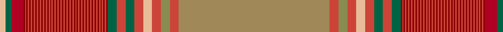

In pattern [YGRRRRRRRRRRRRRRRRRRRRRRRRRRRRRRRRRRRRRRRRRRRRRRRRRRRRRRRRRRGRGRYRGRY](/patterns/ygrrrrrrrrrrrrrrrrrrrrrrrrrrrrrrrrrrrrrrrrrrrrrrrrrrrrrrrrrrgrgryrgry/).

This was sourced from tartans-authority.  It is a [69 stripes tartan](/stripes/stripes69/).

Original link http://www.tartansauthority.com/tartan-ferret/display/8273/

## Thread count
LR/8 G8 Ra16 DR2 R2 DR2 R2 DR2 R2 DR2 R2 DR2 R2 DR2 R2 DR2 R2 DR2 R2 DR2 R2 DR2 R2 DR2 R2 DR2 R2 DR2 R2 DR2 R2 DR2 R2 DR2 R2 DR2 R2 DR2 R2 DR2 R2 DR2 R2 DR2 R2 DR2 R2 DR2 R2 DR2 R2 DR2 R2 DR2 R2 DR2 R2 DR2 R2 DR2 G12 R12 G12 R12 LR12 R12 LTa12 R12 LT/204

## Palette
Each colour and its ΔE from the base-6 reference it is a variant of.

| Colour | Shade | Base | ΔE (OKLab) |
|---|---|---|---|
| DR | <code style="background-color:#880000;">#880000</code> `#880000` | R <code style="background-color:#CC0000;">#CC0000</code> | 0.15 |
| G | <code style="background-color:#006444;">#006444</code> `#006444` | G <code style="background-color:#006100;">#006100</code> | 0.07 |
| LR | <code style="background-color:#E8BC98;">#E8BC98</code> `#E8BC98` | Y <code style="background-color:#F2BF00;">#F2BF00</code> | 0.11 |
| LT | <code style="background-color:#A08858;">#A08858</code> `#A08858` | Y <code style="background-color:#F2BF00;">#F2BF00</code> | 0.21 |
| LTa | <code style="background-color:#888C50;">#888C50</code> `#888C50` | G <code style="background-color:#006100;">#006100</code> | 0.21 |
| R | <code style="background-color:#CC4438;">#CC4438</code> `#CC4438` | R <code style="background-color:#CC0000;">#CC0000</code> | 0.06 |
| Ra | <code style="background-color:#B00024;">#B00024</code> `#B00024` | R <code style="background-color:#CC0000;">#CC0000</code> | 0.06 |

## Nearest tartans

The nearest existing variants by ΔTartan distance.

1. [Unidentified Cant #11](/setts/s48/b18g6b36g34r2g6r4g4r6g2r7w3r7g2r6g4r4g6r2g34ra10ga4ra8ga6ra99ga6ra8ga4ra10g34r2g6r4g4r6g2r7w3r7g2r6g4r4g6r2g34b36g6~b2888c4-g604000-ga289c18-rc80000-ra9c68a4-we0e0e0/) — ΔT 3.14
1. [New Brunswick](/setts/s44/b1y1b1g1ga2g2ga2g2ga2g1b1y1b1y1b1g28r24y1ra2y3b4r10gb16r4y2r15gb5r9g28b1y1b1y1b1g1ga2g2ga2g2ga2g1b1y1b1~b5c8ca8-g006818-ga289c18-gb604000-rc80000-ra888888-ye8c000~x2/) — ΔT 3.32
1. [Lehbrink No. 1 (Fashion)](/setts/s24/y8r68ra56ya1ra1ya1ra1ya1ra1ya1ra1ya1ra1ya1ra1ya1ra1ya1ra1ya1rb52b6rb14y8~b5c5c5c-rb07048-rab84c00-rba40000-ye8c000-yac4bc68~x2/) — ΔT 3.32
1. [MacFarhadian Canadian Personal Tartan Tartan Number: 6375. Earliest known date: 2003 During the design process, a version missing the white pivot was woven. A new piece was woven to replace the first but, in old Scots style, the original was put to good use. This tartan, therefore, has two versions extant. Designed to be woven with a 6 inch repeat and 2 thread stripes. Andre said, "I have designed a tartan around some of the major elements found in the tartans of her ancestors: Leitch; Munro; Wilson; Stuart.". See products available Copyright © Blair Urquhart, Comrie, 2015](/setts/s34/r55b1y1r3b7r3y1b1r3g16r3b1y1k3w1g5r3k2r3g5w1k3y1b1r3g16r3b1y1r3b7r3y1b1~b740074-g006818-k101010-rc80000-wececec-ye8c000~x2/) — ΔT 3.53
1. [New Brunswick, variation](/setts/s38/y2b2g1ga2g2ga2g2ga2g2b2y2b2g28r24y1gb2y3b4r10ra16r4y2r14ra5r10g28b2y2b2g1ga2g2ga2g2ga2g1b2y2~b5480b0-g008000-ga30a010-gb808080-rc00000-ra806050-yf0c000~x2/) — ΔT 3.65
1. [New Brunswick variation Canadian Tartan Tartan Number: 1880. Earliest known date: pre 2003 Sent in by Tweedmill for information. See products available Copyright © Blair Urquhart, Comrie, 2015](/setts/s38/y2b2g1ga2g2ga2g2ga2g2b2y2b2g28r24y1ra2y3b4r10gb16r4y2r14gb5r10g28b2y2b2g1ga2g2ga2g2ga2g1b2y2~b5c8ca8-g006818-ga289c18-gb604000-rc80000-ra888888-ye8c000~x2/) — ΔT 3.69
1. [Unidentified Plaid 5](/setts/s25/b2r2b2r2b6r5w2r75b13w5b9ra2b45rb1b3rb2b2rb3b1rb10w2b10ba2rb14ba2~b304080-ba5480b0-rc00000-rad03030-rb806050-we0e0e0~x2/) — ΔT 3.77
1. [New Brunswick (Lyon Court Books)](/setts/s44/b1y1b1g1ga2g2ga2g2ga2g1b1y1b1y1b1g28r24y1ra2y3b4r10rb16r4y2r15rb5r9g28b1y1b1y1b1g1ga2g2ga2g2ga2g1b1y1b1~b5c8ca8-g003820-ga289c18-rc80000-ra888888-rb6c0800-ye8c000~x2/) — ΔT 3.77
1. [Arran - 1978 (Fashion)](/setts/s25/b86g4b4g4b4g16r2g4r3g3r4g2r6w3r6g2r4g3r3g4r2g16b24g4b10~b780078-g006818-rc80000-we0e0e0/) — ΔT 3.86
1. [Unidentified 22](/setts/s25/b96g10b8g8b10r34ra1r6ra4r4ra6r2ra7w3ra7r2ra6r4ra4r6ra1r34ba36r6ba18~b800080-ba5480b0-g008000-r806050-rac00000-we0e0e0~x2/) — ΔT 3.87

## Neighbour map

Every grey dot is one of 15726 variants placed by the first two principal components of the ΔTartan feature space (44% of its variance). Red is this tartan; blue dots are its nearest — click one to open its page.

<svg viewBox="0 0 640 380" role="img" style="max-width:100%;height:auto;border:1px solid #e0e0e0;border-radius:4px;display:block" xmlns="http://www.w3.org/2000/svg"><image href="/nn/cloud.v1.png" width="640" height="380"/><a href="/setts/s48/b18g6b36g34r2g6r4g4r6g2r7w3r7g2r6g4r4g6r2g34ra10ga4ra8ga6ra99ga6ra8ga4ra10g34r2g6r4g4r6g2r7w3r7g2r6g4r4g6r2g34b36g6~b2888c4-g604000-ga289c18-rc80000-ra9c68a4-we0e0e0/"><circle cx="243.7" cy="14.0" r="4" fill="#3465a4"><title>Unidentified Cant #11</title></circle></a><a href="/setts/s44/b1y1b1g1ga2g2ga2g2ga2g1b1y1b1y1b1g28r24y1ra2y3b4r10gb16r4y2r15gb5r9g28b1y1b1y1b1g1ga2g2ga2g2ga2g1b1y1b1~b5c8ca8-g006818-ga289c18-gb604000-rc80000-ra888888-ye8c000~x2/"><circle cx="187.4" cy="14.0" r="4" fill="#3465a4"><title>New Brunswick</title></circle></a><a href="/setts/s24/y8r68ra56ya1ra1ya1ra1ya1ra1ya1ra1ya1ra1ya1ra1ya1ra1ya1ra1ya1rb52b6rb14y8~b5c5c5c-rb07048-rab84c00-rba40000-ye8c000-yac4bc68~x2/"><circle cx="314.8" cy="20.2" r="4" fill="#3465a4"><title>Lehbrink No. 1 (Fashion)</title></circle></a><a href="/setts/s34/r55b1y1r3b7r3y1b1r3g16r3b1y1k3w1g5r3k2r3g5w1k3y1b1r3g16r3b1y1r3b7r3y1b1~b740074-g006818-k101010-rc80000-wececec-ye8c000~x2/"><circle cx="332.0" cy="14.0" r="4" fill="#3465a4"><title>MacFarhadian Canadian Personal Tartan Tartan Number: 6375. Earliest known date: 2003 During the design process, a version missing the white pivot was woven. A new piece was woven to replace the first but, in old Scots style, the original was put to good use. This tartan, therefore, has two versions extant. Designed to be woven with a 6 inch repeat and 2 thread stripes. Andre said, &quot;I have designed a tartan around some of the major elements found in the tartans of her ancestors: Leitch; Munro; Wilson; Stuart.&quot;. See products available Copyright © Blair Urquhart, Comrie, 2015</title></circle></a><a href="/setts/s38/y2b2g1ga2g2ga2g2ga2g2b2y2b2g28r24y1gb2y3b4r10ra16r4y2r14ra5r10g28b2y2b2g1ga2g2ga2g2ga2g1b2y2~b5480b0-g008000-ga30a010-gb808080-rc00000-ra806050-yf0c000~x2/"><circle cx="177.0" cy="14.0" r="4" fill="#3465a4"><title>New Brunswick, variation</title></circle></a><a href="/setts/s38/y2b2g1ga2g2ga2g2ga2g2b2y2b2g28r24y1ra2y3b4r10gb16r4y2r14gb5r10g28b2y2b2g1ga2g2ga2g2ga2g1b2y2~b5c8ca8-g006818-ga289c18-gb604000-rc80000-ra888888-ye8c000~x2/"><circle cx="175.6" cy="14.0" r="4" fill="#3465a4"><title>New Brunswick variation Canadian Tartan Tartan Number: 1880. Earliest known date: pre 2003 Sent in by Tweedmill for information. See products available Copyright © Blair Urquhart, Comrie, 2015</title></circle></a><a href="/setts/s25/b2r2b2r2b6r5w2r75b13w5b9ra2b45rb1b3rb2b2rb3b1rb10w2b10ba2rb14ba2~b304080-ba5480b0-rc00000-rad03030-rb806050-we0e0e0~x2/"><circle cx="308.6" cy="14.0" r="4" fill="#3465a4"><title>Unidentified Plaid 5</title></circle></a><a href="/setts/s44/b1y1b1g1ga2g2ga2g2ga2g1b1y1b1y1b1g28r24y1ra2y3b4r10rb16r4y2r15rb5r9g28b1y1b1y1b1g1ga2g2ga2g2ga2g1b1y1b1~b5c8ca8-g003820-ga289c18-rc80000-ra888888-rb6c0800-ye8c000~x2/"><circle cx="171.8" cy="14.0" r="4" fill="#3465a4"><title>New Brunswick (Lyon Court Books)</title></circle></a><a href="/setts/s25/b86g4b4g4b4g16r2g4r3g3r4g2r6w3r6g2r4g3r3g4r2g16b24g4b10~b780078-g006818-rc80000-we0e0e0/"><circle cx="289.2" cy="14.0" r="4" fill="#3465a4"><title>Arran - 1978 (Fashion)</title></circle></a><a href="/setts/s25/b96g10b8g8b10r34ra1r6ra4r4ra6r2ra7w3ra7r2ra6r4ra4r6ra1r34ba36r6ba18~b800080-ba5480b0-g008000-r806050-rac00000-we0e0e0~x2/"><circle cx="272.1" cy="27.0" r="4" fill="#3465a4"><title>Unidentified 22</title></circle></a><circle cx="345.0" cy="14.0" r="5" fill="#c00000"/></svg>

ID: /setts/s69/y102r6g6r6ya6r6ga6r6ga6ra1r1ra1r1ra1r1ra1r1ra1r1ra1r1ra1r1ra1r1ra1r1ra1r1ra1r1ra1r1ra1r1ra1r1ra1r1ra1r1ra1r1ra1r1ra1r1ra1r1ra1r1ra1r1ra1r1ra1r1ra1r1ra1r1ra1r1ra1r1ra1rb8ga4ya4~g888c50-ga006444-rcc4438-h3e656c2474121b9d/
