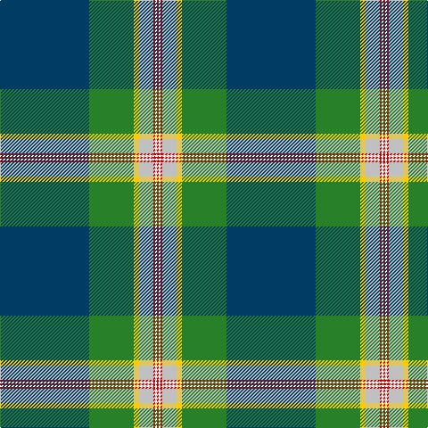

In pattern [BGYWRWR](/patterns/bgywrwr/).

This was sourced from tartans-authority.  It is a [7 stripes tartan](/stripes/stripes7/).

Original link http://www.tartansauthority.com/tartan-ferret/display/11106/

## Thread count
DB/100 G50 Y6 N16 R2 W2 R/2

## Palette
Each colour and its ΔE from the base-6 reference it is a variant of.

| Colour | Shade | Base | ΔE (OKLab) |
|---|---|---|---|
| DB | <code style="background-color:#003C64;">#003C64</code> `#003C64` | B <code style="background-color:#2A418A;">#2A418A</code> | 0.08 |
| G | <code style="background-color:#288028;">#288028</code> `#288028` | G <code style="background-color:#006100;">#006100</code> | 0.10 |
| N | <code style="background-color:#C0C0C0;">#C0C0C0</code> `#C0C0C0` | W <code style="background-color:#F7F7F7;">#F7F7F7</code> | 0.17 |
| R | <code style="background-color:#C80000;">#C80000</code> `#C80000` | R <code style="background-color:#CC0000;">#CC0000</code> | 0.01 |
| W | <code style="background-color:#FCFCFC;">#FCFCFC</code> `#FCFCFC` | W <code style="background-color:#F7F7F7;">#F7F7F7</code> | 0.01 |
| Y | <code style="background-color:#FCCC00;">#FCCC00</code> `#FCCC00` | Y <code style="background-color:#F2BF00;">#F2BF00</code> | 0.04 |

# Sample pattern

## Nearest tartans

The nearest existing variants by ΔTartan distance.

1. [Inkster (Name)](/setts/s8/b62y8g136w8b62r4k12r4-b2c2c80-g006818-k101010-rc80000-we0e0e0-ye8c000/) — ΔT 1.22
1. [O'Mahony, The (Commemorative)](/setts/s10/w4y8b2y2b80r12g36ra4g4w2-b202060-g289c18-r888888-rac80000-we0e0e0-ybc8c00/) — ΔT 1.23
1. [Ascension Island Heritage Trust](/setts/s7/r16b90w2ra8k22g12r8-b5c8ca8-g006818-k101010-rc80000-ra888888-wfcfcfc/) — ΔT 1.24
1. [Stirling, University of](/setts/s9/g90r1k10w6k4g6r10b62y8-b2c4084-g005020-k101010-rdc0000-we0e0e0-ye8c000/) — ΔT 1.27
1. [Macmillan Cancer Support](/setts/s9/b4g24ga6y4ga4y4ga44ya1w4-baa00ff-g289c18-ga005448-wfcfcfc-y86c67c-yad87c00/) — ΔT 1.29
1. [Johnston, Diana Hunting (Personal)](/setts/s8/y6b2k4g52b56w2b2r4-b2c2c80-g006818-k101010-rc80000-wfcfcfc-yfccc00/) — ΔT 1.29
1. [Wells (2014)](/setts/s7/b100g50y6r16ra2w2ra2-b141e46-g285800-r888888-ra960028-wf8f8f8-yd87c00/) — ΔT 1.29
1. [College of New Caledonia (Corporate)](/setts/s6/b104y46g12ga10w2r2-b1474b4-g289c18-ga006818-rc80000-we0e0e0-ye8c000/) — ΔT 1.35
1. [Stirling, University of](/setts/s9/g90r1k10w6k4g6r10b62y8-b304080-g008000-k000000-rc00000-we0e0e0-yf0c000/) — ΔT 1.36
1. [German MacLeod](/setts/s8/w4k2g26k12b54k4r4y4-b1474b4-g006818-k101010-rc80000-w98c8e8-ye8c000/) — ΔT 1.41

## Neighbour map

Every grey dot is one of 15726 variants placed by the first two principal components of the ΔTartan feature space (44% of its variance). Red is this tartan; blue dots are its nearest — click one to open its page.

<svg viewBox="0 0 640 380" role="img" style="max-width:100%;height:auto;border:1px solid #e0e0e0;border-radius:4px;display:block" xmlns="http://www.w3.org/2000/svg"><image href="/nn/cloud.v1.png" width="640" height="380"/><a href="/setts/s8/b62y8g136w8b62r4k12r4-b2c2c80-g006818-k101010-rc80000-we0e0e0-ye8c000/"><circle cx="289.4" cy="110.6" r="4" fill="#3465a4"><title>Inkster (Name)</title></circle></a><a href="/setts/s10/w4y8b2y2b80r12g36ra4g4w2-b202060-g289c18-r888888-rac80000-we0e0e0-ybc8c00/"><circle cx="295.9" cy="62.2" r="4" fill="#3465a4"><title>O'Mahony, The (Commemorative)</title></circle></a><a href="/setts/s7/r16b90w2ra8k22g12r8-b5c8ca8-g006818-k101010-rc80000-ra888888-wfcfcfc/"><circle cx="331.3" cy="89.5" r="4" fill="#3465a4"><title>Ascension Island Heritage Trust</title></circle></a><a href="/setts/s9/g90r1k10w6k4g6r10b62y8-b2c4084-g005020-k101010-rdc0000-we0e0e0-ye8c000/"><circle cx="308.2" cy="82.9" r="4" fill="#3465a4"><title>Stirling, University of</title></circle></a><a href="/setts/s9/b4g24ga6y4ga4y4ga44ya1w4-baa00ff-g289c18-ga005448-wfcfcfc-y86c67c-yad87c00/"><circle cx="326.5" cy="87.6" r="4" fill="#3465a4"><title>Macmillan Cancer Support</title></circle></a><a href="/setts/s8/y6b2k4g52b56w2b2r4-b2c2c80-g006818-k101010-rc80000-wfcfcfc-yfccc00/"><circle cx="287.7" cy="103.3" r="4" fill="#3465a4"><title>Johnston, Diana Hunting (Personal)</title></circle></a><a href="/setts/s7/b100g50y6r16ra2w2ra2-b141e46-g285800-r888888-ra960028-wf8f8f8-yd87c00/"><circle cx="366.4" cy="99.0" r="4" fill="#3465a4"><title>Wells (2014)</title></circle></a><a href="/setts/s6/b104y46g12ga10w2r2-b1474b4-g289c18-ga006818-rc80000-we0e0e0-ye8c000/"><circle cx="353.1" cy="93.6" r="4" fill="#3465a4"><title>College of New Caledonia (Corporate)</title></circle></a><a href="/setts/s9/g90r1k10w6k4g6r10b62y8-b304080-g008000-k000000-rc00000-we0e0e0-yf0c000/"><circle cx="278.1" cy="69.7" r="4" fill="#3465a4"><title>Stirling, University of</title></circle></a><a href="/setts/s8/w4k2g26k12b54k4r4y4-b1474b4-g006818-k101010-rc80000-w98c8e8-ye8c000/"><circle cx="257.6" cy="108.6" r="4" fill="#3465a4"><title>German MacLeod</title></circle></a><circle cx="340.2" cy="88.1" r="5" fill="#c00000"/></svg>

ID: /setts/s7/b100g50y6w16r2wa2r2-b003c64-g288028-rc80000-wc0c0c0-wafcfcfc-yfccc00/
