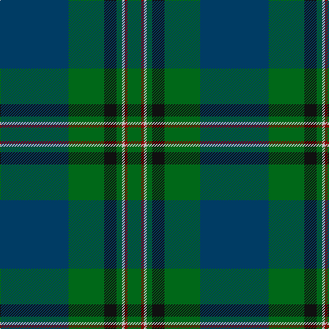

In pattern [BGKGWRG](/patterns/bgkgwrg/).

This was sourced from register-of-tartans.  It is a [7 stripes tartan](/stripes/stripes7/).

Original link https://www.tartanregister.gov.uk/tartanDetails.aspx?ref=1886

## Attestations

This cloth appears in 2 source records; the oldest owns this page.

- 05/07/2001 — Java Saint Andrew Society Hunting (register-of-tartans, [record](https://www.tartanregister.gov.uk/tartanDetails.aspx?ref=1886))
- Jun. 2001 — Java Saint Andrew Society Htg (Corp) (tartans-authority, [record](http://www.tartansauthority.com/tartan-ferret/display/4105/))

## Thread count
DB/100 G52 K18 G8 N4 DR4 G/20

## Palette
Each colour and its ΔE from the base-6 reference it is a variant of.

| Colour | Shade | Base | ΔE (OKLab) |
|---|---|---|---|
| DB | <code style="background-color:#003C64;">#003C64</code> `#003C64` | B <code style="background-color:#2C4084;">#2C4084</code> | 0.07 |
| DR | <code style="background-color:#880000;">#880000</code> `#880000` | R <code style="background-color:#C80000;">#C80000</code> | 0.14 |
| G | <code style="background-color:#006818;">#006818</code> `#006818` | G <code style="background-color:#006400;">#006400</code> | 0.02 |
| K | <code style="background-color:#101010;">#101010</code> `#101010` | K <code style="background-color:#000000;">#000000</code> | 0.17 |
| N | <code style="background-color:#C0C0C0;">#C0C0C0</code> `#C0C0C0` | W <code style="background-color:#F4F4F0;">#F4F4F0</code> | 0.16 |

# Sample pattern

ID: /setts/s7/b100g52k18g8w4r4g20-b003c64-g006818-k101010-r880000-wc0c0c0/
