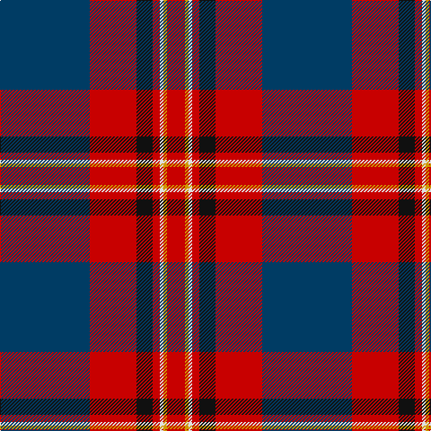

In pattern [BRKRWYR](/patterns/brkrwyr/).

This was sourced from register-of-tartans.  It is a [7 stripes tartan](/stripes/stripes7/).

Original link https://www.tartanregister.gov.uk/tartanDetails.aspx?ref=1885

## Thread count
DB/100 R52 K18 R8 LN4 DY4 R/20

## Palette
Each colour and its ΔE from the base-6 reference it is a variant of.

| Colour | Shade | Base | ΔE (OKLab) |
|---|---|---|---|
| DB | <code style="background-color:#003C64;">#003C64</code> `#003C64` | B <code style="background-color:#2C4084;">#2C4084</code> | 0.07 |
| DY | <code style="background-color:#D09800;">#D09800</code> `#D09800` | Y <code style="background-color:#E8C000;">#E8C000</code> | 0.11 |
| K | <code style="background-color:#101010;">#101010</code> `#101010` | K <code style="background-color:#000000;">#000000</code> | 0.17 |
| LN | <code style="background-color:#E0E0E0;">#E0E0E0</code> `#E0E0E0` | W <code style="background-color:#F4F4F0;">#F4F4F0</code> | 0.06 |
| R | <code style="background-color:#C80000;">#C80000</code> `#C80000` | R <code style="background-color:#C80000;">#C80000</code> | 0.00 |

# Sample pattern

ID: /setts/s7/b100r52k18r8w4y4r20-b003c64-k101010-rc80000-we0e0e0-yd09800/
