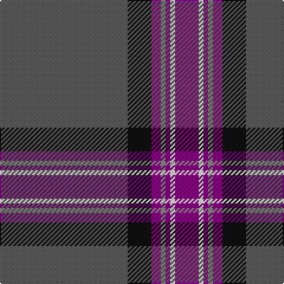

In pattern [BKBRBWB](/patterns/bkbrbwb/).

This was sourced from tartans-authority.  It is a [7 stripes tartan](/stripes/stripes7/).

Original link http://www.tartansauthority.com/tartan-ferret/display/11287/

## Thread count
N/108 K20 P8 Na4 P4 W4 P/20

## Palette
Each colour and its ΔE from the base-6 reference it is a variant of.

| Colour | Shade | Base | ΔE (OKLab) |
|---|---|---|---|
| K | <code style="background-color:#101010;">#101010</code> `#101010` | K <code style="background-color:#000000;">#000000</code> | 0.17 |
| N | <code style="background-color:#5C5C5C;">#5C5C5C</code> `#5C5C5C` | B <code style="background-color:#2A418A;">#2A418A</code> | 0.15 |
| Na | <code style="background-color:#888888;">#888888</code> `#888888` | R <code style="background-color:#CC0000;">#CC0000</code> | 0.24 |
| P | <code style="background-color:#780078;">#780078</code> `#780078` | B <code style="background-color:#2A418A;">#2A418A</code> | 0.17 |
| W | <code style="background-color:#FCFCFC;">#FCFCFC</code> `#FCFCFC` | W <code style="background-color:#F7F7F7;">#F7F7F7</code> | 0.01 |

# Sample pattern

## Nearest tartans

The nearest existing variants by ΔTartan distance.

1. [University of Edinburgh](/setts/s7/k8r26k22b110w4k5w4-b484c68-k101010-r780028-we0e0e0/) — ΔT 1.04
1. [Edinburgh Fire (Corporate)](/setts/s7/y8g16r16b84w4b4ra4-b506078-g604000-rc80000-racc4438-we0e0e0-ye8c000/) — ΔT 1.26
1. [Lochnagar Dark (Fashion)](/setts/s10/b12r2b80ba2b24r24bb12r4ra4r8-b343434-ba5c5c5c-bb780078-r888888-rac80000/) — ΔT 1.29
1. [Dunning Primary (School)](/setts/s5/b120ba36w4r20y4-b405064-ba441800-r880000-we0e0e0-ye8c000/) — ΔT 1.31
1. [Unidentified #64](/setts/s10/b114y4b20g8b8g18r24b8r8ya4-b2c4084-g003c14-rdc0000-ye8c000-yab0b0b0/) — ΔT 1.38
1. [Glen Clova #1](/setts/s11/b76ba8k12r4k4w4k4ba24b12k4b24-b5c5c5c-ba441800-k101010-ra07c58-we0e0e0/) — ΔT 1.40
1. [Edinburgh, The University of](/setts/s7/k8r26k22b110w4k5w4-b145064-k101010-r781c38-we0e0e0/) — ΔT 1.40
1. [Lochnagar Dress (Fashion)](/setts/s10/g10k2g66b2g18k18b10k2r4k8-b440044-g686868-k101010-r880000/) — ΔT 1.42
1. [Wcwm 1445](/setts/s13/b12k4r4ba96r4ba16y12b4k16r4ba32r4k4-b1c0070-ba5c5c5c-k101010-r880000-yd09800/) — ΔT 1.45
1. [MacLaurin of Brioch](/setts/s7/b72k20g6r6g12k2y4-b2c4084-g005020-k101010-rdc0000-ye8c000/) — ΔT 1.47

## Neighbour map

Every grey dot is one of 15726 variants placed by the first two principal components of the ΔTartan feature space (44% of its variance). Red is this tartan; blue dots are its nearest — click one to open its page.

<svg viewBox="0 0 640 380" role="img" style="max-width:100%;height:auto;border:1px solid #e0e0e0;border-radius:4px;display:block" xmlns="http://www.w3.org/2000/svg"><image href="/nn/cloud.v1.png" width="640" height="380"/><a href="/setts/s7/k8r26k22b110w4k5w4-b484c68-k101010-r780028-we0e0e0/"><circle cx="429.4" cy="150.5" r="4" fill="#3465a4"><title>University of Edinburgh</title></circle></a><a href="/setts/s7/y8g16r16b84w4b4ra4-b506078-g604000-rc80000-racc4438-we0e0e0-ye8c000/"><circle cx="405.7" cy="126.4" r="4" fill="#3465a4"><title>Edinburgh Fire (Corporate)</title></circle></a><a href="/setts/s10/b12r2b80ba2b24r24bb12r4ra4r8-b343434-ba5c5c5c-bb780078-r888888-rac80000/"><circle cx="474.7" cy="119.8" r="4" fill="#3465a4"><title>Lochnagar Dark (Fashion)</title></circle></a><a href="/setts/s5/b120ba36w4r20y4-b405064-ba441800-r880000-we0e0e0-ye8c000/"><circle cx="463.4" cy="170.1" r="4" fill="#3465a4"><title>Dunning Primary (School)</title></circle></a><a href="/setts/s10/b114y4b20g8b8g18r24b8r8ya4-b2c4084-g003c14-rdc0000-ye8c000-yab0b0b0/"><circle cx="455.7" cy="114.1" r="4" fill="#3465a4"><title>Unidentified #64</title></circle></a><a href="/setts/s11/b76ba8k12r4k4w4k4ba24b12k4b24-b5c5c5c-ba441800-k101010-ra07c58-we0e0e0/"><circle cx="407.4" cy="140.2" r="4" fill="#3465a4"><title>Glen Clova #1</title></circle></a><a href="/setts/s7/k8r26k22b110w4k5w4-b145064-k101010-r781c38-we0e0e0/"><circle cx="423.6" cy="154.6" r="4" fill="#3465a4"><title>Edinburgh, The University of</title></circle></a><a href="/setts/s10/g10k2g66b2g18k18b10k2r4k8-b440044-g686868-k101010-r880000/"><circle cx="465.4" cy="133.3" r="4" fill="#3465a4"><title>Lochnagar Dress (Fashion)</title></circle></a><a href="/setts/s13/b12k4r4ba96r4ba16y12b4k16r4ba32r4k4-b1c0070-ba5c5c5c-k101010-r880000-yd09800/"><circle cx="446.5" cy="112.5" r="4" fill="#3465a4"><title>Wcwm 1445</title></circle></a><a href="/setts/s7/b72k20g6r6g12k2y4-b2c4084-g005020-k101010-rdc0000-ye8c000/"><circle cx="389.0" cy="130.7" r="4" fill="#3465a4"><title>MacLaurin of Brioch</title></circle></a><circle cx="438.0" cy="131.8" r="5" fill="#c00000"/></svg>

ID: /setts/s7/b108k20ba8r4ba4w4ba20-b5c5c5c-ba780078-k101010-r888888-wfcfcfc/
