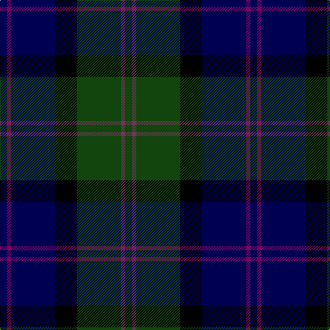

In pattern [BBBKGBG](/patterns/bbbkgbg/).

This was sourced from weddslist.  It is a [7 stripes tartan](/stripes/stripes7/).

Original link http://www.weddslist.com/cgi-bin/tartans/pg.pl?source=tinsel

## Thread count
DB/10 P6 DB64 K32 DG64 N6 DG/10

## Palette
Each colour and its ΔE from the base-6 reference it is a variant of.

| Colour | Shade | Base | ΔE (OKLab) |
|---|---|---|---|
| DB | <code style="background-color:#000052;">#000052</code> `#000052` | B <code style="background-color:#2A418A;">#2A418A</code> | 0.20 |
| DG | <code style="background-color:#11450D;">#11450D</code> `#11450D` | G <code style="background-color:#006100;">#006100</code> | 0.09 |
| K | <code style="background-color:#000000;">#000000</code> `#000000` | K <code style="background-color:#000000;">#000000</code> | 0.00 |
| N | <code style="background-color:#6D3855;">#6D3855</code> `#6D3855` | B <code style="background-color:#2A418A;">#2A418A</code> | 0.14 |
| P | <code style="background-color:#7F0066;">#7F0066</code> `#7F0066` | B <code style="background-color:#2A418A;">#2A418A</code> | 0.18 |

# Sample pattern

## Nearest tartans

The nearest existing variants by ΔTartan distance.

1. [MacThomas LC](/setts/s7/b5ba3b32k16g32bb3g5-b000052-ba7f0066-bb6d3855-g11450d-k000000/) — ΔT 0.00
1. [MacThomas](/setts/s7/b6ba4b42k22g42ba4g6-b000052-ba59110d-g11450d-k000000/) — ΔT 0.87
1. [MacThomas](/setts/s7/b3ba2b21k11g21ba2g3-b000052-ba59110d-g11450d-k000000/) — ΔT 0.87
1. [MacThomas LC](/setts/s7/b5ba3b32k16g32ba3g5-b000064-ba5a3094-g004c00-k000000/) — ΔT 0.98
1. [MacCaskill (Personal)](/setts/s7/k4r2g30k30b30y2k4-b2c2c80-g285800-k101010-rc80000-ye8c000/) — ΔT 1.00
1. [MacLeod](/setts/s7/r6k4g30k20b40k4y4-b000052-g11450d-k000000-raa0000-yaaaa00/) — ΔT 1.03
1. [MacLeod](/setts/s7/r3k2g15k10b20k2y2-b000052-g11450d-k000000-raa0000-yaaaa00/) — ΔT 1.03
1. [McEwan "1856", The](/setts/s7/k3r6k32ka36g36ka4ra3-g003000-k000030-ka000000-r806050-rac00020/) — ΔT 1.03
1. [Lyle and Scott](/setts/s6/g10b4g18ba38bb18y4-b2c2c80-ba000048-bb4c0000-g005020-yfccc00/) — ΔT 1.04
1. [MacCaskill Family Tartan Tartan Number: 1152. Earliest known date: 1951 Miss M.MacDougal of the Inverness Museum wrote (7th September 1951) :- ''Herewith pattern of the MacAskill which Messrs Pringle made at the request of an old man of this name. As you can see it is a variant of the MacLeod...?" . . . wherein the colors of stripes and their guards are reversed. Designed for a farmer - Kenneth MacAskill, Milton of Leys. See products available Copyright © Blair Urquhart, Comrie, 2015](/setts/s7/k4r2g30k30b30y2k4-b2c2c80-g006818-k101010-rc80000-ye8c000/) — ΔT 1.08

## Neighbour map

Every grey dot is one of 15726 variants placed by the first two principal components of the ΔTartan feature space (44% of its variance). Red is this tartan; blue dots are its nearest — click one to open its page.

<svg viewBox="0 0 640 380" role="img" style="max-width:100%;height:auto;border:1px solid #e0e0e0;border-radius:4px;display:block" xmlns="http://www.w3.org/2000/svg"><image href="/nn/cloud.v1.png" width="640" height="380"/><a href="/setts/s7/b5ba3b32k16g32bb3g5-b000052-ba7f0066-bb6d3855-g11450d-k000000/"><circle cx="225.2" cy="207.4" r="4" fill="#3465a4"><title>MacThomas LC</title></circle></a><a href="/setts/s7/b6ba4b42k22g42ba4g6-b000052-ba59110d-g11450d-k000000/"><circle cx="245.6" cy="225.5" r="4" fill="#3465a4"><title>MacThomas</title></circle></a><a href="/setts/s7/b3ba2b21k11g21ba2g3-b000052-ba59110d-g11450d-k000000/"><circle cx="245.6" cy="225.5" r="4" fill="#3465a4"><title>MacThomas</title></circle></a><a href="/setts/s7/b5ba3b32k16g32ba3g5-b000064-ba5a3094-g004c00-k000000/"><circle cx="229.9" cy="218.2" r="4" fill="#3465a4"><title>MacThomas LC</title></circle></a><a href="/setts/s7/k4r2g30k30b30y2k4-b2c2c80-g285800-k101010-rc80000-ye8c000/"><circle cx="229.1" cy="187.1" r="4" fill="#3465a4"><title>MacCaskill (Personal)</title></circle></a><a href="/setts/s7/r6k4g30k20b40k4y4-b000052-g11450d-k000000-raa0000-yaaaa00/"><circle cx="177.1" cy="196.5" r="4" fill="#3465a4"><title>MacLeod</title></circle></a><a href="/setts/s7/r3k2g15k10b20k2y2-b000052-g11450d-k000000-raa0000-yaaaa00/"><circle cx="177.1" cy="196.5" r="4" fill="#3465a4"><title>MacLeod</title></circle></a><a href="/setts/s7/k3r6k32ka36g36ka4ra3-g003000-k000030-ka000000-r806050-rac00020/"><circle cx="205.1" cy="206.4" r="4" fill="#3465a4"><title>McEwan &quot;1856&quot;, The</title></circle></a><a href="/setts/s6/g10b4g18ba38bb18y4-b2c2c80-ba000048-bb4c0000-g005020-yfccc00/"><circle cx="198.8" cy="217.4" r="4" fill="#3465a4"><title>Lyle and Scott</title></circle></a><a href="/setts/s7/k4r2g30k30b30y2k4-b2c2c80-g006818-k101010-rc80000-ye8c000/"><circle cx="217.6" cy="182.8" r="4" fill="#3465a4"><title>MacCaskill Family Tartan Tartan Number: 1152. Earliest known date: 1951 Miss M.MacDougal of the Inverness Museum wrote (7th September 1951) :- ''Herewith pattern of the MacAskill which Messrs Pringle made at the request of an old man of this name. As you can see it is a variant of the MacLeod...?&quot; . . . wherein the colors of stripes and their guards are reversed. Designed for a farmer - Kenneth MacAskill, Milton of Leys. See products available Copyright © Blair Urquhart, Comrie, 2015</title></circle></a><circle cx="225.2" cy="207.4" r="5" fill="#c00000"/></svg>

ID: /setts/s7/b10ba6b64k32g64bb6g10-b000052-ba7f0066-bb6d3855-g11450d-k000000/
