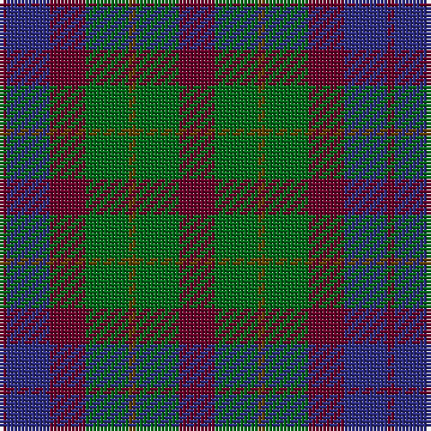

In pattern [BBBGGGB](/patterns/bbbgggb/).

This was sourced from house-of-tartan.  It is a [7 stripes tartan](/stripes/stripes7/).

Original link http://www.house-of-tartan.scotland.net/house/TartanViewjs.asp?colr=Def&tnam=2107

## Thread count
DR/2 DB12 DR10 G12 T2 G12 DR/10

## Palette
Each colour and its ΔE from the base-6 reference it is a variant of.

| Colour | Shade | Base | ΔE (OKLab) |
|---|---|---|---|
| DB | <code style="background-color:#2C2C80;">#2C2C80</code> `#2C2C80` | B <code style="background-color:#2C4084;">#2C4084</code> | 0.05 |
| DR | <code style="background-color:#680028;">#680028</code> `#680028` | B <code style="background-color:#2C4084;">#2C4084</code> | 0.20 |
| G | <code style="background-color:#006818;">#006818</code> `#006818` | G <code style="background-color:#006400;">#006400</code> | 0.02 |
| T | <code style="background-color:#604000;">#604000</code> `#604000` | G <code style="background-color:#006400;">#006400</code> | 0.14 |

# Sample pattern

## Nearest tartans

The nearest existing variants by ΔTartan distance.

1. [Dorward/Dogwood](/setts/s7/g14r6g18ga30b38g28r8-b2c2c80-g604000-ga006818-rc80000/) — ΔT 0.78
1. [Tennant (Yules)](/setts/s7/r8b56g56b56g56ga56r8-b2c2c80-g006818-ga604000-rc80000/) — ΔT 0.82
1. [Unidentified Pinafore](/setts/s7/g48k8g48k48b14r48b14-b3c82af-g005020-k101010-r960028/) — ΔT 0.89
1. [MacCallum #2](/setts/s7/k12g12r2g12k12b12k2-b2c4084-g005020-k101010-rdc0000/) — ΔT 1.06
1. [Dorward](/setts/s7/r14ra6r18g30b38r28ra8-b304080-g008000-r806050-rac00000/) — ΔT 1.20
1. [Abercrombie (Wilsons No 2/64)](/setts/s7/k24g24y4g24k24b24k4-b5a008c-g005020-k101010-ye8c000/) — ΔT 1.22
1. [Scottish Airports (Corporate)](/setts/s6/b8g36b6k34b36ba8-b3c505c-ba780078-g006818-k101010/) — ΔT 1.23
1. [Tennant](/setts/s7/r4b28g28b28g28ba28r4-b304080-ba401000-g008000-rc00000/) — ΔT 1.23
1. [MacIntyre](/setts/s7/k24g24k4g24k24b24ba6-b2c4084-ba3c82af-g005020-k101010/) — ΔT 1.23
1. [Hebrides #8](/setts/s8/b14r6g14r2g14r6b14ba2-b2c2c80-ba5c8ca8-g006818-rc80000/) — ΔT 1.24

## Neighbour map

Every grey dot is one of 15726 variants placed by the first two principal components of the ΔTartan feature space (44% of its variance). Red is this tartan; blue dots are its nearest — click one to open its page.

<svg viewBox="0 0 640 380" role="img" style="max-width:100%;height:auto;border:1px solid #e0e0e0;border-radius:4px;display:block" xmlns="http://www.w3.org/2000/svg"><image href="/nn/cloud.v1.png" width="640" height="380"/><a href="/setts/s7/g14r6g18ga30b38g28r8-b2c2c80-g604000-ga006818-rc80000/"><circle cx="227.9" cy="273.7" r="4" fill="#3465a4"><title>Dorward/Dogwood</title></circle></a><a href="/setts/s7/r8b56g56b56g56ga56r8-b2c2c80-g006818-ga604000-rc80000/"><circle cx="205.8" cy="274.5" r="4" fill="#3465a4"><title>Tennant (Yules)</title></circle></a><a href="/setts/s7/g48k8g48k48b14r48b14-b3c82af-g005020-k101010-r960028/"><circle cx="190.4" cy="264.7" r="4" fill="#3465a4"><title>Unidentified Pinafore</title></circle></a><a href="/setts/s7/k12g12r2g12k12b12k2-b2c4084-g005020-k101010-rdc0000/"><circle cx="218.2" cy="289.8" r="4" fill="#3465a4"><title>MacCallum #2</title></circle></a><a href="/setts/s7/r14ra6r18g30b38r28ra8-b304080-g008000-r806050-rac00000/"><circle cx="228.7" cy="272.1" r="4" fill="#3465a4"><title>Dorward</title></circle></a><a href="/setts/s7/k24g24y4g24k24b24k4-b5a008c-g005020-k101010-ye8c000/"><circle cx="190.5" cy="274.7" r="4" fill="#3465a4"><title>Abercrombie (Wilsons No 2/64)</title></circle></a><a href="/setts/s6/b8g36b6k34b36ba8-b3c505c-ba780078-g006818-k101010/"><circle cx="219.9" cy="274.0" r="4" fill="#3465a4"><title>Scottish Airports (Corporate)</title></circle></a><a href="/setts/s7/r4b28g28b28g28ba28r4-b304080-ba401000-g008000-rc00000/"><circle cx="177.8" cy="261.4" r="4" fill="#3465a4"><title>Tennant</title></circle></a><a href="/setts/s7/k24g24k4g24k24b24ba6-b2c4084-ba3c82af-g005020-k101010/"><circle cx="209.8" cy="295.5" r="4" fill="#3465a4"><title>MacIntyre</title></circle></a><a href="/setts/s8/b14r6g14r2g14r6b14ba2-b2c2c80-ba5c8ca8-g006818-rc80000/"><circle cx="191.5" cy="244.0" r="4" fill="#3465a4"><title>Hebrides #8</title></circle></a><circle cx="211.3" cy="278.5" r="5" fill="#c00000"/></svg>

ID: /setts/s7/b10g12ga2g12b10ba12b2-b680028-ba2c2c80-g006818-ga604000/
