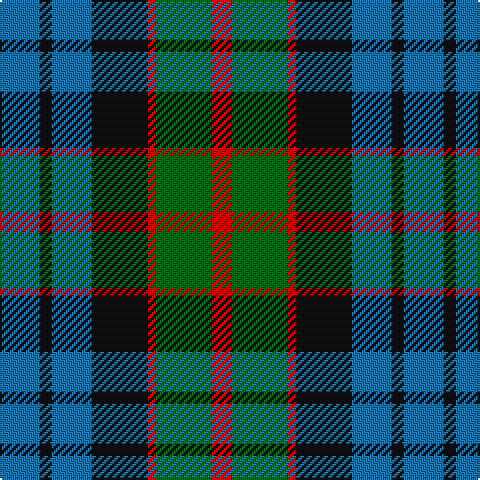

This page is one **sett** — a single exact thread-count. It belongs to the [tartan](/tartans/b10k3b10k14r2g14r5/)
(the same proportion at any scale), whose colour order is pattern [BKBKRGR](/stripes/bkbkrgr/).

Sourced from register-of-tartans.  It is a [7 stripe tartan](/stripes/stripes7/).

Original link https://www.tartanregister.gov.uk/tartanDetails.aspx?ref=1207

2 attestations — the source records this cloth was collapsed from (oldest owns this page)

<ul>
<li>01/01/1880 — Fletcher of Dunans (register-of-tartans, <a href="https://www.tartanregister.gov.uk/tartanDetails.aspx?ref=1207">record</a>)</li>
<li>1880 — Fletcher of Dunans (Clan) (tartans-authority, <a href="http://www.tartansauthority.com/tartan-ferret/display/272/">record</a>)</li>
</ul>

## Register references

External register numbers recorded for this tartan.

- Scottish Register of Tartans: [1207](https://www.tartanregister.gov.uk/tartanDetails.aspx?ref=1207)
- Scottish Tartans Authority (ITI): 272
- Scottish Tartans World Register: 272

## Thread count
B/20 K6 B20 K28 R4 G28 R/10

## Palette

Palette: <strong>Tartan Register</strong>
<table><thead><tr><th>Colour</th><th>Threads</th><th>Shade</th><th>Base</th><th>OKLCh</th></tr></thead><tbody><tr><td>B/</td><td style="text-align:right;font-variant-numeric:tabular-nums">20</td><td><code style="background-color:#1870A4;">#1870A4</code> <small style="color:#888">#1870A4</small></td><td>B <code style="background-color:#2A418A;">#2A418A</code></td><td><small style="color:#888">oklch(52.2% 0.113 241.2)</small></td></tr><tr><td>K</td><td style="text-align:right;font-variant-numeric:tabular-nums">6</td><td><code style="background-color:#101010;">#101010</code> <small style="color:#888">#101010</small></td><td>K <code style="background-color:#000000;">#000000</code></td><td><small style="color:#888">oklch(17.3% 0.000 89.9)</small></td></tr><tr><td>B</td><td style="text-align:right;font-variant-numeric:tabular-nums">20</td><td><code style="background-color:#1870A4;">#1870A4</code> <small style="color:#888">#1870A4</small></td><td>B <code style="background-color:#2A418A;">#2A418A</code></td><td><small style="color:#888">oklch(52.2% 0.113 241.2)</small></td></tr><tr><td>K</td><td style="text-align:right;font-variant-numeric:tabular-nums">28</td><td><code style="background-color:#101010;">#101010</code> <small style="color:#888">#101010</small></td><td>K <code style="background-color:#000000;">#000000</code></td><td><small style="color:#888">oklch(17.3% 0.000 89.9)</small></td></tr><tr><td>R</td><td style="text-align:right;font-variant-numeric:tabular-nums">4</td><td><code style="background-color:#C80000;">#C80000</code> <small style="color:#888">#C80000</small></td><td>R <code style="background-color:#CC0000;">#CC0000</code></td><td><small style="color:#888">oklch(52.3% 0.215 29.2)</small></td></tr><tr><td>G</td><td style="text-align:right;font-variant-numeric:tabular-nums">28</td><td><code style="background-color:#006818;">#006818</code> <small style="color:#888">#006818</small></td><td>G <code style="background-color:#006100;">#006100</code></td><td><small style="color:#888">oklch(45.0% 0.142 145.0)</small></td></tr><tr><td>R/</td><td style="text-align:right;font-variant-numeric:tabular-nums">10</td><td><code style="background-color:#C80000;">#C80000</code> <small style="color:#888">#C80000</small></td><td>R <code style="background-color:#CC0000;">#CC0000</code></td><td><small style="color:#888">oklch(52.3% 0.215 29.2)</small></td></tr></tbody></table>

# Sample pattern

## Nearest tartans

The nearest existing variants by ΔTartan distance, with this tartan at the top so the swatches line up against it.

ΔTartan

Tartan

Sett

—

<a href="/ttd/edit/#slug=b10k3b10k14r2g14r5~x2">Fletcher of Dunans</a> <a class="nn-out" href="/setts/s7/b10k3b10k14r2g14r5~x2/" title="open its dictionary page">↗</a>

0.77

<a href="/ttd/edit/#slug=k3g14k14g2b14r3~x2">Morrison Society</a> <a class="nn-out" href="/setts/s6/k3g14k14g2b14r3~x2/" title="open its dictionary page">↗</a>

0.79

<a href="/ttd/edit/#slug=y3dg6k6y4r1y1~x2">Waterloo</a> <a class="nn-out" href="/setts/s6/y3dg6k6y4r1y1~x2/" title="open its dictionary page">↗</a>

0.81

<a href="/ttd/edit/#slug=r4g12k12g2db12g3~x2">Gunn - 1810 (Clan)</a> <a class="nn-out" href="/setts/s6/r4g12k12g2db12g3~x2/" title="open its dictionary page">↗</a>

0.83

<a href="/ttd/edit/#slug=t3dg12k14t11r3t3~x2">Wellington or Waterloo</a> <a class="nn-out" href="/setts/s6/t3dg12k14t11r3t3~x2/" title="open its dictionary page">↗</a>

0.88

<a href="/ttd/edit/#slug=r1dr7g7db7g7db7r1~x4">Tennant</a> <a class="nn-out" href="/setts/s7/r1dr7g7db7g7db7r1~x4/" title="open its dictionary page">↗</a>

0.92

<a href="/ttd/edit/#slug=w4db4dg22k20db20w3">Unidentified No 26</a> <a class="nn-out" href="/setts/s6/w4db4dg22k20db20w3/" title="open its dictionary page">↗</a>

0.95

<a href="/ttd/edit/#slug=ly5g16k16db16k2db2~x2">Hudson Valley Reg. Police P &amp; D (Cor</a> <a class="nn-out" href="/setts/s6/ly5g16k16db16k2db2~x2/" title="open its dictionary page">↗</a>

0.96

<a href="/ttd/edit/#slug=k2g10t2k9dp8g2~x2">Lennie Family Tartan Tartan Number: 725. Earliest known date: 1819 Wilson's No 231. See products available Copyright © Blair Urquhart, Comrie, 2015</a> <a class="nn-out" href="/setts/s6/k2g10t2k9dp8g2~x2/" title="open its dictionary page">↗</a>

0.99

<a href="/ttd/edit/#slug=db4dg6w1dg6k6db6k2~x2">MacNeil of Colonsay</a> <a class="nn-out" href="/setts/s7/db4dg6w1dg6k6db6k2~x2/" title="open its dictionary page">↗</a>

0.99

<a href="/ttd/edit/#slug=db7r3g7r1g7r3db7t1~x2">Hebrides #8</a> <a class="nn-out" href="/setts/s8/db7r3g7r1g7r3db7t1~x2/" title="open its dictionary page">↗</a>

## Neighbour map

Every grey dot is one of 14359 variants placed by the first two principal components of the ΔTartan feature space (44% of its variance). Red is this tartan; blue dots are its nearest — click one to open its page.

<svg viewBox="0 0 640 380" role="img" style="max-width:100%;height:auto;border:1px solid #e0e0e0;border-radius:4px;display:block" xmlns="http://www.w3.org/2000/svg"><image href="/nn/cloud.v1.png" width="640" height="380"/><a href="/setts/s6/k3g14k14g2b14r3~x2/"><circle cx="163.1" cy="248.6" r="4" fill="#3465a4"><title>Morrison Society</title></circle></a><a href="/setts/s6/y3dg6k6y4r1y1~x2/"><circle cx="157.3" cy="255.5" r="4" fill="#3465a4"><title>Waterloo</title></circle></a><a href="/setts/s6/r4g12k12g2db12g3~x2/"><circle cx="167.6" cy="265.0" r="4" fill="#3465a4"><title>Gunn - 1810 (Clan)</title></circle></a><a href="/setts/s6/t3dg12k14t11r3t3~x2/"><circle cx="149.5" cy="265.6" r="4" fill="#3465a4"><title>Wellington or Waterloo</title></circle></a><a href="/setts/s7/r1dr7g7db7g7db7r1~x4/"><circle cx="180.0" cy="266.3" r="4" fill="#3465a4"><title>Tennant</title></circle></a><a href="/setts/s6/w4db4dg22k20db20w3/"><circle cx="150.2" cy="240.9" r="4" fill="#3465a4"><title>Unidentified No 26</title></circle></a><a href="/setts/s6/ly5g16k16db16k2db2~x2/"><circle cx="151.5" cy="240.1" r="4" fill="#3465a4"><title>Hudson Valley Reg. Police P &amp; D (Cor</title></circle></a><a href="/setts/s6/k2g10t2k9dp8g2~x2/"><circle cx="165.6" cy="263.2" r="4" fill="#3465a4"><title>Lennie Family Tartan Tartan Number: 725. Earliest known date: 1819 Wilson's No 231. See products available Copyright © Blair Urquhart, Comrie, 2015</title></circle></a><a href="/setts/s7/db4dg6w1dg6k6db6k2~x2/"><circle cx="161.7" cy="281.2" r="4" fill="#3465a4"><title>MacNeil of Colonsay</title></circle></a><a href="/setts/s8/db7r3g7r1g7r3db7t1~x2/"><circle cx="193.5" cy="248.2" r="4" fill="#3465a4"><title>Hebrides #8</title></circle></a><circle cx="141.7" cy="251.9" r="5" fill="#c00000"/></svg>

ID: /setts/s7/b10k3b10k14r2g14r5~x2/
