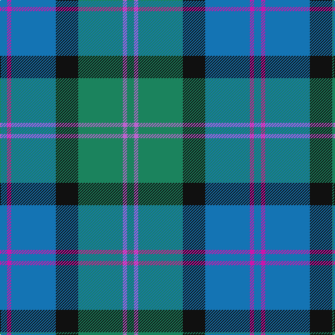

In pattern [BRBKGRG](/patterns/brbkgrg/).

This was sourced from register-of-tartans.  It is a [7 stripes tartan](/stripes/stripes7/).

Original link https://www.tartanregister.gov.uk/tartanDetails.aspx?ref=2772

## Thread count
B/10 LR6 B64 K32 G64 P6 G/10

## Palette
Each colour and its ΔE from the base-6 reference it is a variant of.

| Colour | Shade | Base | ΔE (OKLab) |
|---|---|---|---|
| B | <code style="background-color:#1474B4;">#1474B4</code> `#1474B4` | B <code style="background-color:#2C4084;">#2C4084</code> | 0.15 |
| G | <code style="background-color:#1B835D;">#1B835D</code> `#1B835D` | G <code style="background-color:#006400;">#006400</code> | 0.12 |
| K | <code style="background-color:#101010;">#101010</code> `#101010` | K <code style="background-color:#000000;">#000000</code> | 0.17 |
| LR | <code style="background-color:#CB15AB;">#CB15AB</code> `#CB15AB` | R <code style="background-color:#C80000;">#C80000</code> | 0.21 |
| P | <code style="background-color:#BB62CE;">#BB62CE</code> `#BB62CE` | R <code style="background-color:#C80000;">#C80000</code> | 0.25 |

# Sample pattern

ID: /setts/s7/b10r6b64k32g64ra6g10-b1474b4-g1b835d-k101010-rcb15ab-rabb62ce/
