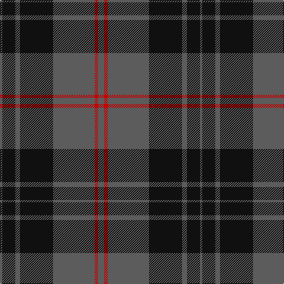

In pattern [BKBKBRB](/patterns/bkbkbrb/).

This was sourced from tartans-authority.  It is a [7 stripes tartan](/stripes/stripes7/).

Original link http://www.tartansauthority.com/tartan-ferret/display/10074/

## Thread count
N/4 K22 N8 K56 N70 R6 N/10

## Palette
Each colour and its ΔE from the base-6 reference it is a variant of.

| Colour | Shade | Base | ΔE (OKLab) |
|---|---|---|---|
| K | <code style="background-color:#101010;">#101010</code> `#101010` | K <code style="background-color:#000000;">#000000</code> | 0.17 |
| N | <code style="background-color:#5C5C5C;">#5C5C5C</code> `#5C5C5C` | B <code style="background-color:#2A418A;">#2A418A</code> | 0.15 |
| R | <code style="background-color:#C80000;">#C80000</code> `#C80000` | R <code style="background-color:#CC0000;">#CC0000</code> | 0.01 |

# Sample pattern

## Nearest tartans

The nearest existing variants by ΔTartan distance.

1. [TACC (Corporate)](/setts/s7/b68k14b24k80b6k8ba6-b5c5c5c-ba5c8ca8-k101010/) — ΔT 0.51
1. [Tartan Army Children's Charity (Corp](/setts/s7/b68k14b24k78b6k8y6-b5c5c5c-k101010-y48a4c0/) — ΔT 0.58
1. [Perthshire (New) District Tartan Tartan Number: 2188. Earliest known date: 1992 The New Perthshire District tartan has established itself through use and wont since 1992. It provides a useful alternative to the Drummond pattern which was always closely associated with Perthshire. See products available Copyright © Blair Urquhart, Comrie, 2015](/setts/s6/b52r12g32b16g6r4-b202060-g006818-rc80000/) — ΔT 1.11
1. [Scottish National Party (Corporate)](/setts/s6/k6b62k6b6k54y6-b5c5c5c-k101010-ye8c000/) — ΔT 1.13
1. [Mountain Rescue Assoc. (Corporate)](/setts/s7/k64b4k12b4k26ba60w4-b1474b4-ba5c5c5c-k101010-wfcfcfc/) — ΔT 1.26
1. [Melange](/setts/s9/k80b4k44b50k36b4g12k12g45-b5c5c5c-g8c7038-k101010/) — ΔT 1.27
1. [Keepers of the Quaich](/setts/s6/y6g66b48g4b4g4-b2c2c80-g604000-yd09800/) — ΔT 1.31
1. [Mountain Rescue Association Honor Guard](/setts/s7/k64b4k12b4k26ba60w4-b0000ff-ba2f4f4f-k101010-wffffff/) — ΔT 1.32
1. [Kelley Oliphint](/setts/s5/b6k62ba54w4k6-b871f78-ba555555-k101010-wffffff/) — ΔT 1.33
1. [Silver Mist (Corporate)](/setts/s6/k52b8k52b124k4b4-b5c5c5c-k101010/) — ΔT 1.35

## Neighbour map

Every grey dot is one of 15726 variants placed by the first two principal components of the ΔTartan feature space (44% of its variance). Red is this tartan; blue dots are its nearest — click one to open its page.

<svg viewBox="0 0 640 380" role="img" style="max-width:100%;height:auto;border:1px solid #e0e0e0;border-radius:4px;display:block" xmlns="http://www.w3.org/2000/svg"><image href="/nn/cloud.v1.png" width="640" height="380"/><a href="/setts/s7/b68k14b24k80b6k8ba6-b5c5c5c-ba5c8ca8-k101010/"><circle cx="367.7" cy="219.5" r="4" fill="#3465a4"><title>TACC (Corporate)</title></circle></a><a href="/setts/s7/b68k14b24k78b6k8y6-b5c5c5c-k101010-y48a4c0/"><circle cx="360.8" cy="219.3" r="4" fill="#3465a4"><title>Tartan Army Children's Charity (Corp</title></circle></a><a href="/setts/s6/b52r12g32b16g6r4-b202060-g006818-rc80000/"><circle cx="351.3" cy="233.2" r="4" fill="#3465a4"><title>Perthshire (New) District Tartan Tartan Number: 2188. Earliest known date: 1992 The New Perthshire District tartan has established itself through use and wont since 1992. It provides a useful alternative to the Drummond pattern which was always closely associated with Perthshire. See products available Copyright © Blair Urquhart, Comrie, 2015</title></circle></a><a href="/setts/s6/k6b62k6b6k54y6-b5c5c5c-k101010-ye8c000/"><circle cx="340.0" cy="220.3" r="4" fill="#3465a4"><title>Scottish National Party (Corporate)</title></circle></a><a href="/setts/s7/k64b4k12b4k26ba60w4-b1474b4-ba5c5c5c-k101010-wfcfcfc/"><circle cx="364.0" cy="189.8" r="4" fill="#3465a4"><title>Mountain Rescue Assoc. (Corporate)</title></circle></a><a href="/setts/s9/k80b4k44b50k36b4g12k12g45-b5c5c5c-g8c7038-k101010/"><circle cx="370.4" cy="206.5" r="4" fill="#3465a4"><title>Melange</title></circle></a><a href="/setts/s6/y6g66b48g4b4g4-b2c2c80-g604000-yd09800/"><circle cx="439.0" cy="215.1" r="4" fill="#3465a4"><title>Keepers of the Quaich</title></circle></a><a href="/setts/s7/k64b4k12b4k26ba60w4-b0000ff-ba2f4f4f-k101010-wffffff/"><circle cx="374.1" cy="198.4" r="4" fill="#3465a4"><title>Mountain Rescue Association Honor Guard</title></circle></a><a href="/setts/s5/b6k62ba54w4k6-b871f78-ba555555-k101010-wffffff/"><circle cx="338.7" cy="204.1" r="4" fill="#3465a4"><title>Kelley Oliphint</title></circle></a><a href="/setts/s6/k52b8k52b124k4b4-b5c5c5c-k101010/"><circle cx="461.3" cy="209.4" r="4" fill="#3465a4"><title>Silver Mist (Corporate)</title></circle></a><circle cx="387.1" cy="208.1" r="5" fill="#c00000"/></svg>

ID: /setts/s7/b10r6b70k56b8k22b4-b5c5c5c-k101010-rc80000/
