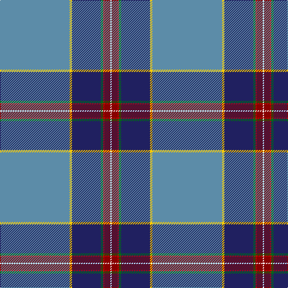

In pattern [BYBGRRW](/patterns/bybgrrw/).

This was sourced from tartans-authority.  It is a [7 stripes tartan](/stripes/stripes7/).

Original link http://www.tartansauthority.com/tartan-ferret/display/10531/

## Thread count
B/116 Y4 DB48 G4 R2 DR10 W/2

## Palette
Each colour and its ΔE from the base-6 reference it is a variant of.

| Colour | Shade | Base | ΔE (OKLab) |
|---|---|---|---|
| B | <code style="background-color:#5C8CA8;">#5C8CA8</code> `#5C8CA8` | B <code style="background-color:#2C4084;">#2C4084</code> | 0.23 |
| DB | <code style="background-color:#202060;">#202060</code> `#202060` | B <code style="background-color:#2C4084;">#2C4084</code> | 0.11 |
| DR | <code style="background-color:#880000;">#880000</code> `#880000` | R <code style="background-color:#C80000;">#C80000</code> | 0.14 |
| G | <code style="background-color:#006818;">#006818</code> `#006818` | G <code style="background-color:#006400;">#006400</code> | 0.02 |
| R | <code style="background-color:#C80000;">#C80000</code> `#C80000` | R <code style="background-color:#C80000;">#C80000</code> | 0.00 |
| W | <code style="background-color:#FCFCFC;">#FCFCFC</code> `#FCFCFC` | W <code style="background-color:#F4F4F0;">#F4F4F0</code> | 0.03 |
| Y | <code style="background-color:#FCCC00;">#FCCC00</code> `#FCCC00` | Y <code style="background-color:#E8C000;">#E8C000</code> | 0.04 |

# Sample pattern

## Nearest tartans

The nearest existing variants by ΔTartan distance.

1. [Glasgow Clyde College](/setts/s9/b96r2ba20r2b20bb4ba54w2ra6-b5c8ca8-ba202060-bb5c5c5c-rc80000-ra9c68a4-wfcfcfc/) — ΔT 1.25
1. [St. Andrew Quebec City (Corporate)](/setts/s8/r4w2r10g10y2g20b80ya4-b2c2c80-g006818-rc80000-we0e0e0-yd87c00-yae8c000/) — ΔT 1.39
1. [Fogarty (Tipperary)](/setts/s10/r4b60g35b4y4b4ga12b18k3w2-b4169e1-g458b00-ga734a12-k101010-rcd0000-wffffff-yeeb422/) — ΔT 1.39
1. [Hier Family, Kilcreggan (Personal)](/setts/s8/b90w4ba46b20g4r2ra10wa2-b1a1849-ba59859e-g305e53-rc91015-ra940543-wfeffaa-waffffff/) — ΔT 1.49
1. [MacLean of Kingairloch (Personal)](/setts/s10/b162k12y2k4w4k4g24ga56w2ga8-b1474b4-g006818-ga604000-k101010-wfcfcfc-ye8c000/) — ΔT 1.57
1. [MacLean of Kingairloch (Personal)](/setts/s10/b162k12y2k4w4k4g24ga56w2ga8-b1474b4-g006818-ga845800-k101010-wfcfcfc-ye8c000/) — ΔT 1.57
1. [Glasgow Clyde College](/setts/s9/b96r2ba20r2b20y4ba54w2ra6-b5f749c-ba202060-rff0000-raa00048-wf8f8f8-ya0a0a0/) — ΔT 1.59
1. [College of New Caledonia](/setts/s6/b104y46g12ga10w2r2-b373875-g649848-ga23321b-rca2625-wf9f5ef-ye0a126/) — ΔT 1.62
1. [Ascension Island Heritage Trust](/setts/s7/r16b90w2ra8k22g12r8-b5c8ca8-g006818-k101010-rc80000-ra888888-wfcfcfc/) — ΔT 1.64
1. [O'Shaughnessy Memorial](/setts/s12/b114w6k18y4k4wa6k4g20b12k4b4r6-b445080-g448c28-k101010-rc80000-wc8d8dc-wae0e0e0-ye8c000/) — ΔT 1.64

## Neighbour map

Every grey dot is one of 15726 variants placed by the first two principal components of the ΔTartan feature space (44% of its variance). Red is this tartan; blue dots are its nearest — click one to open its page.

<svg viewBox="0 0 640 380" role="img" style="max-width:100%;height:auto;border:1px solid #e0e0e0;border-radius:4px;display:block" xmlns="http://www.w3.org/2000/svg"><image href="/nn/cloud.v1.png" width="640" height="380"/><a href="/setts/s9/b96r2ba20r2b20bb4ba54w2ra6-b5c8ca8-ba202060-bb5c5c5c-rc80000-ra9c68a4-wfcfcfc/"><circle cx="366.9" cy="84.3" r="4" fill="#3465a4"><title>Glasgow Clyde College</title></circle></a><a href="/setts/s8/r4w2r10g10y2g20b80ya4-b2c2c80-g006818-rc80000-we0e0e0-yd87c00-yae8c000/"><circle cx="376.2" cy="85.5" r="4" fill="#3465a4"><title>St. Andrew Quebec City (Corporate)</title></circle></a><a href="/setts/s10/r4b60g35b4y4b4ga12b18k3w2-b4169e1-g458b00-ga734a12-k101010-rcd0000-wffffff-yeeb422/"><circle cx="308.4" cy="79.8" r="4" fill="#3465a4"><title>Fogarty (Tipperary)</title></circle></a><a href="/setts/s8/b90w4ba46b20g4r2ra10wa2-b1a1849-ba59859e-g305e53-rc91015-ra940543-wfeffaa-waffffff/"><circle cx="357.8" cy="73.6" r="4" fill="#3465a4"><title>Hier Family, Kilcreggan (Personal)</title></circle></a><a href="/setts/s10/b162k12y2k4w4k4g24ga56w2ga8-b1474b4-g006818-ga604000-k101010-wfcfcfc-ye8c000/"><circle cx="378.6" cy="66.6" r="4" fill="#3465a4"><title>MacLean of Kingairloch (Personal)</title></circle></a><a href="/setts/s10/b162k12y2k4w4k4g24ga56w2ga8-b1474b4-g006818-ga845800-k101010-wfcfcfc-ye8c000/"><circle cx="380.4" cy="66.0" r="4" fill="#3465a4"><title>MacLean of Kingairloch (Personal)</title></circle></a><a href="/setts/s9/b96r2ba20r2b20y4ba54w2ra6-b5f749c-ba202060-rff0000-raa00048-wf8f8f8-ya0a0a0/"><circle cx="386.3" cy="90.8" r="4" fill="#3465a4"><title>Glasgow Clyde College</title></circle></a><a href="/setts/s6/b104y46g12ga10w2r2-b373875-g649848-ga23321b-rca2625-wf9f5ef-ye0a126/"><circle cx="354.5" cy="88.9" r="4" fill="#3465a4"><title>College of New Caledonia</title></circle></a><a href="/setts/s7/r16b90w2ra8k22g12r8-b5c8ca8-g006818-k101010-rc80000-ra888888-wfcfcfc/"><circle cx="331.3" cy="89.5" r="4" fill="#3465a4"><title>Ascension Island Heritage Trust</title></circle></a><a href="/setts/s12/b114w6k18y4k4wa6k4g20b12k4b4r6-b445080-g448c28-k101010-rc80000-wc8d8dc-wae0e0e0-ye8c000/"><circle cx="364.0" cy="52.6" r="4" fill="#3465a4"><title>O'Shaughnessy Memorial</title></circle></a><circle cx="381.8" cy="66.2" r="5" fill="#c00000"/></svg>

ID: /setts/s7/b116y4ba48g4r2ra10w2-b5c8ca8-ba202060-g006818-rc80000-ra880000-wfcfcfc-yfccc00/
