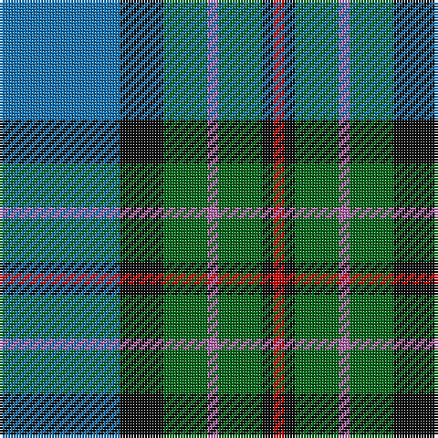

**Bands:** [RKGRGKB](/stripes/rkgrgkb/) · **Stripes:** [R K G M G K B](/stripes/stripes7/) R K G M G K B

This was sourced from tartans-authority.  It is a [7 band tartan](/bands/bands7/).

Original link http://www.tartansauthority.com/tartan-ferret/display/8511/

## Thread count
B/44 K16 G16 P4 G16 K4 R/4

## Palette
Each colour and its ΔE from the base-6 reference it is a variant of.

| Colour | Shade | Base | ΔE (OKLab) |
|---|---|---|---|
| B | <code style="background-color:#1474B4;">#1474B4</code> `#1474B4` | B <code style="background-color:#2A418A;">#2A418A</code> | 0.15 |
| G | <code style="background-color:#006818;">#006818</code> `#006818` | G <code style="background-color:#006100;">#006100</code> | 0.02 |
| K | <code style="background-color:#101010;">#101010</code> `#101010` | K <code style="background-color:#000000;">#000000</code> | 0.17 |
| P | <code style="background-color:#B468AC;">#B468AC</code> `#B468AC` | R <code style="background-color:#CC0000;">#CC0000</code> | 0.21 |
| R | <code style="background-color:#C80000;">#C80000</code> `#C80000` | R <code style="background-color:#CC0000;">#CC0000</code> | 0.01 |

# Sample pattern

## Nearest tartans

The nearest existing variants by ΔTartan distance.

1. [DeLoughery (Personal)](/setts/s6/db20k6lo4db3g20w2~x2/) — ΔT 0.52
1. [MacThomas (Clan)](/setts/s7/dg5lp3dg32k16b32m3b5~x2/) — ΔT 0.68
1. [MacThomas](/setts/s7/g5m3g32k16b32m3b5~x2/) — ΔT 0.68
1. [Heckenberg Htg (Personal)](/setts/s7/db3g13t1r3t1db10ly1~x2/) — ΔT 0.74
1. [MacThomas Clan Tartan Tartan Number: 407. Earliest known date: 1975 Designed by David Thomas - former director of the Strathmore Woollen Co. in Forfar who still (in 2011) weave this tartan. Adopted by Clan Society in 1975, and registered with Lord Lyon in 1979. See products available Copyright © Blair Urquhart, Comrie, 2015](/setts/s7/db3m2db22k11g24lp2g3~x2/) — ΔT 0.78
1. [State Seal of Washington (Fashion)](/setts/s7/b5dy28lb5k20lo5b47lo4~x2/) — ΔT 0.83
1. [Pride of Yorkland (Fashion)](/setts/s6/g35k3db26k4db4w3~x2/) — ΔT 0.87
1. [MacLeod of Assynt](/setts/s6/r3k2g20k10b20ly2~x2/) — ΔT 0.90
1. [Dickson (Kirkcudbrightshire) (Name)](/setts/s7/n6db8n8g12dt29w3dt4~x2/) — ΔT 0.91
1. [Leslie, Hebridean](/setts/s6/k6g15w2db22r2k4~x2/) — ΔT 0.92

## Neighbour map

Every grey dot is one of 14299 variants placed by the first two principal components of the ΔTartan feature space (44% of its variance). Red is this tartan; blue dots are its nearest — click one to open its page.

<svg viewBox="0 0 640 380" role="img" style="max-width:100%;height:auto;border:1px solid #e0e0e0;border-radius:4px;display:block" xmlns="http://www.w3.org/2000/svg"><image href="/nn/cloud.v1.png" width="640" height="380"/><a href="/setts/s6/db20k6lo4db3g20w2~x2/"><circle cx="206.8" cy="203.1" r="4" fill="#3465a4"><title>DeLoughery (Personal)</title></circle></a><a href="/setts/s7/dg5lp3dg32k16b32m3b5~x2/"><circle cx="213.8" cy="200.8" r="4" fill="#3465a4"><title>MacThomas (Clan)</title></circle></a><a href="/setts/s7/g5m3g32k16b32m3b5~x2/"><circle cx="212.2" cy="198.7" r="4" fill="#3465a4"><title>MacThomas</title></circle></a><a href="/setts/s7/db3g13t1r3t1db10ly1~x2/"><circle cx="236.5" cy="178.7" r="4" fill="#3465a4"><title>Heckenberg Htg (Personal)</title></circle></a><a href="/setts/s7/db3m2db22k11g24lp2g3~x2/"><circle cx="233.8" cy="194.8" r="4" fill="#3465a4"><title>MacThomas Clan Tartan Tartan Number: 407. Earliest known date: 1975 Designed by David Thomas - former director of the Strathmore Woollen Co. in Forfar who still (in 2011) weave this tartan. Adopted by Clan Society in 1975, and registered with Lord Lyon in 1979. See products available Copyright © Blair Urquhart, Comrie, 2015</title></circle></a><a href="/setts/s7/b5dy28lb5k20lo5b47lo4~x2/"><circle cx="219.0" cy="176.9" r="4" fill="#3465a4"><title>State Seal of Washington (Fashion)</title></circle></a><a href="/setts/s6/g35k3db26k4db4w3~x2/"><circle cx="252.7" cy="188.1" r="4" fill="#3465a4"><title>Pride of Yorkland (Fashion)</title></circle></a><a href="/setts/s6/r3k2g20k10b20ly2~x2/"><circle cx="169.5" cy="202.8" r="4" fill="#3465a4"><title>MacLeod of Assynt</title></circle></a><a href="/setts/s7/n6db8n8g12dt29w3dt4~x2/"><circle cx="212.8" cy="202.7" r="4" fill="#3465a4"><title>Dickson (Kirkcudbrightshire) (Name)</title></circle></a><a href="/setts/s6/k6g15w2db22r2k4~x2/"><circle cx="214.6" cy="197.6" r="4" fill="#3465a4"><title>Leslie, Hebridean</title></circle></a><circle cx="213.1" cy="194.5" r="5" fill="#c00000"/></svg>

ID: /setts/s7/b11k4g4m1g4k1r1~x4/
