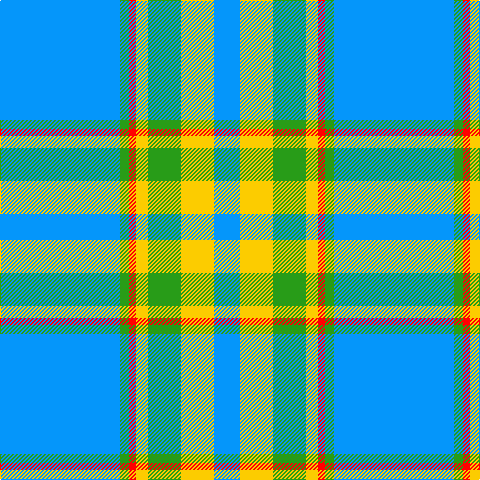

This page is one **sett** — a single exact thread-count. It belongs to the [tartan](/tartans/b120g9r7ly12g33ly33b26/)
(the same proportion at any scale), whose colour order is pattern [BGRYGYB](/stripes/bgrygyb/).

Sourced from register-of-tartans.  It is a [7 stripe tartan](/stripes/stripes7/).

Original link https://www.tartanregister.gov.uk/tartanDetails.aspx?ref=11078

## Register references

External register numbers recorded for this tartan.

- Scottish Register of Tartans: [11078](https://www.tartanregister.gov.uk/tartanDetails.aspx?ref=11078)

## Thread count
B/120 G9 R7 Y12 G33 Y33 B/26

## Palette

Palette: <strong>Tartan Register</strong>
<table><thead><tr><th>Colour</th><th>Threads</th><th>Shade</th><th>Base</th><th>OKLCh</th></tr></thead><tbody><tr><td>B/</td><td style="text-align:right;font-variant-numeric:tabular-nums">120</td><td><code style="background-color:#0596FA;">#0596FA</code> <small style="color:#888">#0596FA</small></td><td>B <code style="background-color:#2A418A;">#2A418A</code></td><td><small style="color:#888">oklch(66.0% 0.180 248.9)</small></td></tr><tr><td>G</td><td style="text-align:right;font-variant-numeric:tabular-nums">9</td><td><code style="background-color:#289C18;">#289C18</code> <small style="color:#888">#289C18</small></td><td>G <code style="background-color:#006100;">#006100</code></td><td><small style="color:#888">oklch(60.6% 0.191 141.6)</small></td></tr><tr><td>R</td><td style="text-align:right;font-variant-numeric:tabular-nums">7</td><td><code style="background-color:#FF0000;">#FF0000</code> <small style="color:#888">#FF0000</small></td><td>R <code style="background-color:#CC0000;">#CC0000</code></td><td><small style="color:#888">oklch(62.8% 0.258 29.2)</small></td></tr><tr><td>Y</td><td style="text-align:right;font-variant-numeric:tabular-nums">12</td><td><code style="background-color:#FCCC00;">#FCCC00</code> <small style="color:#888">#FCCC00</small></td><td>Y <code style="background-color:#F2BF00;">#F2BF00</code></td><td><small style="color:#888">oklch(86.2% 0.176 91.5)</small></td></tr><tr><td>G</td><td style="text-align:right;font-variant-numeric:tabular-nums">33</td><td><code style="background-color:#289C18;">#289C18</code> <small style="color:#888">#289C18</small></td><td>G <code style="background-color:#006100;">#006100</code></td><td><small style="color:#888">oklch(60.6% 0.191 141.6)</small></td></tr><tr><td>Y</td><td style="text-align:right;font-variant-numeric:tabular-nums">33</td><td><code style="background-color:#FCCC00;">#FCCC00</code> <small style="color:#888">#FCCC00</small></td><td>Y <code style="background-color:#F2BF00;">#F2BF00</code></td><td><small style="color:#888">oklch(86.2% 0.176 91.5)</small></td></tr><tr><td>B/</td><td style="text-align:right;font-variant-numeric:tabular-nums">26</td><td><code style="background-color:#0596FA;">#0596FA</code> <small style="color:#888">#0596FA</small></td><td>B <code style="background-color:#2A418A;">#2A418A</code></td><td><small style="color:#888">oklch(66.0% 0.180 248.9)</small></td></tr></tbody></table>

# Sample pattern

## Nearest tartans

The nearest existing variants by ΔTartan distance, with this tartan at the top so the swatches line up against it.

ΔTartan

Tartan

Sett

—

<a href="/ttd/edit/#slug=b120g9r7ly12g33ly33b26">Supporter.com</a> <a class="nn-out" href="/setts/s7/b120g9r7ly12g33ly33b26/" title="open its dictionary page">↗</a>

1.24

<a href="/ttd/edit/#slug=n3b2w10b2n6b26k2~x2">MacLintock #2</a> <a class="nn-out" href="/setts/s7/n3b2w10b2n6b26k2~x2/" title="open its dictionary page">↗</a>

1.26

<a href="/ttd/edit/#slug=db9lb27db2ly4db2lb10db2w3~x2">Alaska Highlanders P &amp; D (Corporate)</a> <a class="nn-out" href="/setts/s8/db9lb27db2ly4db2lb10db2w3~x2/" title="open its dictionary page">↗</a>

1.30

<a href="/ttd/edit/#slug=t45w4db4w2ly14db2w2db2~x4">Madras 1 (Fashion)</a> <a class="nn-out" href="/setts/s8/t45w4db4w2ly14db2w2db2~x4/" title="open its dictionary page">↗</a>

1.41

<a href="/ttd/edit/#slug=w2db1w15t12w1ly3db1~x6">St. John's (Corporate)</a> <a class="nn-out" href="/setts/s7/w2db1w15t12w1ly3db1~x6/" title="open its dictionary page">↗</a>

1.49

<a href="/ttd/edit/#slug=b12ly1w16b1w1b14w3b14r2~x4">Orlando Dress, City of (District)</a> <a class="nn-out" href="/setts/s9/b12ly1w16b1w1b14w3b14r2~x4/" title="open its dictionary page">↗</a>

1.50

<a href="/ttd/edit/#slug=w4k2w26t23w3t8p3~x2">MacPherson Turquoise Dress Tartan Tartan Number: 8183. Earliest known date: Threadcount and colours aren't 100% original. Generated manually. See products available Copyright © Blair Urquhart, Comrie, 2015</a> <a class="nn-out" href="/setts/s7/w4k2w26t23w3t8p3~x2/" title="open its dictionary page">↗</a>

1.54

<a href="/ttd/edit/#slug=t42k2w2k2t5n12w32t4~x2">Longniddry, dress (Turquoise)</a> <a class="nn-out" href="/setts/s8/t42k2w2k2t5n12w32t4~x2/" title="open its dictionary page">↗</a>

1.56

<a href="/ttd/edit/#slug=w1lb4b4db3w3b20lb1~x4">Starr</a> <a class="nn-out" href="/setts/s7/w1lb4b4db3w3b20lb1~x4/" title="open its dictionary page">↗</a>

1.59

<a href="/ttd/edit/#slug=t26w2ly1w3ly2w3ly4~x2">Argentine Flag</a> <a class="nn-out" href="/setts/s7/t26w2ly1w3ly2w3ly4~x2/" title="open its dictionary page">↗</a>

1.63

<a href="/ttd/edit/#slug=k3t2g13w2t24r3~x4">Vance</a> <a class="nn-out" href="/setts/s6/k3t2g13w2t24r3~x4/" title="open its dictionary page">↗</a>

## Neighbour map

Every grey dot is one of 14359 variants placed by the first two principal components of the ΔTartan feature space (44% of its variance). Red is this tartan; blue dots are its nearest — click one to open its page.

<svg viewBox="0 0 640 380" role="img" style="max-width:100%;height:auto;border:1px solid #e0e0e0;border-radius:4px;display:block" xmlns="http://www.w3.org/2000/svg"><image href="/nn/cloud.v1.png" width="640" height="380"/><a href="/setts/s7/n3b2w10b2n6b26k2~x2/"><circle cx="315.1" cy="170.1" r="4" fill="#3465a4"><title>MacLintock #2</title></circle></a><a href="/setts/s8/db9lb27db2ly4db2lb10db2w3~x2/"><circle cx="332.5" cy="154.0" r="4" fill="#3465a4"><title>Alaska Highlanders P &amp; D (Corporate)</title></circle></a><a href="/setts/s8/t45w4db4w2ly14db2w2db2~x4/"><circle cx="352.4" cy="119.4" r="4" fill="#3465a4"><title>Madras 1 (Fashion)</title></circle></a><a href="/setts/s7/w2db1w15t12w1ly3db1~x6/"><circle cx="286.3" cy="154.5" r="4" fill="#3465a4"><title>St. John's (Corporate)</title></circle></a><a href="/setts/s9/b12ly1w16b1w1b14w3b14r2~x4/"><circle cx="339.5" cy="160.8" r="4" fill="#3465a4"><title>Orlando Dress, City of (District)</title></circle></a><a href="/setts/s7/w4k2w26t23w3t8p3~x2/"><circle cx="277.7" cy="173.1" r="4" fill="#3465a4"><title>MacPherson Turquoise Dress Tartan Tartan Number: 8183. Earliest known date: Threadcount and colours aren't 100% original. Generated manually. See products available Copyright © Blair Urquhart, Comrie, 2015</title></circle></a><a href="/setts/s8/t42k2w2k2t5n12w32t4~x2/"><circle cx="296.5" cy="138.3" r="4" fill="#3465a4"><title>Longniddry, dress (Turquoise)</title></circle></a><a href="/setts/s7/w1lb4b4db3w3b20lb1~x4/"><circle cx="403.0" cy="162.8" r="4" fill="#3465a4"><title>Starr</title></circle></a><a href="/setts/s7/t26w2ly1w3ly2w3ly4~x2/"><circle cx="400.3" cy="138.7" r="4" fill="#3465a4"><title>Argentine Flag</title></circle></a><a href="/setts/s6/k3t2g13w2t24r3~x4/"><circle cx="289.6" cy="180.8" r="4" fill="#3465a4"><title>Vance</title></circle></a><circle cx="340.2" cy="166.3" r="5" fill="#c00000"/></svg>

ID: /setts/s7/b120g9r7ly12g33ly33b26/
