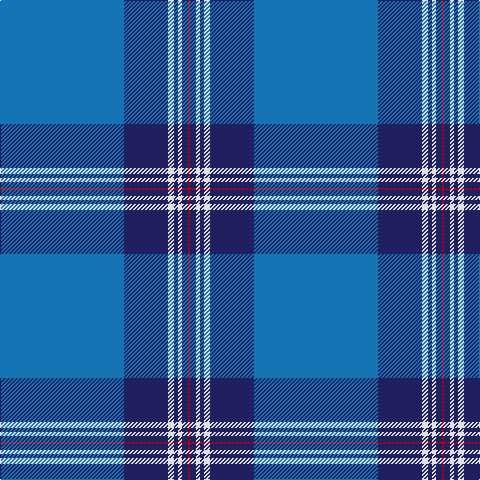

In pattern [BBWBWBR](/patterns/bbwbwbr/).

This was sourced from tartans-authority.  It is a [7 stripes tartan](/stripes/stripes7/).

Original link http://www.tartansauthority.com/tartan-ferret/display/2351/

## Thread count
B/124 DB44 LN6 DB4 LN4 DB6 R/2

## Palette
Each colour and its ΔE from the base-6 reference it is a variant of.

| Colour | Shade | Base | ΔE (OKLab) |
|---|---|---|---|
| B | <code style="background-color:#1474B4;">#1474B4</code> `#1474B4` | B <code style="background-color:#2C4084;">#2C4084</code> | 0.15 |
| DB | <code style="background-color:#202060;">#202060</code> `#202060` | B <code style="background-color:#2C4084;">#2C4084</code> | 0.11 |
| LN | <code style="background-color:#E0E0E0;">#E0E0E0</code> `#E0E0E0` | W <code style="background-color:#F4F4F0;">#F4F4F0</code> | 0.06 |
| R | <code style="background-color:#C80000;">#C80000</code> `#C80000` | R <code style="background-color:#C80000;">#C80000</code> | 0.00 |

# Sample pattern

ID: /setts/s7/b124ba44w6ba4w4ba6r2-b1474b4-ba202060-rc80000-we0e0e0/
