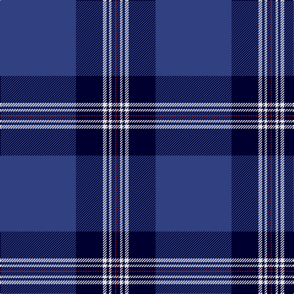

In pattern [BKWKWKR](/patterns/bkwkwkr/).

This was sourced from weddslist.  It is a [7 stripes tartan](/stripes/stripes7/).

Original link http://www.weddslist.com/cgi-bin/tartans/pg.pl?source=sts

## Thread count
B/124 DB44 LN6 DB4 LN4 DB6 R/2

## Palette
Each colour and its ΔE from the base-6 reference it is a variant of.

| Colour | Shade | Base | ΔE (OKLab) |
|---|---|---|---|
| B | <code style="background-color:#304080;">#304080</code> `#304080` | B <code style="background-color:#2C4084;">#2C4084</code> | 0.01 |
| DB | <code style="background-color:#000030;">#000030</code> `#000030` | K <code style="background-color:#000000;">#000000</code> | 0.17 |
| LN | <code style="background-color:#E0E0E0;">#E0E0E0</code> `#E0E0E0` | W <code style="background-color:#F4F4F0;">#F4F4F0</code> | 0.06 |
| R | <code style="background-color:#C00000;">#C00000</code> `#C00000` | R <code style="background-color:#C80000;">#C80000</code> | 0.02 |

# Sample pattern

## Nearest tartans

The nearest existing variants by ΔTartan distance.

1. [Skye District Tartan Tartan Number: 385. Earliest known date: 1984 See also 'Isle of Skye'. See products available Copyright © Blair Urquhart, Comrie, 2015](/setts/s11/b90k20r4k4y4k4r20b10k2b10y2-b2c2c80-k101010-r888888-ye8c000/) — ΔT 1.11
1. [French Freemasons' Pride (Fashion)](/setts/s6/b128r8ba41bb4ba4bb4-b1c0070-ba2888c4-bb5c5c5c-r901c38/) — ΔT 1.18
1. [Salvation Army Hunting Corporate Tartan Tartan Number: 150. Earliest known date: 1983 Designed to be ready for the Perth Citadel Corps Centenary. The hunting version replaces red with green. See products available Copyright © Blair Urquhart, Comrie, 2015](/setts/s7/b160g32k4y8k4g32b20-b2c2c80-g006818-k101010-ye8c000/) — ΔT 1.19
1. [French Freemasons' Pride](/setts/s6/b128r8y41ba4y4ba4-b000080-ba2f4f4f-r8b0000-y5f9ea0/) — ΔT 1.21
1. [Calum's Cabin](/setts/s9/b32y4ba12b2ba4b2r16b67y6-b202060-ba2c2c80-r888888-yfccc00/) — ΔT 1.21
1. [Calum's Cabin](/setts/s10/b32r4ba12b2ba4b2ba2g16b67r6-b000048-ba003c64-g808080-re86000/) — ΔT 1.28
1. [NHS Grampian](/setts/s7/b8ba72k32w2b4w2k8-b2888c4-ba2c2c80-k101010-wfcfcfc/) — ΔT 1.31
1. [Affara (Personal)](/setts/s7/b160k10g24k4y4g4k20-b2c2c80-g006818-k101010-ye8c000/) — ΔT 1.35
1. [Michael (John) (Personal)](/setts/s6/g10w2r10k10b86r2-b2c2c80-g006818-k101010-rc80000-we0e0e0/) — ΔT 1.36
1. [Marist School, The](/setts/s8/b116ba8b4ba4b4ba4bb32y4-b1c0070-ba2c2c80-bb5c8ca8-yd09800/) — ΔT 1.36

## Neighbour map

Every grey dot is one of 15726 variants placed by the first two principal components of the ΔTartan feature space (44% of its variance). Red is this tartan; blue dots are its nearest — click one to open its page.

<svg viewBox="0 0 640 380" role="img" style="max-width:100%;height:auto;border:1px solid #e0e0e0;border-radius:4px;display:block" xmlns="http://www.w3.org/2000/svg"><image href="/nn/cloud.v1.png" width="640" height="380"/><a href="/setts/s11/b90k20r4k4y4k4r20b10k2b10y2-b2c2c80-k101010-r888888-ye8c000/"><circle cx="449.2" cy="102.9" r="4" fill="#3465a4"><title>Skye District Tartan Tartan Number: 385. Earliest known date: 1984 See also 'Isle of Skye'. See products available Copyright © Blair Urquhart, Comrie, 2015</title></circle></a><a href="/setts/s6/b128r8ba41bb4ba4bb4-b1c0070-ba2888c4-bb5c5c5c-r901c38/"><circle cx="476.8" cy="154.0" r="4" fill="#3465a4"><title>French Freemasons' Pride (Fashion)</title></circle></a><a href="/setts/s7/b160g32k4y8k4g32b20-b2c2c80-g006818-k101010-ye8c000/"><circle cx="499.7" cy="146.3" r="4" fill="#3465a4"><title>Salvation Army Hunting Corporate Tartan Tartan Number: 150. Earliest known date: 1983 Designed to be ready for the Perth Citadel Corps Centenary. The hunting version replaces red with green. See products available Copyright © Blair Urquhart, Comrie, 2015</title></circle></a><a href="/setts/s6/b128r8y41ba4y4ba4-b000080-ba2f4f4f-r8b0000-y5f9ea0/"><circle cx="451.1" cy="147.0" r="4" fill="#3465a4"><title>French Freemasons' Pride</title></circle></a><a href="/setts/s9/b32y4ba12b2ba4b2r16b67y6-b202060-ba2c2c80-r888888-yfccc00/"><circle cx="464.3" cy="137.2" r="4" fill="#3465a4"><title>Calum's Cabin</title></circle></a><a href="/setts/s10/b32r4ba12b2ba4b2ba2g16b67r6-b000048-ba003c64-g808080-re86000/"><circle cx="457.8" cy="133.6" r="4" fill="#3465a4"><title>Calum's Cabin</title></circle></a><a href="/setts/s7/b8ba72k32w2b4w2k8-b2888c4-ba2c2c80-k101010-wfcfcfc/"><circle cx="390.6" cy="142.9" r="4" fill="#3465a4"><title>NHS Grampian</title></circle></a><a href="/setts/s7/b160k10g24k4y4g4k20-b2c2c80-g006818-k101010-ye8c000/"><circle cx="531.5" cy="142.5" r="4" fill="#3465a4"><title>Affara (Personal)</title></circle></a><a href="/setts/s6/g10w2r10k10b86r2-b2c2c80-g006818-k101010-rc80000-we0e0e0/"><circle cx="501.0" cy="125.1" r="4" fill="#3465a4"><title>Michael (John) (Personal)</title></circle></a><a href="/setts/s8/b116ba8b4ba4b4ba4bb32y4-b1c0070-ba2c2c80-bb5c8ca8-yd09800/"><circle cx="497.9" cy="138.6" r="4" fill="#3465a4"><title>Marist School, The</title></circle></a><circle cx="472.2" cy="122.3" r="5" fill="#c00000"/></svg>

ID: /setts/s7/b124k44w6k4w4k6r2-b304080-k000030-rc00000-we0e0e0/
