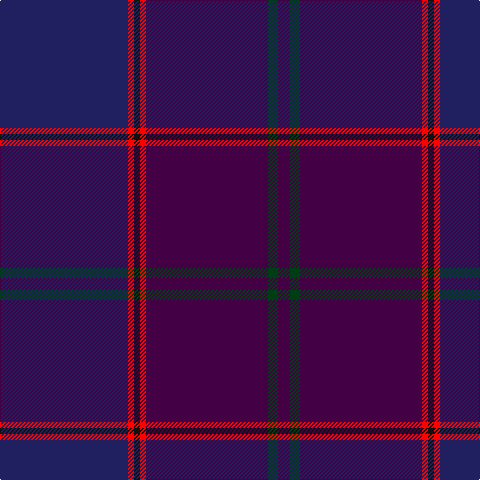

In pattern [BGBRKRB](/patterns/bgbrkrb/).

This was sourced from register-of-tartans.  It is a [7 stripes tartan](/stripes/stripes7/).

Original link https://www.tartanregister.gov.uk/tartanDetails.aspx?ref=10937

## Thread count
DB/128 R6 K6 R6 DP122 DG10 DP/12

## Palette
Each colour and its ΔE from the base-6 reference it is a variant of.

| Colour | Shade | Base | ΔE (OKLab) |
|---|---|---|---|
| DB | <code style="background-color:#202060;">#202060</code> `#202060` | B <code style="background-color:#2A418A;">#2A418A</code> | 0.11 |
| DG | <code style="background-color:#003C14;">#003C14</code> `#003C14` | G <code style="background-color:#006100;">#006100</code> | 0.13 |
| DP | <code style="background-color:#440044;">#440044</code> `#440044` | B <code style="background-color:#2A418A;">#2A418A</code> | 0.18 |
| K | <code style="background-color:#101010;">#101010</code> `#101010` | K <code style="background-color:#000000;">#000000</code> | 0.17 |
| R | <code style="background-color:#FF0000;">#FF0000</code> `#FF0000` | R <code style="background-color:#CC0000;">#CC0000</code> | 0.11 |

# Sample pattern

## Nearest tartans

The nearest existing variants by ΔTartan distance.

1. [Rutherford, John (Personal)](/setts/s7/b128r6k6r6ba122g10ba12-b202060-ba440044-g003820-k101010-rc80000/) — ΔT 1.10
1. [Phillips](/setts/s9/b80ba4bb4ba4b4bc10bb40ba4bb40-b4c2424-ba2888c4-bb440044-bc780078/) — ΔT 1.39
1. [ODL (Corporate)](/setts/s8/k8r2b6ba56b72k6r4ra2-b2c2c80-ba1c1c50-k101010-rc80000-ra888888/) — ΔT 1.42
1. [By Storm](/setts/s8/b10ba6b36g16k16bb62k4bb8-b400040-ba7c045c-bb68205c-g00400c-k101010/) — ΔT 1.65
1. [Spirit of Wales (Fashion)](/setts/s10/b8ba4b44k4b2bb4b2k4bb48w4-b14283c-ba780078-bb202060-k101010-we0e0e0/) — ΔT 1.68
1. [Spirit of Hoxa](/setts/s9/g4b38g4ba92w4b20g6bb4r4-b4d0066-ba440066-bb8547c2-g00611c-rff6a6a-w99ccff/) — ΔT 1.69
1. [Little Hunting](/setts/s8/b10ba6b8ba6b8k56b16r2-b1c1c50-ba2c2c80-k101010-rc80000/) — ΔT 1.84
1. [Finnie (Personal)](/setts/s8/b8g8b74k40g2ba10g2k8-b141e46-ba280032-g808080-k101010/) — ΔT 2.00
1. [Edzell U.S. Navy Regimental Tartan Tartan Number: 81. Earliest known date: pre 2003 Designed by Mr Arthur MacKie See products available Copyright © Blair Urquhart, Comrie, 2015](/setts/s6/b104ba16w8ba66r3ba16-b202060-ba2c2c80-rc80000-we0e0e0/) — ΔT 2.12
1. [Edinburgh & Lothian T.B. (Corporate)](/setts/s7/b80ba16y6ba12k6ba12r8-b1c1c50-ba2c2c80-k101010-rc80000-ybc8c00/) — ΔT 2.12

## Neighbour map

Every grey dot is one of 15726 variants placed by the first two principal components of the ΔTartan feature space (44% of its variance). Red is this tartan; blue dots are its nearest — click one to open its page.

<svg viewBox="0 0 640 380" role="img" style="max-width:100%;height:auto;border:1px solid #e0e0e0;border-radius:4px;display:block" xmlns="http://www.w3.org/2000/svg"><image href="/nn/cloud.v1.png" width="640" height="380"/><a href="/setts/s7/b128r6k6r6ba122g10ba12-b202060-ba440044-g003820-k101010-rc80000/"><circle cx="456.9" cy="206.5" r="4" fill="#3465a4"><title>Rutherford, John (Personal)</title></circle></a><a href="/setts/s9/b80ba4bb4ba4b4bc10bb40ba4bb40-b4c2424-ba2888c4-bb440044-bc780078/"><circle cx="426.9" cy="200.0" r="4" fill="#3465a4"><title>Phillips</title></circle></a><a href="/setts/s8/k8r2b6ba56b72k6r4ra2-b2c2c80-ba1c1c50-k101010-rc80000-ra888888/"><circle cx="446.3" cy="170.0" r="4" fill="#3465a4"><title>ODL (Corporate)</title></circle></a><a href="/setts/s8/b10ba6b36g16k16bb62k4bb8-b400040-ba7c045c-bb68205c-g00400c-k101010/"><circle cx="347.2" cy="209.6" r="4" fill="#3465a4"><title>By Storm</title></circle></a><a href="/setts/s10/b8ba4b44k4b2bb4b2k4bb48w4-b14283c-ba780078-bb202060-k101010-we0e0e0/"><circle cx="391.2" cy="169.3" r="4" fill="#3465a4"><title>Spirit of Wales (Fashion)</title></circle></a><a href="/setts/s9/g4b38g4ba92w4b20g6bb4r4-b4d0066-ba440066-bb8547c2-g00611c-rff6a6a-w99ccff/"><circle cx="398.6" cy="140.6" r="4" fill="#3465a4"><title>Spirit of Hoxa</title></circle></a><a href="/setts/s8/b10ba6b8ba6b8k56b16r2-b1c1c50-ba2c2c80-k101010-rc80000/"><circle cx="469.1" cy="215.0" r="4" fill="#3465a4"><title>Little Hunting</title></circle></a><a href="/setts/s8/b8g8b74k40g2ba10g2k8-b141e46-ba280032-g808080-k101010/"><circle cx="461.1" cy="185.0" r="4" fill="#3465a4"><title>Finnie (Personal)</title></circle></a><a href="/setts/s6/b104ba16w8ba66r3ba16-b202060-ba2c2c80-rc80000-we0e0e0/"><circle cx="455.0" cy="214.6" r="4" fill="#3465a4"><title>Edzell U.S. Navy Regimental Tartan Tartan Number: 81. Earliest known date: pre 2003 Designed by Mr Arthur MacKie See products available Copyright © Blair Urquhart, Comrie, 2015</title></circle></a><a href="/setts/s7/b80ba16y6ba12k6ba12r8-b1c1c50-ba2c2c80-k101010-rc80000-ybc8c00/"><circle cx="395.4" cy="193.7" r="4" fill="#3465a4"><title>Edinburgh &amp; Lothian T.B. (Corporate)</title></circle></a><circle cx="425.9" cy="191.8" r="5" fill="#c00000"/></svg>

ID: /setts/s7/b128r6k6r6ba122g10ba12-b202060-ba440044-g003c14-k101010-rff0000/
