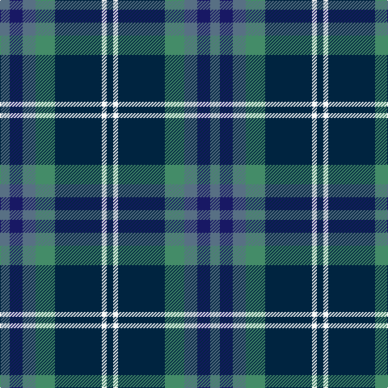

In pattern [BBBGBWB](/patterns/bbbgbwb/).

This was sourced from tartans-authority.  It is a [7 stripes tartan](/stripes/stripes7/).

Original link http://www.tartansauthority.com/tartan-ferret/display/10140/

## Thread count
B/12 DB16 B16 G24 DN58 W6 DN/8

## Palette
Each colour and its ΔE from the base-6 reference it is a variant of.

| Colour | Shade | Base | ΔE (OKLab) |
|---|---|---|---|
| B | <code style="background-color:#587084;">#587084</code> `#587084` | B <code style="background-color:#2C4084;">#2C4084</code> | 0.16 |
| DB | <code style="background-color:#181864;">#181864</code> `#181864` | B <code style="background-color:#2C4084;">#2C4084</code> | 0.12 |
| DN | <code style="background-color:#002440;">#002440</code> `#002440` | B <code style="background-color:#2C4084;">#2C4084</code> | 0.15 |
| G | <code style="background-color:#448C68;">#448C68</code> `#448C68` | G <code style="background-color:#006400;">#006400</code> | 0.16 |
| W | <code style="background-color:#F8F8F8;">#F8F8F8</code> `#F8F8F8` | W <code style="background-color:#F4F4F0;">#F4F4F0</code> | 0.01 |

# Sample pattern

ID: /setts/s7/b12ba16b16g24bb58w6bb8-b587084-ba181864-bb002440-g448c68-wf8f8f8/
