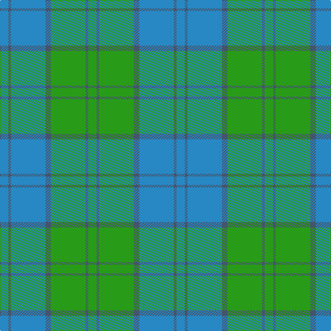

In pattern [BBBBGBG](/patterns/bbbbgbg/).

This was sourced from tartans-authority.  It is a [7 stripes tartan](/stripes/stripes7/).

Original link http://www.tartansauthority.com/tartan-ferret/display/8189/

## Thread count
B/12 Na4 B50 Na8 G50 N4 G/12

## Palette
Each colour and its ΔE from the base-6 reference it is a variant of.

| Colour | Shade | Base | ΔE (OKLab) |
|---|---|---|---|
| B | <code style="background-color:#2888C4;">#2888C4</code> `#2888C4` | B <code style="background-color:#2A418A;">#2A418A</code> | 0.21 |
| G | <code style="background-color:#289C18;">#289C18</code> `#289C18` | G <code style="background-color:#006100;">#006100</code> | 0.19 |
| N | <code style="background-color:#44546C;">#44546C</code> `#44546C` | B <code style="background-color:#2A418A;">#2A418A</code> | 0.09 |
| Na | <code style="background-color:#44546C;">#44546C</code> `#44546C` | B <code style="background-color:#2A418A;">#2A418A</code> | 0.09 |

# Sample pattern

## Nearest tartans

The nearest existing variants by ΔTartan distance.

1. [Bermuda (1986)](/setts/s5/b16w8g68b68y8-b2888c4-g009468-wfcfcfc-yd87c00/) — ΔT 1.48
1. [Universal Ancient](/setts/s8/b24g4b4g4b4ga16gb16ga2-b3c82af-g005020-ga503c14-gb309c18/) — ΔT 1.48
1. [Holmes (Clan?)](/setts/s8/g60k6g6k6g12b64g6b6-b1474b4-g289c18-k101010/) — ΔT 1.49
1. [Irvine of Drum](/setts/s8/b6k6b42g98b42k6b6w6-b5c8ca8-g408060-k101010-wfcfcfc/) — ΔT 1.50
1. [Milligan](/setts/s6/b104g42b12g32k8g32-b1870a4-g289c18-k101010/) — ΔT 1.51
1. [Universal Ancient International Tartan Tartan Number: 136. Earliest known date: Canada This design is different in warp and weft. The display gives the general appearance only. Produced to celebrate American tourism is Scotland. The colours are taken from the flags of the two nations and the Atlantic Ocean that separates them. See products available Copyright © Blair Urquhart, Comrie, 2015](/setts/s8/b24g4b4g4b4ga16gb16ga2-b5c8ca8-g006818-ga604000-gb289c18/) — ΔT 1.52
1. [Unidentified 1](/setts/s7/b8g6b4g38ba48g2ba4-b304080-ba5480b0-g008000/) — ΔT 1.52
1. [Unnamed, No 17](/setts/s7/g20b4g4b12ba10b2ba4-b304080-ba5480b0-g008000/) — ΔT 1.63
1. [Yarmouth NS (District)](/setts/s12/y4b4y2b36g4b20g20b4g36ya2g4ya4-b2888c4-g5c6428-ya08858-yafccc00/) — ΔT 1.69
1. [Valley of the Green (The ) Canadian Tartan Tartan Number: 148. Earliest known date: 1968 Specimen from Miss K Sinclair 1968 See products available Copyright © Blair Urquhart, Comrie, 2015](/setts/s7/b8g52ga16b16ga16gb6b4-b5c8ca8-g003820-ga006818-gb289c18/) — ΔT 1.69

## Neighbour map

Every grey dot is one of 15726 variants placed by the first two principal components of the ΔTartan feature space (44% of its variance). Red is this tartan; blue dots are its nearest — click one to open its page.

<svg viewBox="0 0 640 380" role="img" style="max-width:100%;height:auto;border:1px solid #e0e0e0;border-radius:4px;display:block" xmlns="http://www.w3.org/2000/svg"><image href="/nn/cloud.v1.png" width="640" height="380"/><a href="/setts/s5/b16w8g68b68y8-b2888c4-g009468-wfcfcfc-yd87c00/"><circle cx="332.0" cy="257.0" r="4" fill="#3465a4"><title>Bermuda (1986)</title></circle></a><a href="/setts/s8/b24g4b4g4b4ga16gb16ga2-b3c82af-g005020-ga503c14-gb309c18/"><circle cx="250.7" cy="212.8" r="4" fill="#3465a4"><title>Universal Ancient</title></circle></a><a href="/setts/s8/g60k6g6k6g12b64g6b6-b1474b4-g289c18-k101010/"><circle cx="289.6" cy="189.1" r="4" fill="#3465a4"><title>Holmes (Clan?)</title></circle></a><a href="/setts/s8/b6k6b42g98b42k6b6w6-b5c8ca8-g408060-k101010-wfcfcfc/"><circle cx="363.3" cy="192.4" r="4" fill="#3465a4"><title>Irvine of Drum</title></circle></a><a href="/setts/s6/b104g42b12g32k8g32-b1870a4-g289c18-k101010/"><circle cx="351.0" cy="242.7" r="4" fill="#3465a4"><title>Milligan</title></circle></a><a href="/setts/s8/b24g4b4g4b4ga16gb16ga2-b5c8ca8-g006818-ga604000-gb289c18/"><circle cx="261.5" cy="215.0" r="4" fill="#3465a4"><title>Universal Ancient International Tartan Tartan Number: 136. Earliest known date: Canada This design is different in warp and weft. The display gives the general appearance only. Produced to celebrate American tourism is Scotland. The colours are taken from the flags of the two nations and the Atlantic Ocean that separates them. See products available Copyright © Blair Urquhart, Comrie, 2015</title></circle></a><a href="/setts/s7/b8g6b4g38ba48g2ba4-b304080-ba5480b0-g008000/"><circle cx="382.7" cy="199.5" r="4" fill="#3465a4"><title>Unidentified 1</title></circle></a><a href="/setts/s7/g20b4g4b12ba10b2ba4-b304080-ba5480b0-g008000/"><circle cx="273.4" cy="252.0" r="4" fill="#3465a4"><title>Unnamed, No 17</title></circle></a><a href="/setts/s12/y4b4y2b36g4b20g20b4g36ya2g4ya4-b2888c4-g5c6428-ya08858-yafccc00/"><circle cx="338.5" cy="169.1" r="4" fill="#3465a4"><title>Yarmouth NS (District)</title></circle></a><a href="/setts/s7/b8g52ga16b16ga16gb6b4-b5c8ca8-g003820-ga006818-gb289c18/"><circle cx="274.6" cy="217.3" r="4" fill="#3465a4"><title>Valley of the Green (The ) Canadian Tartan Tartan Number: 148. Earliest known date: 1968 Specimen from Miss K Sinclair 1968 See products available Copyright © Blair Urquhart, Comrie, 2015</title></circle></a><circle cx="310.5" cy="215.7" r="5" fill="#c00000"/></svg>

ID: /setts/s7/b12ba4b50ba8g50ba4g12-b2888c4-ba44546c-g289c18/
