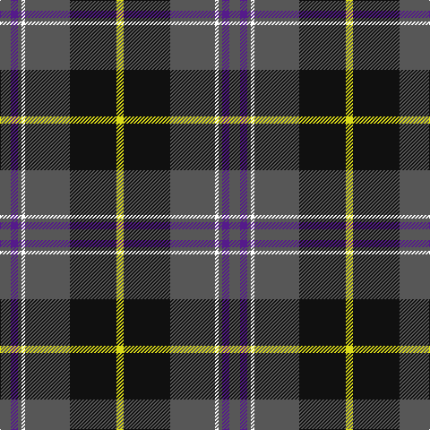

In pattern [BBBWBKY](/patterns/bbbwbky/).

This was sourced from register-of-tartans.  It is a [7 stripes tartan](/stripes/stripes7/).

Original link https://www.tartanregister.gov.uk/tartanDetails.aspx?ref=3123

## Thread count
N/12 P8 N4 W4 N50 K52 Y/8

## Palette
Each colour and its ΔE from the base-6 reference it is a variant of.

| Colour | Shade | Base | ΔE (OKLab) |
|---|---|---|---|
| K | <code style="background-color:#101010;">#101010</code> `#101010` | K <code style="background-color:#000000;">#000000</code> | 0.17 |
| N | <code style="background-color:#575757;">#575757</code> `#575757` | B <code style="background-color:#2C4084;">#2C4084</code> | 0.13 |
| P | <code style="background-color:#551A8B;">#551A8B</code> `#551A8B` | B <code style="background-color:#2C4084;">#2C4084</code> | 0.10 |
| W | <code style="background-color:#FFFFFF;">#FFFFFF</code> `#FFFFFF` | W <code style="background-color:#F4F4F0;">#F4F4F0</code> | 0.03 |
| Y | <code style="background-color:#D9D919;">#D9D919</code> `#D9D919` | Y <code style="background-color:#E8C000;">#E8C000</code> | 0.06 |

# Sample pattern

ID: /setts/s7/b12ba8b4w4b50k52y8-b575757-ba551a8b-k101010-wffffff-yd9d919/
