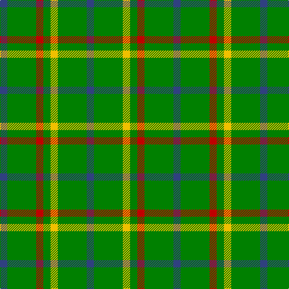

In pattern [BGRGYGB](/patterns/bgrgygb/).

This was sourced from weddslist.  It is a [7 stripes tartan](/stripes/stripes7/).

Original link http://www.weddslist.com/cgi-bin/tartans/pg.pl?source=sts

## Thread count
B/12 G48 R12 G12 Y12 G48 B/12

## Palette
Each colour and its ΔE from the base-6 reference it is a variant of.

| Colour | Shade | Base | ΔE (OKLab) |
|---|---|---|---|
| B | <code style="background-color:#304080;">#304080</code> `#304080` | B <code style="background-color:#2A418A;">#2A418A</code> | 0.02 |
| G | <code style="background-color:#008000;">#008000</code> `#008000` | G <code style="background-color:#006100;">#006100</code> | 0.10 |
| R | <code style="background-color:#C00000;">#C00000</code> `#C00000` | R <code style="background-color:#CC0000;">#CC0000</code> | 0.03 |
| Y | <code style="background-color:#F0C000;">#F0C000</code> `#F0C000` | Y <code style="background-color:#F2BF00;">#F2BF00</code> | 0.00 |

# Sample pattern

## Nearest tartans

The nearest existing variants by ΔTartan distance.

1. [Meath County Crest (Fashion)](/setts/s6/y21g28b24g72w16g20-b2c2c80-g006818-we0e0e0-ybc8c00/) — ΔT 1.03
1. [Ayrton, Laoch](/setts/s10/r4g24y4g24b4g4b4g4b8r4-b304080-g008000-rc00000-yf0c000/) — ΔT 1.25
1. [Justus Hunting (Personal)](/setts/s7/b12g48r12g12y12g48b12-b1c0070-g285800-r880000-yd09800/) — ΔT 1.40
1. [Ayrton Laoch Family Tartan Tartan Number: 1330. Earliest known date: 1982 The weaving and wearing of this tartan is 'Restricted'. This is not a legal definition and is applied by the Scottish Tartans Society irrespective of Design Patent or Copyright, in the spirit of a gentlemans agreement. Interested parties should contact the person listed under 'Source:' in this document. See products available Copyright © Blair Urquhart, Comrie, 2015](/setts/s10/r4g24y4g24b4g4b4g4b8r4-b2c2c80-g006818-rc80000-ye8c000/) — ΔT 1.61
1. [Ayrton of Laoch (Personal)](/setts/s10/r4g24y4g24b6g4b4g4b8r4-b2c2c80-g006818-rc80000-ye8c000/) — ΔT 1.67
1. [MacKintosh, hunting](/setts/s7/b2r6g22r4b10g22y2-b304080-g008000-rc00000-yf0c000/) — ΔT 1.73
1. [McGrane (2014)](/setts/s12/g26ga14g26ga4g26ga4g26ga4w6y8w6g8-g408060-ga603800-wfcfcfc-yfccc00/) — ΔT 1.74
1. [Campbell-Simpson (Personal)](/setts/s6/g48k8g8ga36g16k8-g289c18-ga285800-k101010/) — ΔT 1.77
1. [Hanby (Personal)](/setts/s8/g42y20g40k6g20r6g20w6-g00643c-k101010-rbc1828-we0e0e0-ye8c000/) — ΔT 1.78
1. [McGrane (2014)](/setts/s12/g26b14g26b4g26b4g26b4w6y8w6g8-b4c3428-g408060-wf8f4d0-ye0a126/) — ΔT 1.79

## Neighbour map

Every grey dot is one of 15726 variants placed by the first two principal components of the ΔTartan feature space (44% of its variance). Red is this tartan; blue dots are its nearest — click one to open its page.

<svg viewBox="0 0 640 380" role="img" style="max-width:100%;height:auto;border:1px solid #e0e0e0;border-radius:4px;display:block" xmlns="http://www.w3.org/2000/svg"><image href="/nn/cloud.v1.png" width="640" height="380"/><a href="/setts/s6/y21g28b24g72w16g20-b2c2c80-g006818-we0e0e0-ybc8c00/"><circle cx="307.5" cy="268.3" r="4" fill="#3465a4"><title>Meath County Crest (Fashion)</title></circle></a><a href="/setts/s10/r4g24y4g24b4g4b4g4b8r4-b304080-g008000-rc00000-yf0c000/"><circle cx="354.3" cy="215.3" r="4" fill="#3465a4"><title>Ayrton, Laoch</title></circle></a><a href="/setts/s7/b12g48r12g12y12g48b12-b1c0070-g285800-r880000-yd09800/"><circle cx="360.1" cy="268.2" r="4" fill="#3465a4"><title>Justus Hunting (Personal)</title></circle></a><a href="/setts/s10/r4g24y4g24b4g4b4g4b8r4-b2c2c80-g006818-rc80000-ye8c000/"><circle cx="356.9" cy="216.4" r="4" fill="#3465a4"><title>Ayrton Laoch Family Tartan Tartan Number: 1330. Earliest known date: 1982 The weaving and wearing of this tartan is 'Restricted'. This is not a legal definition and is applied by the Scottish Tartans Society irrespective of Design Patent or Copyright, in the spirit of a gentlemans agreement. Interested parties should contact the person listed under 'Source:' in this document. See products available Copyright © Blair Urquhart, Comrie, 2015</title></circle></a><a href="/setts/s10/r4g24y4g24b6g4b4g4b8r4-b2c2c80-g006818-rc80000-ye8c000/"><circle cx="343.7" cy="218.1" r="4" fill="#3465a4"><title>Ayrton of Laoch (Personal)</title></circle></a><a href="/setts/s7/b2r6g22r4b10g22y2-b304080-g008000-rc00000-yf0c000/"><circle cx="364.2" cy="214.8" r="4" fill="#3465a4"><title>MacKintosh, hunting</title></circle></a><a href="/setts/s12/g26ga14g26ga4g26ga4g26ga4w6y8w6g8-g408060-ga603800-wfcfcfc-yfccc00/"><circle cx="362.7" cy="218.5" r="4" fill="#3465a4"><title>McGrane (2014)</title></circle></a><a href="/setts/s6/g48k8g8ga36g16k8-g289c18-ga285800-k101010/"><circle cx="317.6" cy="270.4" r="4" fill="#3465a4"><title>Campbell-Simpson (Personal)</title></circle></a><a href="/setts/s8/g42y20g40k6g20r6g20w6-g00643c-k101010-rbc1828-we0e0e0-ye8c000/"><circle cx="383.8" cy="223.8" r="4" fill="#3465a4"><title>Hanby (Personal)</title></circle></a><a href="/setts/s12/g26b14g26b4g26b4g26b4w6y8w6g8-b4c3428-g408060-wf8f4d0-ye0a126/"><circle cx="371.8" cy="223.2" r="4" fill="#3465a4"><title>McGrane (2014)</title></circle></a><circle cx="345.2" cy="262.3" r="5" fill="#c00000"/></svg>

ID: /setts/s7/b12g48r12g12y12g48b12-b304080-g008000-rc00000-yf0c000/
