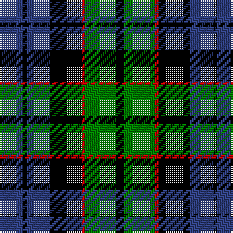

In pattern [BKBKRGK](/patterns/bkbkrgk/).

This was sourced from weddslist.  It is a [7 stripes tartan](/stripes/stripes7/).

Original link http://www.weddslist.com/cgi-bin/tartans/pg.pl?source=sts

## Thread count
B/12 K2 B12 K16 R2 G16 K/4

## Palette
Each colour and its ΔE from the base-6 reference it is a variant of.

| Colour | Shade | Base | ΔE (OKLab) |
|---|---|---|---|
| B | <code style="background-color:#304080;">#304080</code> `#304080` | B <code style="background-color:#2C4084;">#2C4084</code> | 0.01 |
| G | <code style="background-color:#008000;">#008000</code> `#008000` | G <code style="background-color:#006400;">#006400</code> | 0.09 |
| K | <code style="background-color:#000000;">#000000</code> `#000000` | K <code style="background-color:#000000;">#000000</code> | 0.00 |
| R | <code style="background-color:#C00000;">#C00000</code> `#C00000` | R <code style="background-color:#C80000;">#C80000</code> | 0.02 |

# Sample pattern

## Nearest tartans

The nearest existing variants by ΔTartan distance.

1. [Fletcher of Dunans](/setts/s7/b12k2b12k16r2g16r4-b304080-g008000-k000000-rc00000/) — ΔT 0.48
1. [Fletcher #2](/setts/s7/b20k6b20k28r4g28k8-b1474b4-g007800-k000000-rc80000/) — ΔT 0.64
1. [Unnamed, No 115](/setts/s8/b20k12ba2g12k2g12ba2k12-b304080-ba5480b0-g008000-k000000/) — ΔT 0.70
1. [Murray](/setts/s6/b4k4b24k16g22r4-b304080-g008000-k000000-rc00000/) — ΔT 0.71
1. [Morrison](/setts/s6/k6g28k28g4b28r6-b304080-g008000-k000000-rc00000/) — ΔT 0.71
1. [Scottish Airports](/setts/s6/b8g36b6k34b36ba8-b102040-ba800070-g008000-k000000/) — ΔT 0.74
1. [Melville](/setts/s6/k5w2g18k17b16k3-b5a3094-g004c00-k000000-wd0d0d0/) — ΔT 0.77
1. [Ferguson](/setts/s6/g8b48r6k48g50k8-b304080-g008000-k000000-rc00000/) — ΔT 0.78
1. [Graham W](/setts/s6/g21w2g4k17b14k3-b5a3094-g004c00-k000000-wd0d0d0/) — ΔT 0.78
1. [Reid Taylor, "House Check"](/setts/s7/b4k2r2b18k18g20k4-b304080-g008000-k000000-rc00000/) — ΔT 0.79

## Neighbour map

Every grey dot is one of 15726 variants placed by the first two principal components of the ΔTartan feature space (44% of its variance). Red is this tartan; blue dots are its nearest — click one to open its page.

<svg viewBox="0 0 640 380" role="img" style="max-width:100%;height:auto;border:1px solid #e0e0e0;border-radius:4px;display:block" xmlns="http://www.w3.org/2000/svg"><image href="/nn/cloud.v1.png" width="640" height="380"/><a href="/setts/s7/b12k2b12k16r2g16r4-b304080-g008000-k000000-rc00000/"><circle cx="144.1" cy="226.6" r="4" fill="#3465a4"><title>Fletcher of Dunans</title></circle></a><a href="/setts/s7/b20k6b20k28r4g28k8-b1474b4-g007800-k000000-rc80000/"><circle cx="128.4" cy="237.6" r="4" fill="#3465a4"><title>Fletcher #2</title></circle></a><a href="/setts/s8/b20k12ba2g12k2g12ba2k12-b304080-ba5480b0-g008000-k000000/"><circle cx="142.4" cy="213.3" r="4" fill="#3465a4"><title>Unnamed, No 115</title></circle></a><a href="/setts/s6/b4k4b24k16g22r4-b304080-g008000-k000000-rc00000/"><circle cx="149.3" cy="238.9" r="4" fill="#3465a4"><title>Murray</title></circle></a><a href="/setts/s6/k6g28k28g4b28r6-b304080-g008000-k000000-rc00000/"><circle cx="133.8" cy="234.5" r="4" fill="#3465a4"><title>Morrison</title></circle></a><a href="/setts/s6/b8g36b6k34b36ba8-b102040-ba800070-g008000-k000000/"><circle cx="159.1" cy="250.6" r="4" fill="#3465a4"><title>Scottish Airports</title></circle></a><a href="/setts/s6/k5w2g18k17b16k3-b5a3094-g004c00-k000000-wd0d0d0/"><circle cx="184.3" cy="230.2" r="4" fill="#3465a4"><title>Melville</title></circle></a><a href="/setts/s6/g8b48r6k48g50k8-b304080-g008000-k000000-rc00000/"><circle cx="151.5" cy="224.2" r="4" fill="#3465a4"><title>Ferguson</title></circle></a><a href="/setts/s6/g21w2g4k17b14k3-b5a3094-g004c00-k000000-wd0d0d0/"><circle cx="197.4" cy="220.6" r="4" fill="#3465a4"><title>Graham W</title></circle></a><a href="/setts/s7/b4k2r2b18k18g20k4-b304080-g008000-k000000-rc00000/"><circle cx="166.1" cy="206.3" r="4" fill="#3465a4"><title>Reid Taylor, &quot;House Check&quot;</title></circle></a><circle cx="154.8" cy="230.8" r="5" fill="#c00000"/></svg>

ID: /setts/s7/b12k2b12k16r2g16k4-b304080-g008000-k000000-rc00000/
