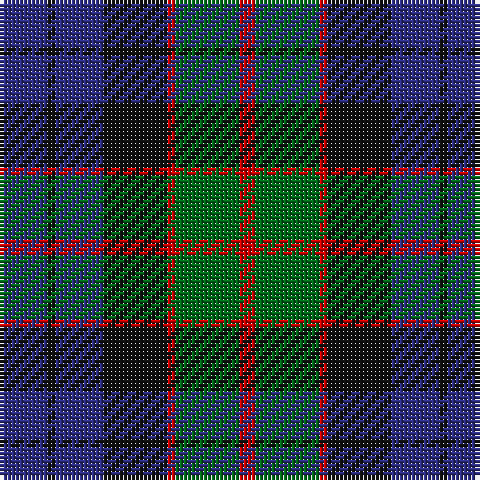

In pattern [BKBKRGR](/patterns/bkbkrgr/).

This was sourced from house-of-tartan.  It is a [7 stripes tartan](/stripes/stripes7/).

Original link http://www.house-of-tartan.scotland.net/house/TartanViewjs.asp?colr=Def&tnam=272

## Thread count
DB/12 K2 DB12 K16 R2 G16 R/4

## Palette
Each colour and its ΔE from the base-6 reference it is a variant of.

| Colour | Shade | Base | ΔE (OKLab) |
|---|---|---|---|
| DB | <code style="background-color:#2C2C80;">#2C2C80</code> `#2C2C80` | B <code style="background-color:#2A418A;">#2A418A</code> | 0.06 |
| G | <code style="background-color:#006818;">#006818</code> `#006818` | G <code style="background-color:#006100;">#006100</code> | 0.02 |
| K | <code style="background-color:#101010;">#101010</code> `#101010` | K <code style="background-color:#000000;">#000000</code> | 0.17 |
| R | <code style="background-color:#C80000;">#C80000</code> `#C80000` | R <code style="background-color:#CC0000;">#CC0000</code> | 0.01 |

# Sample pattern

## Nearest tartans

The nearest existing variants by ΔTartan distance.

1. [Fletcher Clan Tartan Tartan Number: 257. Earliest known date: 1906 Sometimes known as Fletcher of Saltoun, but commonly worn by all the Scottish Fletchers regardless family origins. According to legend, "Is e Clann-an-leisdeir a thog a cued smuid thug goil air uisge 'an Urcha." (It was the Fletcher clan that first raised smoke and boiled their water in Glen Orchy.) See products available Copyright © Blair Urquhart, Comrie, 2015](/setts/s7/b12k2b12k16r2g16k4-b2c2c80-g006818-k101010-rc80000/) — ΔT 0.57
1. [Alexander Hunting (Name)](/setts/s9/b24r4b8r8k30b8g8b4g24-b2c2c80-g006818-k101010-rc80000/) — ΔT 0.62
1. [Wilson's No.100](/setts/s6/g6b34k36y4g34k6-b5a008c-g005020-k101010-ye8c000/) — ΔT 0.67
1. [Morrison Clan Tartan Tartan Number: 1083. Earliest known date: 1908 The Clan Morrison have strong links with the MacKays and this is evident in the similarity of the tartans. Morrison has an added red stripe. Lord Lyon recorded a new sett in 1968 based on a fragment of Morrison tartan dated 1747. See products available Copyright © Blair Urquhart, Comrie, 2015](/setts/s6/k6g28k28g4b28r6-b2c2c80-g006818-k101010-rc80000/) — ΔT 0.69
1. [Murray (Variation) Clan Tartan Tartan Number: 271. Earliest known date: 1810-15 A simplified version of the Murray of Atholl. The Cockburn collection housed in the Mitchell Library in Glasgow, is one of the earliest references for clan tartans. James Logan, in his book, The Scottish Gael (1831), wrote concerning the Black Watch, that "...a red stripe is often introduced", and this by Lord Murray who commanded the regiment. See products available Copyright © Blair Urquhart, Comrie, 2015](/setts/s6/b4k4b24k16g22r4-b2c2c80-g006818-k101010-rc80000/) — ΔT 0.70
1. [Gallamore](/setts/s6/k6b28r4k28g28k6-b2c2c80-g006818-k101010-rc80000/) — ΔT 0.71
1. [Unnamed 19th Century Plaid](/setts/s7/g32b4g4k24ba24k4ba12-b5c8ca8-ba440044-g006818-k101010/) — ΔT 0.74
1. [Blair Clan Tartan Tartan Number: 416. Earliest known date: pre 1963 Described by MacKinlay as a "Modern family sett". See products available Copyright © Blair Urquhart, Comrie, 2015](/setts/s7/b12r4b40k32g40r4g12-b2c2c80-g006818-k101010-rc80000/) — ΔT 0.74
1. [Baird (Modern)](/setts/s8/b12k8b32k32g32ba4g4ba12-b2c2c80-ba780078-g006818-k101010/) — ΔT 0.77
1. [Baird Clan Tartan Tartan Number: 104. Earliest known date: 1906 This tartan is first recorded in Johnston's work of 1906, and the sample from the Highland Society of London probably dates from the same period. In both these early references the triple stripes are rendered in red. Today, however, they are generally woven in purple. The name originates from 'bard' meaning poet. The Bairds owned estates in Aberdeenshire which were later purchased by the Gordons. See products available Copyright © Blair Urquhart, Comrie, 2015](/setts/s8/b6k4b16k16g16ba2g2ba6-b2c2c80-ba780078-g006818-k101010/) — ΔT 0.77

## Neighbour map

Every grey dot is one of 15726 variants placed by the first two principal components of the ΔTartan feature space (44% of its variance). Red is this tartan; blue dots are its nearest — click one to open its page.

<svg viewBox="0 0 640 380" role="img" style="max-width:100%;height:auto;border:1px solid #e0e0e0;border-radius:4px;display:block" xmlns="http://www.w3.org/2000/svg"><image href="/nn/cloud.v1.png" width="640" height="380"/><a href="/setts/s7/b12k2b12k16r2g16k4-b2c2c80-g006818-k101010-rc80000/"><circle cx="206.3" cy="251.2" r="4" fill="#3465a4"><title>Fletcher Clan Tartan Tartan Number: 257. Earliest known date: 1906 Sometimes known as Fletcher of Saltoun, but commonly worn by all the Scottish Fletchers regardless family origins. According to legend, &quot;Is e Clann-an-leisdeir a thog a cued smuid thug goil air uisge 'an Urcha.&quot; (It was the Fletcher clan that first raised smoke and boiled their water in Glen Orchy.) See products available Copyright © Blair Urquhart, Comrie, 2015</title></circle></a><a href="/setts/s9/b24r4b8r8k30b8g8b4g24-b2c2c80-g006818-k101010-rc80000/"><circle cx="181.2" cy="225.5" r="4" fill="#3465a4"><title>Alexander Hunting (Name)</title></circle></a><a href="/setts/s6/g6b34k36y4g34k6-b5a008c-g005020-k101010-ye8c000/"><circle cx="200.9" cy="235.4" r="4" fill="#3465a4"><title>Wilson's No.100</title></circle></a><a href="/setts/s6/k6g28k28g4b28r6-b2c2c80-g006818-k101010-rc80000/"><circle cx="179.8" cy="252.3" r="4" fill="#3465a4"><title>Morrison Clan Tartan Tartan Number: 1083. Earliest known date: 1908 The Clan Morrison have strong links with the MacKays and this is evident in the similarity of the tartans. Morrison has an added red stripe. Lord Lyon recorded a new sett in 1968 based on a fragment of Morrison tartan dated 1747. See products available Copyright © Blair Urquhart, Comrie, 2015</title></circle></a><a href="/setts/s6/b4k4b24k16g22r4-b2c2c80-g006818-k101010-rc80000/"><circle cx="194.7" cy="257.1" r="4" fill="#3465a4"><title>Murray (Variation) Clan Tartan Tartan Number: 271. Earliest known date: 1810-15 A simplified version of the Murray of Atholl. The Cockburn collection housed in the Mitchell Library in Glasgow, is one of the earliest references for clan tartans. James Logan, in his book, The Scottish Gael (1831), wrote concerning the Black Watch, that &quot;...a red stripe is often introduced&quot;, and this by Lord Murray who commanded the regiment. See products available Copyright © Blair Urquhart, Comrie, 2015</title></circle></a><a href="/setts/s6/k6b28r4k28g28k6-b2c2c80-g006818-k101010-rc80000/"><circle cx="211.1" cy="256.0" r="4" fill="#3465a4"><title>Gallamore</title></circle></a><a href="/setts/s7/g32b4g4k24ba24k4ba12-b5c8ca8-ba440044-g006818-k101010/"><circle cx="199.8" cy="237.4" r="4" fill="#3465a4"><title>Unnamed 19th Century Plaid</title></circle></a><a href="/setts/s7/b12r4b40k32g40r4g12-b2c2c80-g006818-k101010-rc80000/"><circle cx="206.9" cy="229.5" r="4" fill="#3465a4"><title>Blair Clan Tartan Tartan Number: 416. Earliest known date: pre 1963 Described by MacKinlay as a &quot;Modern family sett&quot;. See products available Copyright © Blair Urquhart, Comrie, 2015</title></circle></a><a href="/setts/s8/b12k8b32k32g32ba4g4ba12-b2c2c80-ba780078-g006818-k101010/"><circle cx="177.0" cy="236.5" r="4" fill="#3465a4"><title>Baird (Modern)</title></circle></a><a href="/setts/s8/b6k4b16k16g16ba2g2ba6-b2c2c80-ba780078-g006818-k101010/"><circle cx="177.0" cy="236.5" r="4" fill="#3465a4"><title>Baird Clan Tartan Tartan Number: 104. Earliest known date: 1906 This tartan is first recorded in Johnston's work of 1906, and the sample from the Highland Society of London probably dates from the same period. In both these early references the triple stripes are rendered in red. Today, however, they are generally woven in purple. The name originates from 'bard' meaning poet. The Bairds owned estates in Aberdeenshire which were later purchased by the Gordons. See products available Copyright © Blair Urquhart, Comrie, 2015</title></circle></a><circle cx="185.1" cy="242.7" r="5" fill="#c00000"/></svg>

ID: /setts/s7/b12k2b12k16r2g16r4-b2c2c80-g006818-k101010-rc80000/
