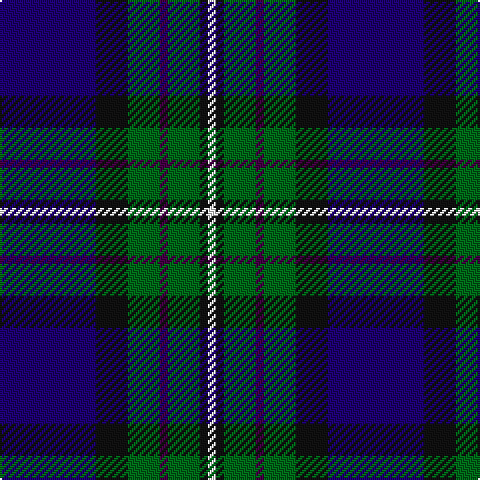

In pattern [BKGBGKW](/patterns/bkgbgkw/).

This was sourced from tartans-authority.  It is a [7 stripes tartan](/stripes/stripes7/).

Original link http://www.tartansauthority.com/tartan-ferret/display/5686/

## Thread count
DB/48 K16 G16 DP4 G16 K4 W/4

## Palette
Each colour and its ΔE from the base-6 reference it is a variant of.

| Colour | Shade | Base | ΔE (OKLab) |
|---|---|---|---|
| DB | <code style="background-color:#1C0070;">#1C0070</code> `#1C0070` | B <code style="background-color:#2A418A;">#2A418A</code> | 0.14 |
| DP | <code style="background-color:#440044;">#440044</code> `#440044` | B <code style="background-color:#2A418A;">#2A418A</code> | 0.18 |
| G | <code style="background-color:#006818;">#006818</code> `#006818` | G <code style="background-color:#006100;">#006100</code> | 0.02 |
| K | <code style="background-color:#101010;">#101010</code> `#101010` | K <code style="background-color:#000000;">#000000</code> | 0.17 |
| W | <code style="background-color:#FCFCFC;">#FCFCFC</code> `#FCFCFC` | W <code style="background-color:#F7F7F7;">#F7F7F7</code> | 0.01 |

# Sample pattern

## Nearest tartans

The nearest existing variants by ΔTartan distance.

1. [Leslie, Hebridean](/setts/s6/k6g15w2b22r2k4x2~b2c2c80-g006818-k101010-re87878-we0e0e0/) — ΔT 0.71
1. [Miller](/setts/s8/r2b6g15ba9b30ba9g6y2x2~b000050-ba1474b4-g146400-r8c0000-yc88c00/) — ΔT 0.78
1. [New England (Fashion)](/setts/s6/k2w1k12g5b11r1x2~b2c2c80-g006818-k101010-rc80000-we0e0e0/) — ΔT 0.79
1. [MacLaren](/setts/s7/b12k4g4r1g4k1y1x4~b2c2c80-g408060-k101010-rc80000-yd09800/) — ΔT 0.82
1. [Wishart Htg (Clan)](/setts/s7/k7b4g31b3y2b27w4x2~b2c2c80-g004c00-k000000-wc8c8c8-ye8c000/) — ΔT 0.86
1. [MacPhail Hunting Clan Tartan Tartan Number: 1367. Earliest known date: 1880 In Clans Originaux as 'Macphail'. with this thread count: R8 B48 K24 G28 K8 LN6. (Does not divide by 4) This sample shown here comes from the MacGregor-Hastie collection which forms the basis of the cloth archive of the Scottish Tartans Society. See products available Copyright © Blair Urquhart, Comrie, 2015](/setts/s6/r2b23k14g16k2w2x2~b2c2c80-g006818-k101010-rc80000-we0e0e0/) — ΔT 0.88
1. [Dickson (Kirkcudbrightshire) (Name)](/setts/s7/b6ba8b8g12bb29w3bb4x2~b587084-ba181864-bb002440-g448c68-wf8f8f8/) — ΔT 0.90
1. [Paterson Blue (Personal)](/setts/s6/b22w2k10g11r3g4x2~b2c2c80-g006818-k101010-rc80000-we0e0e0/) — ΔT 0.90
1. [MacLeod Small Clan Tartan Tartan Number: 15833. Earliest known date: See products available Copyright © Blair Urquhart, Comrie, 2015](/setts/s7/r1k1g7k5b10k1y1x2~b2c2c80-g006818-k101010-rc80000-ye8c000/) — ΔT 0.95
1. [U.S.I. Limited](/setts/s11/k20b2ba2b4g20w2k16b7ba2k3ba5x2~b5a5a82-ba3c82af-g005020-k000028-we0e0e0/) — ΔT 1.02

## Neighbour map

Every grey dot is one of 15726 variants placed by the first two principal components of the ΔTartan feature space (44% of its variance). Red is this tartan; blue dots are its nearest — click one to open its page.

<svg viewBox="0 0 640 380" role="img" style="max-width:100%;height:auto;border:1px solid #e0e0e0;border-radius:4px;display:block" xmlns="http://www.w3.org/2000/svg"><image href="/nn/cloud.v1.png" width="640" height="380"/><a href="/setts/s6/k6g15w2b22r2k4x2~b2c2c80-g006818-k101010-re87878-we0e0e0/"><circle cx="211.2" cy="194.7" r="4" fill="#3465a4"><title>Leslie, Hebridean</title></circle></a><a href="/setts/s8/r2b6g15ba9b30ba9g6y2x2~b000050-ba1474b4-g146400-r8c0000-yc88c00/"><circle cx="226.1" cy="177.0" r="4" fill="#3465a4"><title>Miller</title></circle></a><a href="/setts/s6/k2w1k12g5b11r1x2~b2c2c80-g006818-k101010-rc80000-we0e0e0/"><circle cx="235.3" cy="200.0" r="4" fill="#3465a4"><title>New England (Fashion)</title></circle></a><a href="/setts/s7/b12k4g4r1g4k1y1x4~b2c2c80-g408060-k101010-rc80000-yd09800/"><circle cx="233.7" cy="183.1" r="4" fill="#3465a4"><title>MacLaren</title></circle></a><a href="/setts/s7/k7b4g31b3y2b27w4x2~b2c2c80-g004c00-k000000-wc8c8c8-ye8c000/"><circle cx="243.3" cy="166.8" r="4" fill="#3465a4"><title>Wishart Htg (Clan)</title></circle></a><a href="/setts/s6/r2b23k14g16k2w2x2~b2c2c80-g006818-k101010-rc80000-we0e0e0/"><circle cx="198.2" cy="198.3" r="4" fill="#3465a4"><title>MacPhail Hunting Clan Tartan Tartan Number: 1367. Earliest known date: 1880 In Clans Originaux as 'Macphail'. with this thread count: R8 B48 K24 G28 K8 LN6. (Does not divide by 4) This sample shown here comes from the MacGregor-Hastie collection which forms the basis of the cloth archive of the Scottish Tartans Society. See products available Copyright © Blair Urquhart, Comrie, 2015</title></circle></a><a href="/setts/s7/b6ba8b8g12bb29w3bb4x2~b587084-ba181864-bb002440-g448c68-wf8f8f8/"><circle cx="209.4" cy="198.9" r="4" fill="#3465a4"><title>Dickson (Kirkcudbrightshire) (Name)</title></circle></a><a href="/setts/s6/b22w2k10g11r3g4x2~b2c2c80-g006818-k101010-rc80000-we0e0e0/"><circle cx="200.8" cy="201.7" r="4" fill="#3465a4"><title>Paterson Blue (Personal)</title></circle></a><a href="/setts/s7/r1k1g7k5b10k1y1x2~b2c2c80-g006818-k101010-rc80000-ye8c000/"><circle cx="192.9" cy="190.3" r="4" fill="#3465a4"><title>MacLeod Small Clan Tartan Tartan Number: 15833. Earliest known date: See products available Copyright © Blair Urquhart, Comrie, 2015</title></circle></a><a href="/setts/s11/k20b2ba2b4g20w2k16b7ba2k3ba5x2~b5a5a82-ba3c82af-g005020-k000028-we0e0e0/"><circle cx="206.1" cy="170.3" r="4" fill="#3465a4"><title>U.S.I. Limited</title></circle></a><circle cx="219.4" cy="182.9" r="5" fill="#c00000"/></svg>

ID: /setts/s7/b12k4g4ba1g4k1w1x4~b1c0070-ba440044-g006818-k101010-wfcfcfc/
