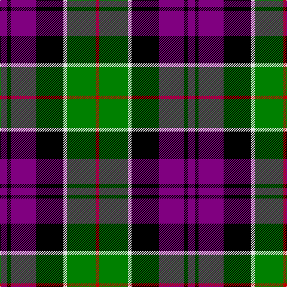

In pattern [BKBKWGR](/patterns/bkbkwgr/).

This was sourced from weddslist.  It is a [7 stripes tartan](/stripes/stripes7/).

Original link http://www.weddslist.com/cgi-bin/tartans/pg.pl?source=sts

## Thread count
P/12 K6 P42 K46 LN6 G48 R/6

## Palette
Each colour and its ΔE from the base-6 reference it is a variant of.

| Colour | Shade | Base | ΔE (OKLab) |
|---|---|---|---|
| G | <code style="background-color:#008000;">#008000</code> `#008000` | G <code style="background-color:#006100;">#006100</code> | 0.10 |
| K | <code style="background-color:#000000;">#000000</code> `#000000` | K <code style="background-color:#000000;">#000000</code> | 0.00 |
| LN | <code style="background-color:#E0E0E0;">#E0E0E0</code> `#E0E0E0` | W <code style="background-color:#F7F7F7;">#F7F7F7</code> | 0.07 |
| P | <code style="background-color:#800080;">#800080</code> `#800080` | B <code style="background-color:#2A418A;">#2A418A</code> | 0.17 |
| R | <code style="background-color:#C00000;">#C00000</code> `#C00000` | R <code style="background-color:#CC0000;">#CC0000</code> | 0.03 |

# Sample pattern

## Nearest tartans

The nearest existing variants by ΔTartan distance.

1. [Ryukoku University Heian Junior Corporate Tartan Tartan Number: 10716. Earliest known date: 12 October 2012 This tartan represents the school's hope for its students' future. It is inspired by the colours of the clouds whilst the sun is rising. Beyond the clouds there is a light of hope which is purple. See products available Copyright © Blair Urquhart, Comrie, 2015](/setts/s10/r10k30y10b18y4ba4y4ba4b18k6-b555555-ba550077-k000000-r9874ac-ybbbbbb/) — ΔT 0.90
1. [Dunbog, Primary School](/setts/s6/r24b6g10ba32y4g4-b304080-ba000050-g008000-rc00000-yf0c000/) — ΔT 0.93
1. [Ryukoku University Heian Junior High School](/setts/s10/w8k32y10b16y4ba4y4ba4b16k6-b555555-ba663399-k000000-wcc99ff-ybbbbbb/) — ΔT 0.98
1. [Colquhoun](/setts/s7/r8g32w4k32b32k4b4-b304080-g008000-k000000-rc00000-we0e0e0/) — ΔT 1.01
1. [Gordon of Esslemont](/setts/s7/y12g6y6g44k46b46k8-b800080-g008000-k000000-yf0c000/) — ΔT 1.04
1. [Baillie](/setts/s7/b6k2b16k12g16k2w4-b800080-g008000-k000000-we0e0e0/) — ΔT 1.07
1. [MacDonald of Borrodale (Clan)](/setts/s8/r12b6r6b64k60g60y6r6-b2c2c80-g006818-k000000-rc80000-ye8c000/) — ΔT 1.07
1. [Borrodale](/setts/s8/r10b6r6b58k58g58w8r8-b304080-g008000-k000000-rc00000-we0e0e0/) — ΔT 1.08
1. [Wilson's, No 76](/setts/s6/g6b34k36w4g34k6-b800080-g008000-k000000-we0e0e0/) — ΔT 1.09
1. [Argyll / MacCorquodale](/setts/s7/b4k2g16k16ba16k2r4-b5480b0-ba304080-g008000-k000000-rc00000/) — ΔT 1.10

## Neighbour map

Every grey dot is one of 15726 variants placed by the first two principal components of the ΔTartan feature space (44% of its variance). Red is this tartan; blue dots are its nearest — click one to open its page.

<svg viewBox="0 0 640 380" role="img" style="max-width:100%;height:auto;border:1px solid #e0e0e0;border-radius:4px;display:block" xmlns="http://www.w3.org/2000/svg"><image href="/nn/cloud.v1.png" width="640" height="380"/><a href="/setts/s10/r10k30y10b18y4ba4y4ba4b18k6-b555555-ba550077-k000000-r9874ac-ybbbbbb/"><circle cx="95.1" cy="174.6" r="4" fill="#3465a4"><title>Ryukoku University Heian Junior Corporate Tartan Tartan Number: 10716. Earliest known date: 12 October 2012 This tartan represents the school's hope for its students' future. It is inspired by the colours of the clouds whilst the sun is rising. Beyond the clouds there is a light of hope which is purple. See products available Copyright © Blair Urquhart, Comrie, 2015</title></circle></a><a href="/setts/s6/r24b6g10ba32y4g4-b304080-ba000050-g008000-rc00000-yf0c000/"><circle cx="157.1" cy="193.2" r="4" fill="#3465a4"><title>Dunbog, Primary School</title></circle></a><a href="/setts/s10/w8k32y10b16y4ba4y4ba4b16k6-b555555-ba663399-k000000-wcc99ff-ybbbbbb/"><circle cx="109.4" cy="166.1" r="4" fill="#3465a4"><title>Ryukoku University Heian Junior High School</title></circle></a><a href="/setts/s7/r8g32w4k32b32k4b4-b304080-g008000-k000000-rc00000-we0e0e0/"><circle cx="106.3" cy="191.3" r="4" fill="#3465a4"><title>Colquhoun</title></circle></a><a href="/setts/s7/y12g6y6g44k46b46k8-b800080-g008000-k000000-yf0c000/"><circle cx="119.3" cy="202.5" r="4" fill="#3465a4"><title>Gordon of Esslemont</title></circle></a><a href="/setts/s7/b6k2b16k12g16k2w4-b800080-g008000-k000000-we0e0e0/"><circle cx="145.7" cy="208.2" r="4" fill="#3465a4"><title>Baillie</title></circle></a><a href="/setts/s8/r12b6r6b64k60g60y6r6-b2c2c80-g006818-k000000-rc80000-ye8c000/"><circle cx="133.5" cy="165.7" r="4" fill="#3465a4"><title>MacDonald of Borrodale (Clan)</title></circle></a><a href="/setts/s8/r10b6r6b58k58g58w8r8-b304080-g008000-k000000-rc00000-we0e0e0/"><circle cx="109.5" cy="167.0" r="4" fill="#3465a4"><title>Borrodale</title></circle></a><a href="/setts/s6/g6b34k36w4g34k6-b800080-g008000-k000000-we0e0e0/"><circle cx="152.0" cy="212.7" r="4" fill="#3465a4"><title>Wilson's, No 76</title></circle></a><a href="/setts/s7/b4k2g16k16ba16k2r4-b5480b0-ba304080-g008000-k000000-rc00000/"><circle cx="107.9" cy="198.1" r="4" fill="#3465a4"><title>Argyll / MacCorquodale</title></circle></a><circle cx="118.0" cy="185.9" r="5" fill="#c00000"/></svg>

ID: /setts/s7/b12k6b42k46w6g48r6-b800080-g008000-k000000-rc00000-we0e0e0/
