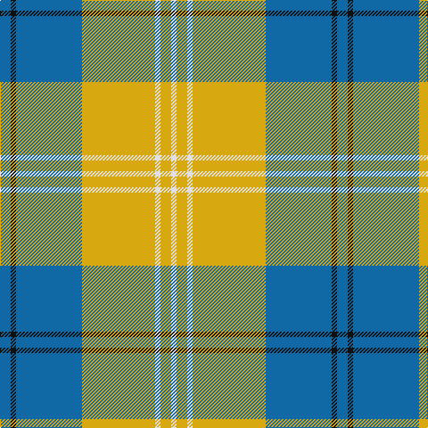

In pattern [BKBYWYW](/patterns/bkbywyw/).

This was sourced from tartans-authority.  It is a [7 stripes tartan](/stripes/stripes7/).

Original link http://www.tartansauthority.com/tartan-ferret/display/7428/

## Attestations

This cloth appears in 2 source records; the oldest owns this page.

- Aug 2007 — Tilburg Hunting (District) (tartans-authority, [record](http://www.tartansauthority.com/tartan-ferret/display/7428/))
- undated — Tilburg Hunting (register-of-tartans, [record](https://www.tartanregister.gov.uk/tartanDetails.aspx?ref=5500))

## Thread count
B/12 K6 B74 Y82 LN6 Y12 LN/6

## Palette
Each colour and its ΔE from the base-6 reference it is a variant of.

| Colour | Shade | Base | ΔE (OKLab) |
|---|---|---|---|
| B | <code style="background-color:#1068A4;">#1068A4</code> `#1068A4` | B <code style="background-color:#2C4084;">#2C4084</code> | 0.12 |
| K | <code style="background-color:#101010;">#101010</code> `#101010` | K <code style="background-color:#000000;">#000000</code> | 0.17 |
| LN | <code style="background-color:#E0E0E0;">#E0E0E0</code> `#E0E0E0` | W <code style="background-color:#F4F4F0;">#F4F4F0</code> | 0.06 |
| Y | <code style="background-color:#D8A810;">#D8A810</code> `#D8A810` | Y <code style="background-color:#E8C000;">#E8C000</code> | 0.07 |

# Sample pattern

## Nearest tartans

The nearest existing variants by ΔTartan distance.

1. [Pollock (Name)](/setts/s7/g12y4g64k16w12y40g10-g408060-k101010-wf8f8f8-yec8048/) — ΔT 1.13
1. [Uist, Green (Dance)](/setts/s7/g6r4g54ga6w60ga4w6-g006818-ga003820-rc80000-wf0e0c8/) — ΔT 1.16
1. [Tiree Grey](/setts/s6/w12k12w12k12r60ra4-k101010-r888888-ra880000-wc0c0c0/) — ΔT 1.22
1. [Greater St. Louis Firefighters (Cor)](/setts/s9/b6w6w76b50r6b12w14b6r4-b5c5c5c-rc80000-wd8d8b0/) — ΔT 1.22
1. [MacPherson Dress Blue (Dance) #2](/setts/s7/w10r6w52g42w6g16y6-g408060-r800028-we0e0e0-ye8c000/) — ΔT 1.24
1. [Beck-McSorley](/setts/s8/r6g6w6wa42g42w6g6w6-g285800-re87878-wc49cd8-wac0c0c0/) — ΔT 1.29
1. [Torridon, Royal Blue (Dance)](/setts/s7/b6ba4w4ba60w60r4w6-b003c64-ba0c5488-rc80000-wf0e0c8/) — ΔT 1.34
1. [Southern Lakes](/setts/s8/b32k2b4k2b8y29w2k2-b5c8ca8-k000000-wf8f8f8-ya08858/) — ΔT 1.36
1. [O'Neill Pipe Band 1970 (Corporate)](/setts/s8/g4w16ga48w12ga24w48g4w4-g289c18-ga604000-wc0c0c0/) — ΔT 1.36
1. [MacPherson Dress Green (Dance)](/setts/s7/w10r6w52g40w6g16y6-g006818-rc80000-we0e0e0-ye8c000/) — ΔT 1.36

## Neighbour map

Every grey dot is one of 15726 variants placed by the first two principal components of the ΔTartan feature space (44% of its variance). Red is this tartan; blue dots are its nearest — click one to open its page.

<svg viewBox="0 0 640 380" role="img" style="max-width:100%;height:auto;border:1px solid #e0e0e0;border-radius:4px;display:block" xmlns="http://www.w3.org/2000/svg"><image href="/nn/cloud.v1.png" width="640" height="380"/><a href="/setts/s7/g12y4g64k16w12y40g10-g408060-k101010-wf8f8f8-yec8048/"><circle cx="292.5" cy="174.1" r="4" fill="#3465a4"><title>Pollock (Name)</title></circle></a><a href="/setts/s7/g6r4g54ga6w60ga4w6-g006818-ga003820-rc80000-wf0e0c8/"><circle cx="265.2" cy="146.6" r="4" fill="#3465a4"><title>Uist, Green (Dance)</title></circle></a><a href="/setts/s6/w12k12w12k12r60ra4-k101010-r888888-ra880000-wc0c0c0/"><circle cx="289.6" cy="171.0" r="4" fill="#3465a4"><title>Tiree Grey</title></circle></a><a href="/setts/s9/b6w6w76b50r6b12w14b6r4-b5c5c5c-rc80000-wd8d8b0/"><circle cx="264.6" cy="129.1" r="4" fill="#3465a4"><title>Greater St. Louis Firefighters (Cor)</title></circle></a><a href="/setts/s7/w10r6w52g42w6g16y6-g408060-r800028-we0e0e0-ye8c000/"><circle cx="261.8" cy="190.2" r="4" fill="#3465a4"><title>MacPherson Dress Blue (Dance) #2</title></circle></a><a href="/setts/s8/r6g6w6wa42g42w6g6w6-g285800-re87878-wc49cd8-wac0c0c0/"><circle cx="222.0" cy="184.5" r="4" fill="#3465a4"><title>Beck-McSorley</title></circle></a><a href="/setts/s7/b6ba4w4ba60w60r4w6-b003c64-ba0c5488-rc80000-wf0e0c8/"><circle cx="282.6" cy="143.2" r="4" fill="#3465a4"><title>Torridon, Royal Blue (Dance)</title></circle></a><a href="/setts/s8/b32k2b4k2b8y29w2k2-b5c8ca8-k000000-wf8f8f8-ya08858/"><circle cx="339.9" cy="161.3" r="4" fill="#3465a4"><title>Southern Lakes</title></circle></a><a href="/setts/s8/g4w16ga48w12ga24w48g4w4-g289c18-ga604000-wc0c0c0/"><circle cx="303.8" cy="192.4" r="4" fill="#3465a4"><title>O'Neill Pipe Band 1970 (Corporate)</title></circle></a><a href="/setts/s7/w10r6w52g40w6g16y6-g006818-rc80000-we0e0e0-ye8c000/"><circle cx="244.7" cy="184.8" r="4" fill="#3465a4"><title>MacPherson Dress Green (Dance)</title></circle></a><circle cx="285.9" cy="161.4" r="5" fill="#c00000"/></svg>

ID: /setts/s7/b12k6b74y82w6y12w6-b1068a4-k101010-we0e0e0-yd8a810/
