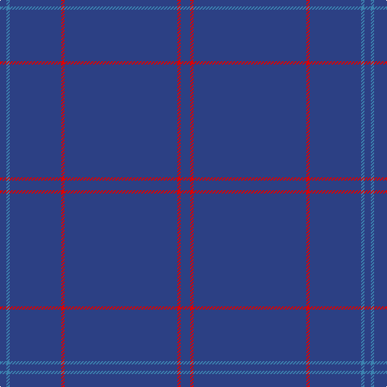

In pattern [BBBRBRB](/patterns/bbbrbrb/).

This was sourced from register-of-tartans.  It is a [7 stripes tartan](/stripes/stripes7/).

Original link https://www.tartanregister.gov.uk/tartanDetails.aspx?ref=2166

## Thread count
B/8 Ba4 B64 R4 B140 R4 B/12

## Palette
Each colour and its ΔE from the base-6 reference it is a variant of.

| Colour | Shade | Base | ΔE (OKLab) |
|---|---|---|---|
| B | <code style="background-color:#2C4084;">#2C4084</code> `#2C4084` | B <code style="background-color:#2A418A;">#2A418A</code> | 0.01 |
| Ba | <code style="background-color:#3C82AF;">#3C82AF</code> `#3C82AF` | B <code style="background-color:#2A418A;">#2A418A</code> | 0.19 |
| R | <code style="background-color:#DC0000;">#DC0000</code> `#DC0000` | R <code style="background-color:#CC0000;">#CC0000</code> | 0.03 |

# Sample pattern

## Nearest tartans

The nearest existing variants by ΔTartan distance.

1. [Lochaber, Old..](/setts/s7/b12r4b140r4b64ba4b8-b304080-ba5480b0-rc00000/) — ΔT 0.68
1. [Lochaber Old.. District Tartan Tartan Number: 33. Earliest known date: 1797 J.Telfer Dunbar Collection. Lochaber is the home of Clan Cameron and a portion of the Clanranald MacDonalds. The former military Fort William is now the population centre of the district on the West coast of Scotland. This is one of several recorded old authentic patterns from the Lochaber district. See products available Copyright © Blair Urquhart, Comrie, 2015](/setts/s7/b12r4b140r4b64ba4b8-b2c2c80-ba5c8ca8-rc80000/) — ΔT 0.73
1. [Norwich No.030](/setts/s6/b66g6r2b66g6r2-b2c2c80-g006818-rc80000/) — ΔT 1.82
1. [Wylie (Ancient)](/setts/s6/b172y4b36r6k2w4-b1870a4-k101010-rc80000-we0e0e0-ye8c000/) — ΔT 2.94
1. [Loch Monar (Fashion)](/setts/s11/b84b20b4b4r4b4b20r12b4r6b4-b1c0070-r800028/) — ΔT 3.10
1. [Mack of Stoneywood Dress (Personal)](/setts/s8/b160r2b4r2b12r20b2r14-b202060-r880000/) — ΔT 3.18
1. [Allt Dubh (Black Burn)](/setts/s6/k198r10k8r6k4g2-g5c6428-k101010-r901c38/) — ΔT 3.20
1. [Alich (Personal)](/setts/s4/k200r4b12ba4-b000080-ba551a8b-k101010-rd41a1f/) — ΔT 3.32
1. [Alich (Personal)](/setts/s4/k200r4b12ba4-b003c64-ba780078-k101010-rc80000/) — ΔT 3.37
1. [Eternity Fashion Tartan Tartan Number: 10214. Earliest known date: 01/02/2010 This tartan was designed for day wear grey tweed jackets. It has been shown in the Dedicated to Wedding magazine (April 2010). Perfection leads to eternity is the goal for all eternal marriage. See products available Copyright © Blair Urquhart, Comrie, 2015](/setts/s5/b176g6y4k4ka2-b5c5c5c-g604000-k101010-ka000000-ya08858/) — ΔT 3.39

## Neighbour map

Every grey dot is one of 15726 variants placed by the first two principal components of the ΔTartan feature space (44% of its variance). Red is this tartan; blue dots are its nearest — click one to open its page.

<svg viewBox="0 0 640 380" role="img" style="max-width:100%;height:auto;border:1px solid #e0e0e0;border-radius:4px;display:block" xmlns="http://www.w3.org/2000/svg"><image href="/nn/cloud.v1.png" width="640" height="380"/><a href="/setts/s7/b12r4b140r4b64ba4b8-b304080-ba5480b0-rc00000/"><circle cx="626.0" cy="219.8" r="4" fill="#3465a4"><title>Lochaber, Old..</title></circle></a><a href="/setts/s7/b12r4b140r4b64ba4b8-b2c2c80-ba5c8ca8-rc80000/"><circle cx="626.0" cy="208.4" r="4" fill="#3465a4"><title>Lochaber Old.. District Tartan Tartan Number: 33. Earliest known date: 1797 J.Telfer Dunbar Collection. Lochaber is the home of Clan Cameron and a portion of the Clanranald MacDonalds. The former military Fort William is now the population centre of the district on the West coast of Scotland. This is one of several recorded old authentic patterns from the Lochaber district. See products available Copyright © Blair Urquhart, Comrie, 2015</title></circle></a><a href="/setts/s6/b66g6r2b66g6r2-b2c2c80-g006818-rc80000/"><circle cx="626.0" cy="218.1" r="4" fill="#3465a4"><title>Norwich No.030</title></circle></a><a href="/setts/s6/b172y4b36r6k2w4-b1870a4-k101010-rc80000-we0e0e0-ye8c000/"><circle cx="626.0" cy="140.9" r="4" fill="#3465a4"><title>Wylie (Ancient)</title></circle></a><a href="/setts/s11/b84b20b4b4r4b4b20r12b4r6b4-b1c0070-r800028/"><circle cx="626.0" cy="202.6" r="4" fill="#3465a4"><title>Loch Monar (Fashion)</title></circle></a><a href="/setts/s8/b160r2b4r2b12r20b2r14-b202060-r880000/"><circle cx="626.0" cy="174.7" r="4" fill="#3465a4"><title>Mack of Stoneywood Dress (Personal)</title></circle></a><a href="/setts/s6/k198r10k8r6k4g2-g5c6428-k101010-r901c38/"><circle cx="626.0" cy="185.1" r="4" fill="#3465a4"><title>Allt Dubh (Black Burn)</title></circle></a><a href="/setts/s4/k200r4b12ba4-b000080-ba551a8b-k101010-rd41a1f/"><circle cx="626.0" cy="204.2" r="4" fill="#3465a4"><title>Alich (Personal)</title></circle></a><a href="/setts/s4/k200r4b12ba4-b003c64-ba780078-k101010-rc80000/"><circle cx="626.0" cy="207.4" r="4" fill="#3465a4"><title>Alich (Personal)</title></circle></a><a href="/setts/s5/b176g6y4k4ka2-b5c5c5c-g604000-k101010-ka000000-ya08858/"><circle cx="626.0" cy="166.2" r="4" fill="#3465a4"><title>Eternity Fashion Tartan Tartan Number: 10214. Earliest known date: 01/02/2010 This tartan was designed for day wear grey tweed jackets. It has been shown in the Dedicated to Wedding magazine (April 2010). Perfection leads to eternity is the goal for all eternal marriage. See products available Copyright © Blair Urquhart, Comrie, 2015</title></circle></a><circle cx="626.0" cy="211.6" r="5" fill="#c00000"/></svg>

ID: /setts/s7/b12r4b140r4b64ba4b8-b2c4084-ba3c82af-rdc0000/
