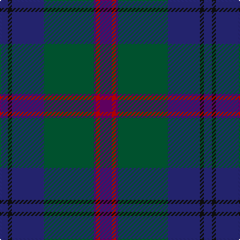

In pattern [BKBGBRB](/patterns/bkbgbrb/).

This was sourced from register-of-tartans.  It is a [7 stripes tartan](/stripes/stripes7/).

Original link https://www.tartanregister.gov.uk/tartanDetails.aspx?ref=2061

## Attestations

This cloth appears in 2 source records; the oldest owns this page.

- 01/01/1999 — Laurie (register-of-tartans, [record](https://www.tartanregister.gov.uk/tartanDetails.aspx?ref=2061))
- 1999 — Laurie (Name) (tartans-authority, [record](http://www.tartansauthority.com/tartan-ferret/display/4224/))

## Thread count
DB/8 K4 DB32 G50 P2 R4 P/12

## Palette
Each colour and its ΔE from the base-6 reference it is a variant of.

| Colour | Shade | Base | ΔE (OKLab) |
|---|---|---|---|
| DB | <code style="background-color:#28287C;">#28287C</code> `#28287C` | B <code style="background-color:#2C4084;">#2C4084</code> | 0.06 |
| G | <code style="background-color:#005C34;">#005C34</code> `#005C34` | G <code style="background-color:#006400;">#006400</code> | 0.06 |
| K | <code style="background-color:#101010;">#101010</code> `#101010` | K <code style="background-color:#000000;">#000000</code> | 0.17 |
| P | <code style="background-color:#6C006C;">#6C006C</code> `#6C006C` | B <code style="background-color:#2C4084;">#2C4084</code> | 0.15 |
| R | <code style="background-color:#C80000;">#C80000</code> `#C80000` | R <code style="background-color:#C80000;">#C80000</code> | 0.00 |

# Sample pattern

## Nearest tartans

The nearest existing variants by ΔTartan distance.

1. [Lawrie](/setts/s7/b12g4b2ga50ba32k4ba8-b700070-ba2c2c84-g784400-ga007040-k101010/) — ΔT 0.52
1. [Lowry](/setts/s7/b12y4b2g50ba32k4ba8-b440044-ba282878-g006438-k101010-yd8b000/) — ΔT 0.73
1. [MacFadzean](/setts/s6/b96w4k40g44r6g8-b2c4084-g005020-k101010-rdc0000-we0e0e0/) — ΔT 0.84
1. [Lawrie Clan Tartan Tartan Number: 3202. Earliest known date: 2000 One of a set of three similar designs for Laurie, Lawrie and Lowry, designed by Peter MacDonald for Iain Laurie. See products available Copyright © Blair Urquhart, Comrie, 2015](/setts/s7/b12r4b2g50ba32k4ba8-b440044-ba2c2c80-g006818-k101010-r945008/) — ΔT 0.87
1. [Laurie Clan Tartan Tartan Number: 3201. Earliest known date: 2000 One of a set of three similar designs for Laurie, Lawrie and Lowry, designed by Peter MacDonald for Iain Laurie. See products available Copyright © Blair Urquhart, Comrie, 2015](/setts/s7/b12r4b2g50ba32k4ba8-b440044-ba2c2c80-g006818-k101010-rc80000/) — ΔT 0.99
1. [Rikaco Classic (Fashion)](/setts/s10/b8ba8b2g48b20r2b4ra10ba6r4-b202060-ba1474b4-g003820-rc80000-ra880000/) — ΔT 1.01
1. [Mann](/setts/s9/k6r4g8r2b50ga24g28b6r2-b202060-g604000-ga006818-k101010-rc80000/) — ΔT 1.06
1. [Hardie (Name)](/setts/s6/r8g18w4g48b74ra6-b202044-g003820-rb468ac-rac80000-we0e0e0/) — ΔT 1.09
1. [Round Table of Britain and Ire Corporate Tartan Tartan Number: 2365. Earliest known date: 1997 Designed by Polly Wittering of House of Edgar in June 1997 for the Round Table of Britain and Ireland. Sample in STA Johnston Collection. For this graphic medium red, green and blue used in place of called-for dark versions of each. See products available Copyright © Blair Urquhart, Comrie, 2015](/setts/s10/b94g28ba10bb4r6g14r6bb4ba10g28-b202060-ba440044-bb4c3428-g285800-r880000/) — ΔT 1.12
1. [Kinfauns Castle](/setts/s10/r8b20g4b4g48ba4g4ba32g4w2-b2c2c80-ba783055-g003820-rc80000-we0e0e0/) — ΔT 1.13

## Neighbour map

Every grey dot is one of 15726 variants placed by the first two principal components of the ΔTartan feature space (44% of its variance). Red is this tartan; blue dots are its nearest — click one to open its page.

<svg viewBox="0 0 640 380" role="img" style="max-width:100%;height:auto;border:1px solid #e0e0e0;border-radius:4px;display:block" xmlns="http://www.w3.org/2000/svg"><image href="/nn/cloud.v1.png" width="640" height="380"/><a href="/setts/s7/b12g4b2ga50ba32k4ba8-b700070-ba2c2c84-g784400-ga007040-k101010/"><circle cx="305.8" cy="164.7" r="4" fill="#3465a4"><title>Lawrie</title></circle></a><a href="/setts/s7/b12y4b2g50ba32k4ba8-b440044-ba282878-g006438-k101010-yd8b000/"><circle cx="298.8" cy="163.2" r="4" fill="#3465a4"><title>Lowry</title></circle></a><a href="/setts/s6/b96w4k40g44r6g8-b2c4084-g005020-k101010-rdc0000-we0e0e0/"><circle cx="309.8" cy="176.4" r="4" fill="#3465a4"><title>MacFadzean</title></circle></a><a href="/setts/s7/b12r4b2g50ba32k4ba8-b440044-ba2c2c80-g006818-k101010-r945008/"><circle cx="299.5" cy="163.5" r="4" fill="#3465a4"><title>Lawrie Clan Tartan Tartan Number: 3202. Earliest known date: 2000 One of a set of three similar designs for Laurie, Lawrie and Lowry, designed by Peter MacDonald for Iain Laurie. See products available Copyright © Blair Urquhart, Comrie, 2015</title></circle></a><a href="/setts/s7/b12r4b2g50ba32k4ba8-b440044-ba2c2c80-g006818-k101010-rc80000/"><circle cx="294.7" cy="160.4" r="4" fill="#3465a4"><title>Laurie Clan Tartan Tartan Number: 3201. Earliest known date: 2000 One of a set of three similar designs for Laurie, Lawrie and Lowry, designed by Peter MacDonald for Iain Laurie. See products available Copyright © Blair Urquhart, Comrie, 2015</title></circle></a><a href="/setts/s10/b8ba8b2g48b20r2b4ra10ba6r4-b202060-ba1474b4-g003820-rc80000-ra880000/"><circle cx="293.1" cy="146.0" r="4" fill="#3465a4"><title>Rikaco Classic (Fashion)</title></circle></a><a href="/setts/s9/k6r4g8r2b50ga24g28b6r2-b202060-g604000-ga006818-k101010-rc80000/"><circle cx="289.8" cy="152.7" r="4" fill="#3465a4"><title>Mann</title></circle></a><a href="/setts/s6/r8g18w4g48b74ra6-b202044-g003820-rb468ac-rac80000-we0e0e0/"><circle cx="329.6" cy="193.8" r="4" fill="#3465a4"><title>Hardie (Name)</title></circle></a><a href="/setts/s10/b94g28ba10bb4r6g14r6bb4ba10g28-b202060-ba440044-bb4c3428-g285800-r880000/"><circle cx="340.2" cy="150.2" r="4" fill="#3465a4"><title>Round Table of Britain and Ire Corporate Tartan Tartan Number: 2365. Earliest known date: 1997 Designed by Polly Wittering of House of Edgar in June 1997 for the Round Table of Britain and Ireland. Sample in STA Johnston Collection. For this graphic medium red, green and blue used in place of called-for dark versions of each. See products available Copyright © Blair Urquhart, Comrie, 2015</title></circle></a><a href="/setts/s10/r8b20g4b4g48ba4g4ba32g4w2-b2c2c80-ba783055-g003820-rc80000-we0e0e0/"><circle cx="314.8" cy="146.5" r="4" fill="#3465a4"><title>Kinfauns Castle</title></circle></a><circle cx="319.2" cy="170.4" r="5" fill="#c00000"/></svg>

ID: /setts/s7/b12r4b2g50ba32k4ba8-b6c006c-ba28287c-g005c34-k101010-rc80000/
