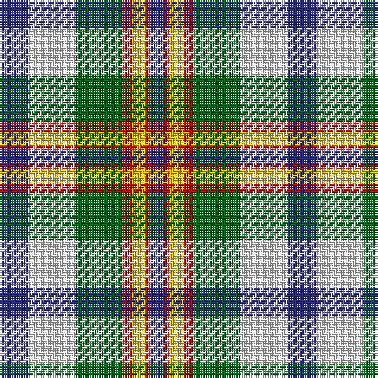

In pattern [BRYRGWB](/patterns/bryrgwb/).

This was sourced from house-of-tartan.  It is a [7 stripes tartan](/stripes/stripes7/).

Original link http://www.house-of-tartan.scotland.net/house/TartanViewjs.asp?colr=Def&tnam=586

## Thread count
DB/12 LN20 G20 R4 Y6 R2 DB/6

## Palette
Each colour and its ΔE from the base-6 reference it is a variant of.

| Colour | Shade | Base | ΔE (OKLab) |
|---|---|---|---|
| DB | <code style="background-color:#2C2C80;">#2C2C80</code> `#2C2C80` | B <code style="background-color:#2A418A;">#2A418A</code> | 0.06 |
| G | <code style="background-color:#006818;">#006818</code> `#006818` | G <code style="background-color:#006100;">#006100</code> | 0.02 |
| LN | <code style="background-color:#E0E0E0;">#E0E0E0</code> `#E0E0E0` | W <code style="background-color:#F7F7F7;">#F7F7F7</code> | 0.07 |
| R | <code style="background-color:#C80000;">#C80000</code> `#C80000` | R <code style="background-color:#CC0000;">#CC0000</code> | 0.01 |
| Y | <code style="background-color:#E8C000;">#E8C000</code> `#E8C000` | Y <code style="background-color:#F2BF00;">#F2BF00</code> | 0.02 |

# Sample pattern

## Nearest tartans

The nearest existing variants by ΔTartan distance.

1. [Ainslie, Lake](/setts/s7/b12w20g20r4y6r2b6-b2c2c80-g006818-rc80000-wfcfcfc-ye8c000/) — ΔT 0.32
1. [Ainslie, Lake](/setts/s7/b12w20g20r4y6r2b6-b304080-g008000-rc00000-we0e0e0-yf0c000/) — ΔT 0.50
1. [Northern Ontario](/setts/s7/g68ga20b8w48b8y16ga28-b1c0070-g603800-ga408060-wf8f8f8-ye8c000/) — ΔT 0.76
1. [MacRobart Dress (Personal)](/setts/s7/b16w66k30g34ba6g34ba6-b2c2c80-ba5c8ca8-g285800-k101010-we0e0e0/) — ΔT 0.85
1. [Gray, Sir John Hamilton (Commem)](/setts/s10/w8b12r6b20ba28y12w36y12ba8y4-b1c1c1c-ba0c5880-rc80000-wf8f4d0-ybc8c00/) — ΔT 0.86
1. [John Hamilton Gray Commemorative Tartan Tartan Number: 1808. Earliest known date: pre 2003 One of the Fathers of the Confederation. Born Prince Edward Island in 1881. Premier in 1863. Died in 1887 See products available Copyright © Blair Urquhart, Comrie, 2015](/setts/s10/w8g14r6g24b30y10w40y10b7y4-b2c2c80-g006818-rc80000-we0e0e0-ye8c000/) — ΔT 0.86
1. [Fraser, Red dress](/setts/s7/r8b36ra8g38w50r20w8-b304080-g008000-rc00000-ra800000-we0e0e0/) — ΔT 1.00
1. [Alexander Brothers - 2007? (Corp.)](/setts/s8/g10y4b40w4k40w40k4w10-b5c8ca8-g289c18-k101010-we0e0e0-ye8c000/) — ΔT 1.04
1. [Womble](/setts/s9/w8b16w2ba2g12ba6r12ba2w8-b304080-ba000050-g008000-rc00000-we0e0e0/) — ΔT 1.04
1. [Inverary](/setts/s6/g20k2b26k6w18y6-b304080-g006030-k000000-we0e0e0-yf0c000/) — ΔT 1.07

## Neighbour map

Every grey dot is one of 15726 variants placed by the first two principal components of the ΔTartan feature space (44% of its variance). Red is this tartan; blue dots are its nearest — click one to open its page.

<svg viewBox="0 0 640 380" role="img" style="max-width:100%;height:auto;border:1px solid #e0e0e0;border-radius:4px;display:block" xmlns="http://www.w3.org/2000/svg"><image href="/nn/cloud.v1.png" width="640" height="380"/><a href="/setts/s7/b12w20g20r4y6r2b6-b2c2c80-g006818-rc80000-wfcfcfc-ye8c000/"><circle cx="69.6" cy="172.6" r="4" fill="#3465a4"><title>Ainslie, Lake</title></circle></a><a href="/setts/s7/b12w20g20r4y6r2b6-b304080-g008000-rc00000-we0e0e0-yf0c000/"><circle cx="81.5" cy="178.6" r="4" fill="#3465a4"><title>Ainslie, Lake</title></circle></a><a href="/setts/s7/g68ga20b8w48b8y16ga28-b1c0070-g603800-ga408060-wf8f8f8-ye8c000/"><circle cx="100.8" cy="177.0" r="4" fill="#3465a4"><title>Northern Ontario</title></circle></a><a href="/setts/s7/b16w66k30g34ba6g34ba6-b2c2c80-ba5c8ca8-g285800-k101010-we0e0e0/"><circle cx="111.5" cy="175.7" r="4" fill="#3465a4"><title>MacRobart Dress (Personal)</title></circle></a><a href="/setts/s10/w8b12r6b20ba28y12w36y12ba8y4-b1c1c1c-ba0c5880-rc80000-wf8f4d0-ybc8c00/"><circle cx="62.6" cy="163.5" r="4" fill="#3465a4"><title>Gray, Sir John Hamilton (Commem)</title></circle></a><a href="/setts/s10/w8g14r6g24b30y10w40y10b7y4-b2c2c80-g006818-rc80000-we0e0e0-ye8c000/"><circle cx="81.4" cy="155.1" r="4" fill="#3465a4"><title>John Hamilton Gray Commemorative Tartan Tartan Number: 1808. Earliest known date: pre 2003 One of the Fathers of the Confederation. Born Prince Edward Island in 1881. Premier in 1863. Died in 1887 See products available Copyright © Blair Urquhart, Comrie, 2015</title></circle></a><a href="/setts/s7/r8b36ra8g38w50r20w8-b304080-g008000-rc00000-ra800000-we0e0e0/"><circle cx="84.5" cy="194.1" r="4" fill="#3465a4"><title>Fraser, Red dress</title></circle></a><a href="/setts/s8/g10y4b40w4k40w40k4w10-b5c8ca8-g289c18-k101010-we0e0e0-ye8c000/"><circle cx="117.1" cy="154.8" r="4" fill="#3465a4"><title>Alexander Brothers - 2007? (Corp.)</title></circle></a><a href="/setts/s9/w8b16w2ba2g12ba6r12ba2w8-b304080-ba000050-g008000-rc00000-we0e0e0/"><circle cx="39.9" cy="179.3" r="4" fill="#3465a4"><title>Womble</title></circle></a><a href="/setts/s6/g20k2b26k6w18y6-b304080-g006030-k000000-we0e0e0-yf0c000/"><circle cx="99.5" cy="180.1" r="4" fill="#3465a4"><title>Inverary</title></circle></a><circle cx="77.9" cy="177.1" r="5" fill="#c00000"/></svg>

ID: /setts/s7/b12w20g20r4y6r2b6-b2c2c80-g006818-rc80000-we0e0e0-ye8c000/
