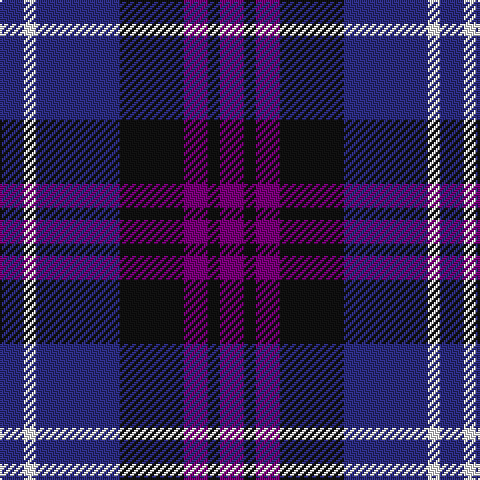

In pattern [BKBKBWB](/patterns/bkbkbwb/).

This was sourced from register-of-tartans.  It is a [7 stripes tartan](/stripes/stripes7/).

Original link https://www.tartanregister.gov.uk/tartanDetails.aspx?ref=1695

## Attestations

This cloth appears in 2 source records; the oldest owns this page.

- 01/09/2007 — Heritage of Scotland (register-of-tartans, [record](https://www.tartanregister.gov.uk/tartanDetails.aspx?ref=1695))
- September 2007 — Heritage of Scotland (Fashion) (tartans-authority, [record](http://www.tartansauthority.com/tartan-ferret/display/7300/))

## Thread count
DB/12 W6 DB42 K32 P12 K6 P/12

## Palette
Each colour and its ΔE from the base-6 reference it is a variant of.

| Colour | Shade | Base | ΔE (OKLab) |
|---|---|---|---|
| DB | <code style="background-color:#2C2C80;">#2C2C80</code> `#2C2C80` | B <code style="background-color:#2C4084;">#2C4084</code> | 0.05 |
| K | <code style="background-color:#101010;">#101010</code> `#101010` | K <code style="background-color:#000000;">#000000</code> | 0.17 |
| P | <code style="background-color:#780078;">#780078</code> `#780078` | B <code style="background-color:#2C4084;">#2C4084</code> | 0.16 |
| W | <code style="background-color:#F8F8F8;">#F8F8F8</code> `#F8F8F8` | W <code style="background-color:#F4F4F0;">#F4F4F0</code> | 0.01 |

# Sample pattern

## Nearest tartans

The nearest existing variants by ΔTartan distance.

1. [Allianz Deutschland 2012 (Corporate)](/setts/s7/b12ba6b12ba40k40ba16w8-b2c2c80-ba202060-k101010-wfcfcfc/) — ΔT 0.94
1. [Hamilton (Personal)](/setts/s10/b6g6b36r28b10r28b10r28b42g6-b000088-g004c00-r880000/) — ΔT 1.04
1. [Brodie Countryfare (Corporate)](/setts/s7/b6k26b26ba26w4ba26w6-b2c2c80-ba1c0070-k101010-we0e0e0/) — ΔT 1.05
1. [Scottish N. A. Business Council (Co](/setts/s10/r8b24ba24b8r8b16ba24r8b8w4-b1c0070-ba003c64-rc80000-we0e0e0/) — ΔT 1.09
1. [Scottish Open Squash (Corporate)](/setts/s5/b46ba4g22ba48w6-b1c0070-ba440044-g006818-wc0c0c0/) — ΔT 1.21
1. [Joker Fancy Tartan Tartan Number: 6769. Earliest known date: 2005 I have a photo of a fabric swatch that I am trying to match as close as possible. I have been commissioned to make a life size mannequin of Jack Nicholson as the Joker and he wore plaid/tartan pants. I could send you some photos through email and possibly you could help me. Thanks, Andy Garringer USA, January 2008. (96 threads @ 40 epi heavyweight = 2.5 inch repeat) See products available Copyright © Blair Urquhart, Comrie, 2015](/setts/s6/b22k2b6k10ba18y2-b1870a4-ba4c0470-k101010-yd87c00/) — ΔT 1.22
1. [Baillie (Highland Society)](/setts/s7/b6k2b16k12g16k2w4-b5a008c-g005020-k101010-we0e0e0/) — ΔT 1.22
1. [Scottish Express International](/setts/s6/b4k16w4k16ba28k4-b9058d8-ba1c0070-k101010-wa8ace8/) — ΔT 1.24
1. [Komissarov, Dmitry (Personal)](/setts/s7/b60ba60g8ba8g8ba10r12-b640044-ba000048-g808080-r880000/) — ΔT 1.24
1. [Bareback (Corporate)](/setts/s6/b6k6b21k16ba36y4-b5c5c5c-ba2c2c80-k101010-ye8c000/) — ΔT 1.26

## Neighbour map

Every grey dot is one of 15726 variants placed by the first two principal components of the ΔTartan feature space (44% of its variance). Red is this tartan; blue dots are its nearest — click one to open its page.

<svg viewBox="0 0 640 380" role="img" style="max-width:100%;height:auto;border:1px solid #e0e0e0;border-radius:4px;display:block" xmlns="http://www.w3.org/2000/svg"><image href="/nn/cloud.v1.png" width="640" height="380"/><a href="/setts/s7/b12ba6b12ba40k40ba16w8-b2c2c80-ba202060-k101010-wfcfcfc/"><circle cx="231.8" cy="248.4" r="4" fill="#3465a4"><title>Allianz Deutschland 2012 (Corporate)</title></circle></a><a href="/setts/s10/b6g6b36r28b10r28b10r28b42g6-b000088-g004c00-r880000/"><circle cx="227.0" cy="231.8" r="4" fill="#3465a4"><title>Hamilton (Personal)</title></circle></a><a href="/setts/s7/b6k26b26ba26w4ba26w6-b2c2c80-ba1c0070-k101010-we0e0e0/"><circle cx="191.5" cy="254.8" r="4" fill="#3465a4"><title>Brodie Countryfare (Corporate)</title></circle></a><a href="/setts/s10/r8b24ba24b8r8b16ba24r8b8w4-b1c0070-ba003c64-rc80000-we0e0e0/"><circle cx="196.4" cy="243.1" r="4" fill="#3465a4"><title>Scottish N. A. Business Council (Co</title></circle></a><a href="/setts/s5/b46ba4g22ba48w6-b1c0070-ba440044-g006818-wc0c0c0/"><circle cx="255.5" cy="234.9" r="4" fill="#3465a4"><title>Scottish Open Squash (Corporate)</title></circle></a><a href="/setts/s6/b22k2b6k10ba18y2-b1870a4-ba4c0470-k101010-yd87c00/"><circle cx="260.5" cy="224.4" r="4" fill="#3465a4"><title>Joker Fancy Tartan Tartan Number: 6769. Earliest known date: 2005 I have a photo of a fabric swatch that I am trying to match as close as possible. I have been commissioned to make a life size mannequin of Jack Nicholson as the Joker and he wore plaid/tartan pants. I could send you some photos through email and possibly you could help me. Thanks, Andy Garringer USA, January 2008. (96 threads @ 40 epi heavyweight = 2.5 inch repeat) See products available Copyright © Blair Urquhart, Comrie, 2015</title></circle></a><a href="/setts/s7/b6k2b16k12g16k2w4-b5a008c-g005020-k101010-we0e0e0/"><circle cx="174.0" cy="223.7" r="4" fill="#3465a4"><title>Baillie (Highland Society)</title></circle></a><a href="/setts/s6/b4k16w4k16ba28k4-b9058d8-ba1c0070-k101010-wa8ace8/"><circle cx="282.8" cy="252.5" r="4" fill="#3465a4"><title>Scottish Express International</title></circle></a><a href="/setts/s7/b60ba60g8ba8g8ba10r12-b640044-ba000048-g808080-r880000/"><circle cx="289.2" cy="221.4" r="4" fill="#3465a4"><title>Komissarov, Dmitry (Personal)</title></circle></a><a href="/setts/s6/b6k6b21k16ba36y4-b5c5c5c-ba2c2c80-k101010-ye8c000/"><circle cx="229.7" cy="235.8" r="4" fill="#3465a4"><title>Bareback (Corporate)</title></circle></a><circle cx="223.2" cy="233.1" r="5" fill="#c00000"/></svg>

ID: /setts/s7/b12w6b42k32ba12k6ba12-b2c2c80-ba780078-k101010-wf8f8f8/
