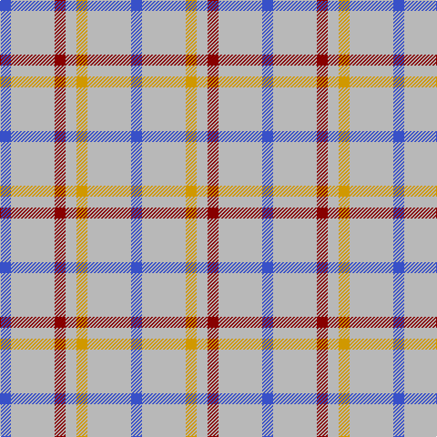

In pattern [BYRYYYB](/patterns/byryyyb/).

This was sourced from tartans-authority.  It is a [7 stripes tartan](/stripes/stripes7/).

Original link http://www.tartansauthority.com/tartan-ferret/display/2500/

## Attestations

This cloth appears in 3 source records; the oldest owns this page.

- 1986 — Justus Dress (Personal) (tartans-authority, [record](http://www.tartansauthority.com/tartan-ferret/display/2500/))
- 01/01/1990 — Justus Dress (Personal) (register-of-tartans, [record](https://www.tartanregister.gov.uk/tartanDetails.aspx?ref=1920))
- undated — Justus Dress Personal Tartan Tartan Number: 2500. Earliest known date: 1986 One of 7 tartans created by Christopher Carlisle Justus in Hendersonville NC - 1986. Status not known and no evidence of actual commercial weaving although it is said to have been adopted by the Justus Family Society. See products available Copyright © Blair Urquhart, Comrie, 2015 (house-of-tartan, [record](http://www.house-of-tartan.scotland.net/house/TartanViewjs.asp?colr=Def&tnam=2500))

## Thread count
B/12 N48 DR12 N12 DY12 N48 B/12

## Palette
Each colour and its ΔE from the base-6 reference it is a variant of.

| Colour | Shade | Base | ΔE (OKLab) |
|---|---|---|---|
| B | <code style="background-color:#3850C8;">#3850C8</code> `#3850C8` | B <code style="background-color:#2C4084;">#2C4084</code> | 0.12 |
| DR | <code style="background-color:#880000;">#880000</code> `#880000` | R <code style="background-color:#C80000;">#C80000</code> | 0.14 |
| DY | <code style="background-color:#D09800;">#D09800</code> `#D09800` | Y <code style="background-color:#E8C000;">#E8C000</code> | 0.11 |
| N | <code style="background-color:#B8B8B8;">#B8B8B8</code> `#B8B8B8` | Y <code style="background-color:#E8C000;">#E8C000</code> | 0.17 |

# Sample pattern

ID: /setts/s7/b12y48r12y12ya12y48b12-b3850c8-r880000-yb8b8b8-yad09800/
