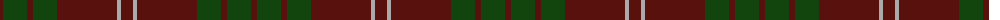

In pattern [BGBGBYB](/patterns/bgbgbyb/).

This was sourced from weddslist.  It is a [7 stripes tartan](/stripes/stripes7/).

Original link http://www.weddslist.com/cgi-bin/tartans/pg.pl?source=tinsel

## Thread count
DR/6 DG24 DR6 DG24 DR60 N4 DR/12

## Palette
Each colour and its ΔE from the base-6 reference it is a variant of.

| Colour | Shade | Base | ΔE (OKLab) |
|---|---|---|---|
| DG | <code style="background-color:#11450D;">#11450D</code> `#11450D` | G <code style="background-color:#006100;">#006100</code> | 0.09 |
| DR | <code style="background-color:#59110D;">#59110D</code> `#59110D` | B <code style="background-color:#2A418A;">#2A418A</code> | 0.22 |
| N | <code style="background-color:#AAAAAA;">#AAAAAA</code> `#AAAAAA` | Y <code style="background-color:#F2BF00;">#F2BF00</code> | 0.19 |

# Sample pattern

## Nearest tartans

The nearest existing variants by ΔTartan distance.

1. [Crawford](/setts/s7/b6y2b30g12b3g12b3-b59110d-g11450d-yaaaaaa/) — ΔT 0.00
1. [Keeper of the Quaich](/setts/s6/g3b3g3b27g40ga3-b304080-g402000-ga908000/) — ΔT 1.44
1. [Glen Trool District Tartan Tartan Number: 914. Earliest known date: pre 1945 Glen Trool is in the Galloway Uplands in the Southwest of Scotland. The tartan began life as a trade sett - a colourful fashion fabric - and was given a name merely to identify it. It proved very popular and is now recognised as a District Tartan. See products available Copyright © Blair Urquhart, Comrie, 2015](/setts/s5/g74ga18g6r18ga6-g003820-ga604000-rc80000/) — ΔT 1.45
1. [Donachie of Brockloch](/setts/s10/r48g4r4g40r50g4r4g4r4g40-g003c24-r6c0000/) — ΔT 1.49
1. [Glen Shee #1 (Fashion)](/setts/s5/r74b18r6g18b6-b441800-g006818-r880000/) — ΔT 1.62
1. [Unidentified #44](/setts/s7/b26k6b40g140b40g60w6-b2c4084-g503c14-k101010-we0e0e0/) — ΔT 1.69
1. [Wasko (Personal)](/setts/s7/r16y4ra60g24ra6g24ra6-g003c20-r9c0000-ra640000-yb0b0b0/) — ΔT 1.73
1. [Donachie of Brockloch (Clan)](/setts/s10/r48g4r4g40r50g4r4g4r4g40-g005834-r940000/) — ΔT 1.79
1. [MacIver of Strathendry Htg (Personal](/setts/s9/r6ra56b10ra10b66ra10b10ra56y6-b441800-r880000-ra98481c-ybc8c00/) — ΔT 1.81
1. [Dege of Saville Row](/setts/s6/g44b4g12ba4b36r4-b202060-ba2c2c80-g604000-rc80000/) — ΔT 1.81

## Neighbour map

Every grey dot is one of 15726 variants placed by the first two principal components of the ΔTartan feature space (44% of its variance). Red is this tartan; blue dots are its nearest — click one to open its page.

<svg viewBox="0 0 640 380" role="img" style="max-width:100%;height:auto;border:1px solid #e0e0e0;border-radius:4px;display:block" xmlns="http://www.w3.org/2000/svg"><image href="/nn/cloud.v1.png" width="640" height="380"/><a href="/setts/s7/b6y2b30g12b3g12b3-b59110d-g11450d-yaaaaaa/"><circle cx="491.9" cy="245.1" r="4" fill="#3465a4"><title>Crawford</title></circle></a><a href="/setts/s6/g3b3g3b27g40ga3-b304080-g402000-ga908000/"><circle cx="470.3" cy="239.7" r="4" fill="#3465a4"><title>Keeper of the Quaich</title></circle></a><a href="/setts/s5/g74ga18g6r18ga6-g003820-ga604000-rc80000/"><circle cx="476.1" cy="251.7" r="4" fill="#3465a4"><title>Glen Trool District Tartan Tartan Number: 914. Earliest known date: pre 1945 Glen Trool is in the Galloway Uplands in the Southwest of Scotland. The tartan began life as a trade sett - a colourful fashion fabric - and was given a name merely to identify it. It proved very popular and is now recognised as a District Tartan. See products available Copyright © Blair Urquhart, Comrie, 2015</title></circle></a><a href="/setts/s10/r48g4r4g40r50g4r4g4r4g40-g003c24-r6c0000/"><circle cx="496.5" cy="257.3" r="4" fill="#3465a4"><title>Donachie of Brockloch</title></circle></a><a href="/setts/s5/r74b18r6g18b6-b441800-g006818-r880000/"><circle cx="516.1" cy="250.7" r="4" fill="#3465a4"><title>Glen Shee #1 (Fashion)</title></circle></a><a href="/setts/s7/b26k6b40g140b40g60w6-b2c4084-g503c14-k101010-we0e0e0/"><circle cx="479.6" cy="212.6" r="4" fill="#3465a4"><title>Unidentified #44</title></circle></a><a href="/setts/s7/r16y4ra60g24ra6g24ra6-g003c20-r9c0000-ra640000-yb0b0b0/"><circle cx="384.1" cy="219.1" r="4" fill="#3465a4"><title>Wasko (Personal)</title></circle></a><a href="/setts/s10/r48g4r4g40r50g4r4g4r4g40-g005834-r940000/"><circle cx="449.8" cy="229.8" r="4" fill="#3465a4"><title>Donachie of Brockloch (Clan)</title></circle></a><a href="/setts/s9/r6ra56b10ra10b66ra10b10ra56y6-b441800-r880000-ra98481c-ybc8c00/"><circle cx="420.4" cy="211.8" r="4" fill="#3465a4"><title>MacIver of Strathendry Htg (Personal</title></circle></a><a href="/setts/s6/g44b4g12ba4b36r4-b202060-ba2c2c80-g604000-rc80000/"><circle cx="397.6" cy="237.5" r="4" fill="#3465a4"><title>Dege of Saville Row</title></circle></a><circle cx="491.9" cy="245.1" r="5" fill="#c00000"/></svg>

ID: /setts/s7/b12y4b60g24b6g24b6-b59110d-g11450d-yaaaaaa/
