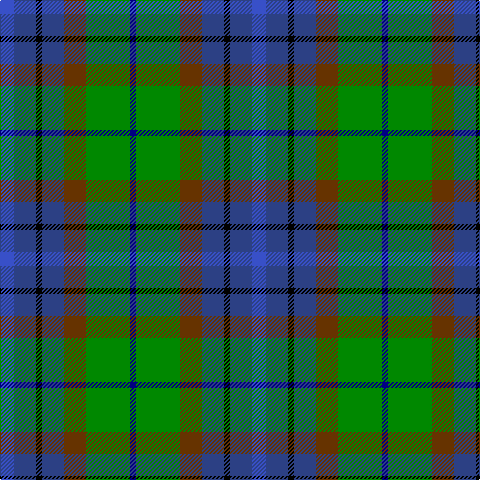

In pattern [BBKBGGB](/patterns/bbkbggb/).

This was sourced from register-of-tartans.  It is a [7 stripes tartan](/stripes/stripes7/).

Original link https://www.tartanregister.gov.uk/tartanDetails.aspx?ref=3737

## Thread count
Ba/14 B22 K6 B22 T22 G44 DB/6

## Palette
Each colour and its ΔE from the base-6 reference it is a variant of.

| Colour | Shade | Base | ΔE (OKLab) |
|---|---|---|---|
| B | <code style="background-color:#2C4084;">#2C4084</code> `#2C4084` | B <code style="background-color:#2C4084;">#2C4084</code> | 0.00 |
| Ba | <code style="background-color:#3850C8;">#3850C8</code> `#3850C8` | B <code style="background-color:#2C4084;">#2C4084</code> | 0.12 |
| DB | <code style="background-color:#000080;">#000080</code> `#000080` | B <code style="background-color:#2C4084;">#2C4084</code> | 0.14 |
| G | <code style="background-color:#008800;">#008800</code> `#008800` | G <code style="background-color:#006400;">#006400</code> | 0.11 |
| K | <code style="background-color:#000000;">#000000</code> `#000000` | K <code style="background-color:#000000;">#000000</code> | 0.00 |
| T | <code style="background-color:#663300;">#663300</code> `#663300` | G <code style="background-color:#006400;">#006400</code> | 0.18 |

# Sample pattern

ID: /setts/s7/b14ba22k6ba22g22ga44bb6-b3850c8-ba2c4084-bb000080-g663300-ga008800-k000000/
