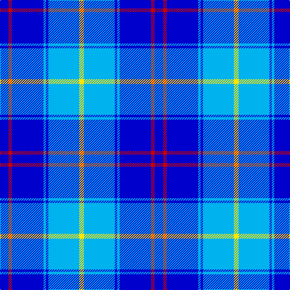

In pattern [BRBWBWY](/patterns/brbwbwy/).

This was sourced from register-of-tartans.  It is a [7 stripes tartan](/stripes/stripes7/).

Original link https://www.tartanregister.gov.uk/tartanDetails.aspx?ref=10174

## Register references

External register numbers recorded for this tartan.

- Scottish Register of Tartans: [10174](https://www.tartanregister.gov.uk/tartanDetails.aspx?ref=10174)

## Thread count
Ba/14 R6 Ba52 B4 Ba4 B51 Y/8

## Palette
Each colour and its ΔE from the base-6 reference it is a variant of.

| Colour | Shade | Base | ΔE (OKLab) |
|---|---|---|---|
| B | <code style="background-color:#00B2EE;">#00B2EE</code> `#00B2EE` | W <code style="background-color:#F7F7F7;">#F7F7F7</code> | 0.30 |
| Ba | <code style="background-color:#0000CD;">#0000CD</code> `#0000CD` | B <code style="background-color:#2A418A;">#2A418A</code> | 0.14 |
| R | <code style="background-color:#CD0000;">#CD0000</code> `#CD0000` | R <code style="background-color:#CC0000;">#CC0000</code> | 0.00 |
| Y | <code style="background-color:#FFE600;">#FFE600</code> `#FFE600` | Y <code style="background-color:#F2BF00;">#F2BF00</code> | 0.10 |

# Sample pattern

## Nearest tartans

The nearest existing variants by ΔTartan distance.

1. [Douglas Variation](/setts/s6/w4b25ba25b2ba5w2~b080848-ba0596fa-we0e0e0~x2/) — ΔT 1.39
1. [Hannah (Personal)](/setts/s6/w2b35k9w3k9y2~b003df5-k101010-wffffff-yffe600~x2/) — ΔT 1.50
1. [Lytley alias Parsons Hunting (Personal)](/setts/s5/b10r1y1ba3y2~b0000cd-ba000080-rff0000-yffe600~x5/) — ΔT 1.55
1. [Callaway (Name)](/setts/s9/r4b12ba36w4ba4b16w3ba6b3~b2474e8-ba2c2c80-rc80000-we0e0e0~x2/) — ΔT 1.70
1. [Bermuda Blue (1962) (District)](/setts/s13/b12r4ba4b42r6b6ba11b6g19b8r4b6ba6~b3474fc-ba000064-g007000-rb00000/) — ΔT 1.85
1. [Kinding](/setts/s7/k10b30g3b3g3b3r6~b0000cd-g00af33-k101010-rc82536~x2/) — ΔT 1.85
1. [Thorburn #1 (Name)](/setts/s9/b12w2b2ba6b4w3b4w18r1~b2c2c80-ba2888c4-rc80000-w98c8e8~x4/) — ΔT 1.86
1. [Bermuda Blue](/setts/s13/b12r4ba4b42r6b6ba11b6g19b8r4b6ba6~b3474fc-ba000064-g004c00-rb00000/) — ΔT 1.88
1. [Douglas, Variation](/setts/s6/w4b25ba25b2ba5w2~b000050-ba8080d0-we0e0e0~x2/) — ΔT 1.91
1. [Federal Bureau of Investigation](/setts/s7/b6w2b2w3b16ba26r2~b1c0070-ba1870a4-r880000-wc0c0c0~x2/) — ΔT 1.92

## Neighbour map

Every grey dot is one of 15726 variants placed by the first two principal components of the ΔTartan feature space (44% of its variance). Red is this tartan; blue dots are its nearest — click one to open its page.

<svg viewBox="0 0 640 380" role="img" style="max-width:100%;height:auto;border:1px solid #e0e0e0;border-radius:4px;display:block" xmlns="http://www.w3.org/2000/svg"><image href="/nn/cloud.v1.png" width="640" height="380"/><a href="/setts/s6/w4b25ba25b2ba5w2~b080848-ba0596fa-we0e0e0~x2/"><circle cx="270.4" cy="203.2" r="4" fill="#3465a4"><title>Douglas Variation</title></circle></a><a href="/setts/s6/w2b35k9w3k9y2~b003df5-k101010-wffffff-yffe600~x2/"><circle cx="317.2" cy="165.6" r="4" fill="#3465a4"><title>Hannah (Personal)</title></circle></a><a href="/setts/s5/b10r1y1ba3y2~b0000cd-ba000080-rff0000-yffe600~x5/"><circle cx="279.7" cy="200.1" r="4" fill="#3465a4"><title>Lytley alias Parsons Hunting (Personal)</title></circle></a><a href="/setts/s9/r4b12ba36w4ba4b16w3ba6b3~b2474e8-ba2c2c80-rc80000-we0e0e0~x2/"><circle cx="300.6" cy="178.7" r="4" fill="#3465a4"><title>Callaway (Name)</title></circle></a><a href="/setts/s13/b12r4ba4b42r6b6ba11b6g19b8r4b6ba6~b3474fc-ba000064-g007000-rb00000/"><circle cx="293.1" cy="168.7" r="4" fill="#3465a4"><title>Bermuda Blue (1962) (District)</title></circle></a><a href="/setts/s7/k10b30g3b3g3b3r6~b0000cd-g00af33-k101010-rc82536~x2/"><circle cx="323.0" cy="191.5" r="4" fill="#3465a4"><title>Kinding</title></circle></a><a href="/setts/s9/b12w2b2ba6b4w3b4w18r1~b2c2c80-ba2888c4-rc80000-w98c8e8~x4/"><circle cx="246.6" cy="157.6" r="4" fill="#3465a4"><title>Thorburn #1 (Name)</title></circle></a><a href="/setts/s13/b12r4ba4b42r6b6ba11b6g19b8r4b6ba6~b3474fc-ba000064-g004c00-rb00000/"><circle cx="293.6" cy="169.1" r="4" fill="#3465a4"><title>Bermuda Blue</title></circle></a><a href="/setts/s6/w4b25ba25b2ba5w2~b000050-ba8080d0-we0e0e0~x2/"><circle cx="279.5" cy="201.0" r="4" fill="#3465a4"><title>Douglas, Variation</title></circle></a><a href="/setts/s7/b6w2b2w3b16ba26r2~b1c0070-ba1870a4-r880000-wc0c0c0~x2/"><circle cx="284.9" cy="188.2" r="4" fill="#3465a4"><title>Federal Bureau of Investigation</title></circle></a><circle cx="267.5" cy="179.4" r="5" fill="#c00000"/></svg>

ID: /setts/s7/b14r6b52w4b4w51y8~b0000cd-rcd0000-w00b2ee-yffe600/
