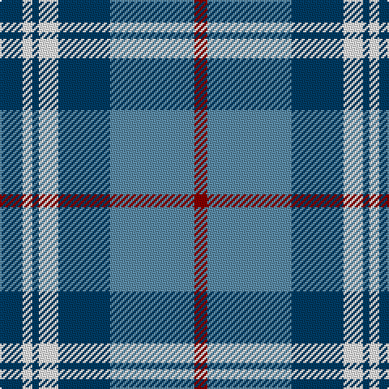

In pattern [BWBWBBR](/patterns/bwbwbbr/).

This was sourced from tartans-authority.  It is a [7 stripes tartan](/stripes/stripes7/).

Original link http://www.tartansauthority.com/tartan-ferret/display/6157/

## Thread count
DB/14 W6 DB4 W12 DB32 B52 DR/8

## Palette
Each colour and its ΔE from the base-6 reference it is a variant of.

| Colour | Shade | Base | ΔE (OKLab) |
|---|---|---|---|
| B | <code style="background-color:#5C8CA8;">#5C8CA8</code> `#5C8CA8` | B <code style="background-color:#2C4084;">#2C4084</code> | 0.23 |
| DB | <code style="background-color:#003C64;">#003C64</code> `#003C64` | B <code style="background-color:#2C4084;">#2C4084</code> | 0.07 |
| DR | <code style="background-color:#880000;">#880000</code> `#880000` | R <code style="background-color:#C80000;">#C80000</code> | 0.14 |
| W | <code style="background-color:#FCFCFC;">#FCFCFC</code> `#FCFCFC` | W <code style="background-color:#F4F4F0;">#F4F4F0</code> | 0.03 |

# Sample pattern

## Nearest tartans

The nearest existing variants by ΔTartan distance.

1. [Halesowen (District)](/setts/s8/w18b6y6b48ba48y4ba4y4-b1474b4-ba2c2c80-we0e0e0-ye8c000/) — ΔT 0.91
1. [(1) Abercrombie](/setts/s9/b27w2b14k14y4k4y4k4y27-b868aff-k000000-wffffff-y86ae9a/) — ΔT 1.07
1. [Newall (Dumbarton) (Personal)](/setts/s7/b60ba30w8g24w18b16w6-b5f749c-ba433a5a-g23321b-we5e0d2/) — ΔT 1.08
1. [Bannockbane Silver](/setts/s8/b6ba4b36ba2w20r36ba4r6-b202060-ba480800-r888888-we0e0e0/) — ΔT 1.11
1. [Afternoon Tea / Earl Grey](/setts/s6/r15b98ba72y25ba8w15-b5c8ca8-ba202060-rc80000-wfcfcfc-yfccc00/) — ΔT 1.11
1. [Unnamed, No 52](/setts/s8/g38w2b24ba4b4ba4b4ba32-b000050-ba8080d0-g008000-we0e0e0/) — ΔT 1.14
1. [Newall (Personal)](/setts/s7/b60ba30w8g24w18b16w6-b1474b4-ba003c64-g285800-we8ccb8/) — ΔT 1.15
1. [Crombie House Check](/setts/s6/k6w20b4g12b36g4-b2c2c80-g006818-k101010-wc0c0c0/) — ΔT 1.15
1. [Bannockbane, Modern Silver](/setts/s8/b6r4b36r2w20g36r4g6-b304080-g808080-r703000-we0e0e0/) — ΔT 1.15
1. [Afternoon Tea / Earl Grey](/setts/s6/r15b98ba72y25ba8w15-b3682af-ba003c64-re87878-wf0e0c8-yc4bc68/) — ΔT 1.16

## Neighbour map

Every grey dot is one of 15726 variants placed by the first two principal components of the ΔTartan feature space (44% of its variance). Red is this tartan; blue dots are its nearest — click one to open its page.

<svg viewBox="0 0 640 380" role="img" style="max-width:100%;height:auto;border:1px solid #e0e0e0;border-radius:4px;display:block" xmlns="http://www.w3.org/2000/svg"><image href="/nn/cloud.v1.png" width="640" height="380"/><a href="/setts/s8/w18b6y6b48ba48y4ba4y4-b1474b4-ba2c2c80-we0e0e0-ye8c000/"><circle cx="206.5" cy="166.9" r="4" fill="#3465a4"><title>Halesowen (District)</title></circle></a><a href="/setts/s9/b27w2b14k14y4k4y4k4y27-b868aff-k000000-wffffff-y86ae9a/"><circle cx="180.9" cy="160.2" r="4" fill="#3465a4"><title>(1) Abercrombie</title></circle></a><a href="/setts/s7/b60ba30w8g24w18b16w6-b5f749c-ba433a5a-g23321b-we5e0d2/"><circle cx="211.8" cy="205.2" r="4" fill="#3465a4"><title>Newall (Dumbarton) (Personal)</title></circle></a><a href="/setts/s8/b6ba4b36ba2w20r36ba4r6-b202060-ba480800-r888888-we0e0e0/"><circle cx="198.2" cy="152.1" r="4" fill="#3465a4"><title>Bannockbane Silver</title></circle></a><a href="/setts/s6/r15b98ba72y25ba8w15-b5c8ca8-ba202060-rc80000-wfcfcfc-yfccc00/"><circle cx="182.7" cy="168.3" r="4" fill="#3465a4"><title>Afternoon Tea / Earl Grey</title></circle></a><a href="/setts/s8/g38w2b24ba4b4ba4b4ba32-b000050-ba8080d0-g008000-we0e0e0/"><circle cx="203.0" cy="158.3" r="4" fill="#3465a4"><title>Unnamed, No 52</title></circle></a><a href="/setts/s7/b60ba30w8g24w18b16w6-b1474b4-ba003c64-g285800-we8ccb8/"><circle cx="212.4" cy="212.7" r="4" fill="#3465a4"><title>Newall (Personal)</title></circle></a><a href="/setts/s6/k6w20b4g12b36g4-b2c2c80-g006818-k101010-wc0c0c0/"><circle cx="224.3" cy="207.5" r="4" fill="#3465a4"><title>Crombie House Check</title></circle></a><a href="/setts/s8/b6r4b36r2w20g36r4g6-b304080-g808080-r703000-we0e0e0/"><circle cx="220.3" cy="161.2" r="4" fill="#3465a4"><title>Bannockbane, Modern Silver</title></circle></a><a href="/setts/s6/r15b98ba72y25ba8w15-b3682af-ba003c64-re87878-wf0e0c8-yc4bc68/"><circle cx="204.3" cy="183.4" r="4" fill="#3465a4"><title>Afternoon Tea / Earl Grey</title></circle></a><circle cx="209.9" cy="180.9" r="5" fill="#c00000"/></svg>

ID: /setts/s7/b14w6b4w12b32ba52r8-b003c64-ba5c8ca8-r880000-wfcfcfc/
