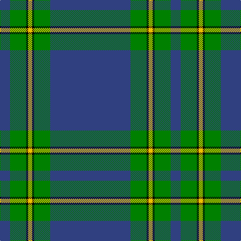

In pattern [BGKYKGB](/patterns/bgkykgb/).

This was sourced from weddslist.  It is a [7 stripes tartan](/stripes/stripes7/).

Original link http://www.weddslist.com/cgi-bin/tartans/pg.pl?source=sts

## Thread count
B/20 G32 K4 Y8 K4 G32 B/160

## Palette
Each colour and its ΔE from the base-6 reference it is a variant of.

| Colour | Shade | Base | ΔE (OKLab) |
|---|---|---|---|
| B | <code style="background-color:#304080;">#304080</code> `#304080` | B <code style="background-color:#2A418A;">#2A418A</code> | 0.02 |
| G | <code style="background-color:#008000;">#008000</code> `#008000` | G <code style="background-color:#006100;">#006100</code> | 0.10 |
| K | <code style="background-color:#000000;">#000000</code> `#000000` | K <code style="background-color:#000000;">#000000</code> | 0.00 |
| Y | <code style="background-color:#F0C000;">#F0C000</code> `#F0C000` | Y <code style="background-color:#F2BF00;">#F2BF00</code> | 0.00 |

# Sample pattern

## Nearest tartans

The nearest existing variants by ΔTartan distance.

1. [Salvation Army Hunting Corporate Tartan Tartan Number: 150. Earliest known date: 1983 Designed to be ready for the Perth Citadel Corps Centenary. The hunting version replaces red with green. See products available Copyright © Blair Urquhart, Comrie, 2015](/setts/s7/b160g32k4y8k4g32b20-b2c2c80-g006818-k101010-ye8c000/) — ΔT 0.85
1. [Pride of the Clyde](/setts/s8/b8w4ba6b2ba6r10ba63w3-b2c2c80-ba003c64-r888888-we0e0e0/) — ΔT 0.98
1. [Brooks Brothers Signature Corporate Tartan Tartan Number: 10652. Earliest known date: 01/05/2012 Brooks Brothers' Scottish roots originate in Perthshire's Glen Lyon. Thomas Lyon emigrated from Glen Lyon to the USA in the 1600s. It was his granddaughter, Lavinia, who married Henry Sands Brooks, founder of the Brooks empire. Brooks opened his first store in Cherry Street, New York in 1818. This simple and elegant tartan contains elements of the traditional 1819 Campbell tartan (the major clan in Glen Lyon) and incorporates the gold from the Brooks Brothers famous Golden Fleece logo and their equally famous necktie design, No. 1 stripe. See products available Copyright © Blair Urquhart, Comrie, 2015](/setts/s9/b10y2g14r2b90r10y6b8y6-b00506b-g006b1b-rb30000-yffd014/) — ΔT 1.05
1. [Chateau](/setts/s10/b144k12g12ba4g12k12b16g24k4ba8-b306084-ba488cc0-g484800-k000000/) — ΔT 1.28
1. [Hastings-Stephenson (Personal)](/setts/s8/g88b22g10ba6g8b16g8w2-b000048-ba2888c4-g00643c-wf8f8f8/) — ΔT 1.28
1. [Munster Ancestry](/setts/s8/b8ba96b42ba28y6ba12b2ya6-b332c2c-ba146a99-yc4950c-yae7b205/) — ΔT 1.34
1. [Murray of Elibank](/setts/s7/b128k6g28k8b8k24y8-b1474b4-g006818-k101010-yd09800/) — ΔT 1.35
1. [Wilson](/setts/s6/b96g28r6g4r6g4-b304080-g008000-rc00000/) — ΔT 1.43
1. [Royal Conservatoire of Scotland](/setts/s8/b11ba13g11ba7b11g3b90ba11-b3c82af-ba440044-g604000/) — ΔT 1.44
1. [Federal Bureaux (FBI) Corporate Tartan Tartan Number: 83. Earliest known date: 1989 Discovered (in 1991) to be the same as a previously accredited tartan, "S.C.O.T.S." designed by Kinloch Anderson in 1988. Twenty kilts have been produced for the F.B.I. pipe band. See products available Copyright © Blair Urquhart, Comrie, 2015](/setts/s6/b120ba38w6ba4r4ba14-b5c8ca8-ba2c2c80-rc80000-we0e0e0/) — ΔT 1.51

## Neighbour map

Every grey dot is one of 15726 variants placed by the first two principal components of the ΔTartan feature space (44% of its variance). Red is this tartan; blue dots are its nearest — click one to open its page.

<svg viewBox="0 0 640 380" role="img" style="max-width:100%;height:auto;border:1px solid #e0e0e0;border-radius:4px;display:block" xmlns="http://www.w3.org/2000/svg"><image href="/nn/cloud.v1.png" width="640" height="380"/><a href="/setts/s7/b160g32k4y8k4g32b20-b2c2c80-g006818-k101010-ye8c000/"><circle cx="499.7" cy="146.3" r="4" fill="#3465a4"><title>Salvation Army Hunting Corporate Tartan Tartan Number: 150. Earliest known date: 1983 Designed to be ready for the Perth Citadel Corps Centenary. The hunting version replaces red with green. See products available Copyright © Blair Urquhart, Comrie, 2015</title></circle></a><a href="/setts/s8/b8w4ba6b2ba6r10ba63w3-b2c2c80-ba003c64-r888888-we0e0e0/"><circle cx="506.8" cy="141.5" r="4" fill="#3465a4"><title>Pride of the Clyde</title></circle></a><a href="/setts/s9/b10y2g14r2b90r10y6b8y6-b00506b-g006b1b-rb30000-yffd014/"><circle cx="504.5" cy="110.8" r="4" fill="#3465a4"><title>Brooks Brothers Signature Corporate Tartan Tartan Number: 10652. Earliest known date: 01/05/2012 Brooks Brothers' Scottish roots originate in Perthshire's Glen Lyon. Thomas Lyon emigrated from Glen Lyon to the USA in the 1600s. It was his granddaughter, Lavinia, who married Henry Sands Brooks, founder of the Brooks empire. Brooks opened his first store in Cherry Street, New York in 1818. This simple and elegant tartan contains elements of the traditional 1819 Campbell tartan (the major clan in Glen Lyon) and incorporates the gold from the Brooks Brothers famous Golden Fleece logo and their equally famous necktie design, No. 1 stripe. See products available Copyright © Blair Urquhart, Comrie, 2015</title></circle></a><a href="/setts/s10/b144k12g12ba4g12k12b16g24k4ba8-b306084-ba488cc0-g484800-k000000/"><circle cx="446.3" cy="118.4" r="4" fill="#3465a4"><title>Chateau</title></circle></a><a href="/setts/s8/g88b22g10ba6g8b16g8w2-b000048-ba2888c4-g00643c-wf8f8f8/"><circle cx="498.5" cy="141.7" r="4" fill="#3465a4"><title>Hastings-Stephenson (Personal)</title></circle></a><a href="/setts/s8/b8ba96b42ba28y6ba12b2ya6-b332c2c-ba146a99-yc4950c-yae7b205/"><circle cx="500.6" cy="150.2" r="4" fill="#3465a4"><title>Munster Ancestry</title></circle></a><a href="/setts/s7/b128k6g28k8b8k24y8-b1474b4-g006818-k101010-yd09800/"><circle cx="409.7" cy="157.8" r="4" fill="#3465a4"><title>Murray of Elibank</title></circle></a><a href="/setts/s6/b96g28r6g4r6g4-b304080-g008000-rc00000/"><circle cx="487.7" cy="183.6" r="4" fill="#3465a4"><title>Wilson</title></circle></a><a href="/setts/s8/b11ba13g11ba7b11g3b90ba11-b3c82af-ba440044-g604000/"><circle cx="511.8" cy="160.0" r="4" fill="#3465a4"><title>Royal Conservatoire of Scotland</title></circle></a><a href="/setts/s6/b120ba38w6ba4r4ba14-b5c8ca8-ba2c2c80-rc80000-we0e0e0/"><circle cx="456.7" cy="154.7" r="4" fill="#3465a4"><title>Federal Bureaux (FBI) Corporate Tartan Tartan Number: 83. Earliest known date: 1989 Discovered (in 1991) to be the same as a previously accredited tartan, &quot;S.C.O.T.S.&quot; designed by Kinloch Anderson in 1988. Twenty kilts have been produced for the F.B.I. pipe band. See products available Copyright © Blair Urquhart, Comrie, 2015</title></circle></a><circle cx="483.7" cy="139.2" r="5" fill="#c00000"/></svg>

ID: /setts/s7/b160g32k4y8k4g32b20-b304080-g008000-k000000-yf0c000/
