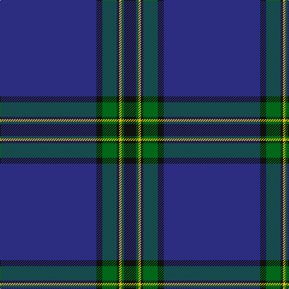

In pattern [BKGKYGK](/patterns/bkgkygk/).

This was sourced from register-of-tartans.  It is a [7 stripes tartan](/stripes/stripes7/).

Original link https://www.tartanregister.gov.uk/tartanDetails.aspx?ref=25

## Attestations

This cloth appears in 2 source records; the oldest owns this page.

- 01/03/2002 — Affara (Personal) (register-of-tartans, [record](https://www.tartanregister.gov.uk/tartanDetails.aspx?ref=25))
- March 2002 — Affara (Personal) (tartans-authority, [record](http://www.tartansauthority.com/tartan-ferret/display/4074/))

## Thread count
DB/160 K10 G24 K4 Y4 G4 K/20

## Palette
Each colour and its ΔE from the base-6 reference it is a variant of.

| Colour | Shade | Base | ΔE (OKLab) |
|---|---|---|---|
| DB | <code style="background-color:#2C2C80;">#2C2C80</code> `#2C2C80` | B <code style="background-color:#2C4084;">#2C4084</code> | 0.05 |
| G | <code style="background-color:#006818;">#006818</code> `#006818` | G <code style="background-color:#006400;">#006400</code> | 0.02 |
| K | <code style="background-color:#101010;">#101010</code> `#101010` | K <code style="background-color:#000000;">#000000</code> | 0.17 |
| Y | <code style="background-color:#E8C000;">#E8C000</code> `#E8C000` | Y <code style="background-color:#E8C000;">#E8C000</code> | 0.00 |

# Sample pattern

## Nearest tartans

The nearest existing variants by ΔTartan distance.

1. [Marist School, The](/setts/s8/b116ba8b4ba4b4ba4bb32y4-b102040-ba4000ff-bb304080-yf0c000/) — ΔT 0.78
1. [Salvation Army Hunting Corporate Tartan Tartan Number: 150. Earliest known date: 1983 Designed to be ready for the Perth Citadel Corps Centenary. The hunting version replaces red with green. See products available Copyright © Blair Urquhart, Comrie, 2015](/setts/s7/b160g32k4y8k4g32b20-b2c2c80-g006818-k101010-ye8c000/) — ΔT 0.87
1. [Pride of the Clyde](/setts/s8/b8w4ba6b2ba6r10ba63w3-b2c2c80-ba003c64-r888888-we0e0e0/) — ΔT 1.21
1. [United States Trade sett Tartan Tartan Number: 2126. Earliest known date: 1989 This design is different in warp and weft. The display gives the general appearance only. Produced to celebrate American tourism is Scotland. The colours are taken from the flags of the two nations and the Atlantic Ocean that separates them. See products available Copyright © Blair Urquhart, Comrie, 2015](/setts/s9/b7ba5y6ba5r7ba2b2ba70y2-b2c2c80-ba003c64-rc80000-yb8b8b8/) — ΔT 1.21
1. [United French Freemasons (Corporate](/setts/s6/b144r9ba44b4ba4b4-b202060-ba2888c4-r880000/) — ΔT 1.22
1. [Lewis Welsh Name Tartan Tartan Number: 5758. Earliest known date: 22002 The tartan for this Welsh surname and its variations, Lewis, Lewys, Lou, Louis, Lew, Lewes, is actually woven in Wales at the Cambrian Woollen Mill, weaving on the same site since 1830. This tartan differs from many traditional patterns in that the warp and weft differ, giving the finished worsted wool cloth more of a predominant stripe, vertically noticeable in the finished Kilt, or Cilt in Wales. See products available Copyright © Blair Urquhart, Comrie, 2015](/setts/s7/b112y4g38y2g4y2b4-b202060-g005c34-ya08858/) — ΔT 1.24
1. [S.C.O.T.S.](/setts/s6/b110ba36w6ba4r4ba12-b304080-ba000050-rc00020-we0e0e0/) — ΔT 1.24
1. [Michael (John) (Personal)](/setts/s6/g10w2r10k10b86r2-b2c2c80-g006818-k101010-rc80000-we0e0e0/) — ΔT 1.26
1. [Parr Family Tartan Tartan Number: 439. Earliest known date: pre 2003 Almost nothing known about this tartan See products available Copyright © Blair Urquhart, Comrie, 2015](/setts/s10/b124r2b4r2b8k28g8w4g12k8-b2c2c80-g006818-k101010-rc80000-we0e0e0/) — ΔT 1.29
1. [Marist School, The](/setts/s8/b116ba8b4ba4b4ba4bb32y4-b1c0070-ba2c2c80-bb5c8ca8-yd09800/) — ΔT 1.34

## Neighbour map

Every grey dot is one of 15726 variants placed by the first two principal components of the ΔTartan feature space (44% of its variance). Red is this tartan; blue dots are its nearest — click one to open its page.

<svg viewBox="0 0 640 380" role="img" style="max-width:100%;height:auto;border:1px solid #e0e0e0;border-radius:4px;display:block" xmlns="http://www.w3.org/2000/svg"><image href="/nn/cloud.v1.png" width="640" height="380"/><a href="/setts/s8/b116ba8b4ba4b4ba4bb32y4-b102040-ba4000ff-bb304080-yf0c000/"><circle cx="525.9" cy="153.6" r="4" fill="#3465a4"><title>Marist School, The</title></circle></a><a href="/setts/s7/b160g32k4y8k4g32b20-b2c2c80-g006818-k101010-ye8c000/"><circle cx="499.7" cy="146.3" r="4" fill="#3465a4"><title>Salvation Army Hunting Corporate Tartan Tartan Number: 150. Earliest known date: 1983 Designed to be ready for the Perth Citadel Corps Centenary. The hunting version replaces red with green. See products available Copyright © Blair Urquhart, Comrie, 2015</title></circle></a><a href="/setts/s8/b8w4ba6b2ba6r10ba63w3-b2c2c80-ba003c64-r888888-we0e0e0/"><circle cx="506.8" cy="141.5" r="4" fill="#3465a4"><title>Pride of the Clyde</title></circle></a><a href="/setts/s9/b7ba5y6ba5r7ba2b2ba70y2-b2c2c80-ba003c64-rc80000-yb8b8b8/"><circle cx="568.1" cy="130.5" r="4" fill="#3465a4"><title>United States Trade sett Tartan Tartan Number: 2126. Earliest known date: 1989 This design is different in warp and weft. The display gives the general appearance only. Produced to celebrate American tourism is Scotland. The colours are taken from the flags of the two nations and the Atlantic Ocean that separates them. See products available Copyright © Blair Urquhart, Comrie, 2015</title></circle></a><a href="/setts/s6/b144r9ba44b4ba4b4-b202060-ba2888c4-r880000/"><circle cx="555.0" cy="171.3" r="4" fill="#3465a4"><title>United French Freemasons (Corporate</title></circle></a><a href="/setts/s7/b112y4g38y2g4y2b4-b202060-g005c34-ya08858/"><circle cx="577.7" cy="161.3" r="4" fill="#3465a4"><title>Lewis Welsh Name Tartan Tartan Number: 5758. Earliest known date: 22002 The tartan for this Welsh surname and its variations, Lewis, Lewys, Lou, Louis, Lew, Lewes, is actually woven in Wales at the Cambrian Woollen Mill, weaving on the same site since 1830. This tartan differs from many traditional patterns in that the warp and weft differ, giving the finished worsted wool cloth more of a predominant stripe, vertically noticeable in the finished Kilt, or Cilt in Wales. See products available Copyright © Blair Urquhart, Comrie, 2015</title></circle></a><a href="/setts/s6/b110ba36w6ba4r4ba12-b304080-ba000050-rc00020-we0e0e0/"><circle cx="464.6" cy="172.8" r="4" fill="#3465a4"><title>S.C.O.T.S.</title></circle></a><a href="/setts/s6/g10w2r10k10b86r2-b2c2c80-g006818-k101010-rc80000-we0e0e0/"><circle cx="501.0" cy="125.1" r="4" fill="#3465a4"><title>Michael (John) (Personal)</title></circle></a><a href="/setts/s10/b124r2b4r2b8k28g8w4g12k8-b2c2c80-g006818-k101010-rc80000-we0e0e0/"><circle cx="488.8" cy="92.8" r="4" fill="#3465a4"><title>Parr Family Tartan Tartan Number: 439. Earliest known date: pre 2003 Almost nothing known about this tartan See products available Copyright © Blair Urquhart, Comrie, 2015</title></circle></a><a href="/setts/s8/b116ba8b4ba4b4ba4bb32y4-b1c0070-ba2c2c80-bb5c8ca8-yd09800/"><circle cx="497.9" cy="138.6" r="4" fill="#3465a4"><title>Marist School, The</title></circle></a><circle cx="531.5" cy="142.5" r="5" fill="#c00000"/></svg>

ID: /setts/s7/b160k10g24k4y4g4k20-b2c2c80-g006818-k101010-ye8c000/
