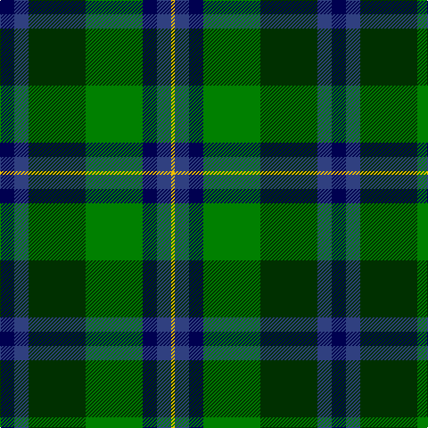

In pattern [BBGGBBY](/patterns/bbggbby/).

This was sourced from weddslist.  It is a [7 stripes tartan](/stripes/stripes7/).

Original link http://www.weddslist.com/cgi-bin/tartans/pg.pl?source=sts

## Thread count
DB/16 B16 DG64 G64 DB16 B16 Y/4

## Palette
Each colour and its ΔE from the base-6 reference it is a variant of.

| Colour | Shade | Base | ΔE (OKLab) |
|---|---|---|---|
| B | <code style="background-color:#304080;">#304080</code> `#304080` | B <code style="background-color:#2A418A;">#2A418A</code> | 0.02 |
| DB | <code style="background-color:#000050;">#000050</code> `#000050` | B <code style="background-color:#2A418A;">#2A418A</code> | 0.21 |
| DG | <code style="background-color:#003000;">#003000</code> `#003000` | G <code style="background-color:#006100;">#006100</code> | 0.17 |
| G | <code style="background-color:#008000;">#008000</code> `#008000` | G <code style="background-color:#006100;">#006100</code> | 0.10 |
| Y | <code style="background-color:#F0C000;">#F0C000</code> `#F0C000` | Y <code style="background-color:#F2BF00;">#F2BF00</code> | 0.00 |

# Sample pattern

## Nearest tartans

The nearest existing variants by ΔTartan distance.

1. [Royal Ashburn Golf Club](/setts/s6/g4b44r4k42g46y4-b1474b4-g006818-k101010-rc80000-ye8c000/) — ΔT 1.04
1. [MacWilliam (Clan)](/setts/s6/g8ga48k40r4b64r8-b1474b4-g604000-ga006818-k101010-rc80000/) — ΔT 1.12
1. [Hughes](/setts/s7/g80ga56b36y8b36k4w8-b304080-g008000-ga003000-k000000-we0e0e0-yf0c000/) — ΔT 1.17
1. [Smith, Sir William (?)](/setts/s6/b6ba36k40g40k2y6-b5c8ca8-ba2c2c80-g006818-k101010-yfccc00/) — ΔT 1.18
1. [Paterson (Personal)](/setts/s7/g6b24w2k24g26r4g4-b2c2c80-g006818-k101010-rc80000-wfcfcfc/) — ΔT 1.19
1. [Tait #1](/setts/s8/r10k4b38g8k38g56k4y10-b2c2c80-g006818-k101010-rc80000-ye8c000/) — ΔT 1.21
1. [Cailleach (Fashion)](/setts/s9/k30b20k10b5w2b10g20r2g10-b3c505c-g007440-k101010-rc80000-we0e0e0/) — ΔT 1.24
1. [MacWilliams Wedding Personal Tartan Tartan Number: 7667. Earliest known date: 2008 Designed by Bisell McWilliams for his wedding. Details from Matt Newsome. See products available Copyright © Blair Urquhart, Comrie, 2015](/setts/s9/g4b2k2b28ka4b2k24g20r4-b506878-g006818-k101010-ka000000-rd40000/) — ΔT 1.24
1. [MacLeod of Assynt](/setts/s6/r6k4g40k20b40y4-b1474b4-g006818-k101010-rc80000-ye8c000/) — ΔT 1.25
1. [Rhun (Fashion)](/setts/s7/r12b68w7k39g75r6g6-b1c1c50-g006818-k101010-rc80000-we0e0e0/) — ΔT 1.28

## Neighbour map

Every grey dot is one of 15726 variants placed by the first two principal components of the ΔTartan feature space (44% of its variance). Red is this tartan; blue dots are its nearest — click one to open its page.

<svg viewBox="0 0 640 380" role="img" style="max-width:100%;height:auto;border:1px solid #e0e0e0;border-radius:4px;display:block" xmlns="http://www.w3.org/2000/svg"><image href="/nn/cloud.v1.png" width="640" height="380"/><a href="/setts/s6/g4b44r4k42g46y4-b1474b4-g006818-k101010-rc80000-ye8c000/"><circle cx="171.0" cy="196.0" r="4" fill="#3465a4"><title>Royal Ashburn Golf Club</title></circle></a><a href="/setts/s6/g8ga48k40r4b64r8-b1474b4-g604000-ga006818-k101010-rc80000/"><circle cx="188.9" cy="187.6" r="4" fill="#3465a4"><title>MacWilliam (Clan)</title></circle></a><a href="/setts/s7/g80ga56b36y8b36k4w8-b304080-g008000-ga003000-k000000-we0e0e0-yf0c000/"><circle cx="161.6" cy="156.4" r="4" fill="#3465a4"><title>Hughes</title></circle></a><a href="/setts/s6/b6ba36k40g40k2y6-b5c8ca8-ba2c2c80-g006818-k101010-yfccc00/"><circle cx="174.8" cy="180.5" r="4" fill="#3465a4"><title>Smith, Sir William (?)</title></circle></a><a href="/setts/s7/g6b24w2k24g26r4g4-b2c2c80-g006818-k101010-rc80000-wfcfcfc/"><circle cx="196.4" cy="190.8" r="4" fill="#3465a4"><title>Paterson (Personal)</title></circle></a><a href="/setts/s8/r10k4b38g8k38g56k4y10-b2c2c80-g006818-k101010-rc80000-ye8c000/"><circle cx="179.8" cy="169.1" r="4" fill="#3465a4"><title>Tait #1</title></circle></a><a href="/setts/s9/k30b20k10b5w2b10g20r2g10-b3c505c-g007440-k101010-rc80000-we0e0e0/"><circle cx="202.3" cy="190.1" r="4" fill="#3465a4"><title>Cailleach (Fashion)</title></circle></a><a href="/setts/s9/g4b2k2b28ka4b2k24g20r4-b506878-g006818-k101010-ka000000-rd40000/"><circle cx="194.5" cy="162.0" r="4" fill="#3465a4"><title>MacWilliams Wedding Personal Tartan Tartan Number: 7667. Earliest known date: 2008 Designed by Bisell McWilliams for his wedding. Details from Matt Newsome. See products available Copyright © Blair Urquhart, Comrie, 2015</title></circle></a><a href="/setts/s6/r6k4g40k20b40y4-b1474b4-g006818-k101010-rc80000-ye8c000/"><circle cx="165.1" cy="199.7" r="4" fill="#3465a4"><title>MacLeod of Assynt</title></circle></a><a href="/setts/s7/r12b68w7k39g75r6g6-b1c1c50-g006818-k101010-rc80000-we0e0e0/"><circle cx="192.3" cy="179.8" r="4" fill="#3465a4"><title>Rhun (Fashion)</title></circle></a><circle cx="170.3" cy="186.8" r="5" fill="#c00000"/></svg>

ID: /setts/s7/b16ba16g64ga64b16ba16y4-b000050-ba304080-g003000-ga008000-yf0c000/
