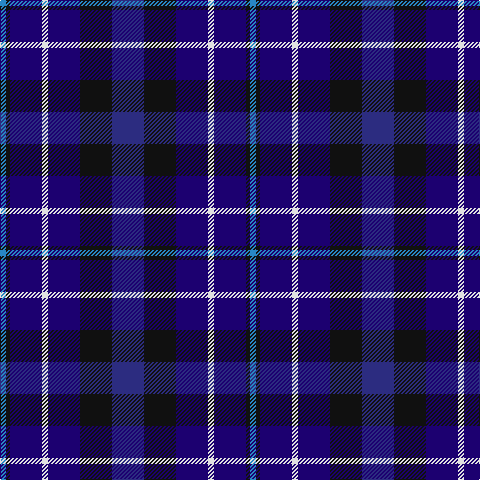

In pattern [BKBWBKB](/patterns/bkbwbkb/).

This was sourced from register-of-tartans.  It is a [7 stripes tartan](/stripes/stripes7/).

Original link https://www.tartanregister.gov.uk/tartanDetails.aspx?ref=3873

## Attestations

This cloth appears in 2 source records; the oldest owns this page.

- 01/01/2007 — St. Andrew Society (register-of-tartans, [record](https://www.tartanregister.gov.uk/tartanDetails.aspx?ref=3873))
- pre 2007 — St. Andrew Society (Corporate) (tartans-authority, [record](http://www.tartansauthority.com/tartan-ferret/display/7251/))

## Register references

External register numbers recorded for this tartan.

- Scottish Register of Tartans: [3873](https://www.tartanregister.gov.uk/tartanDetails.aspx?ref=3873)
- Scottish Tartans Authority (ITI): 7251

## Thread count
Ba/6 K4 DBa32 LN6 DBa32 K32 DB/32

## Palette
Each colour and its ΔE from the base-6 reference it is a variant of.

| Colour | Shade | Base | ΔE (OKLab) |
|---|---|---|---|
| B | <code style="background-color:#1474B4;">#1474B4</code> `#1474B4` | B <code style="background-color:#2A418A;">#2A418A</code> | 0.15 |
| Ba | <code style="background-color:#2888C4;">#2888C4</code> `#2888C4` | B <code style="background-color:#2A418A;">#2A418A</code> | 0.21 |
| DB | <code style="background-color:#2C2C80;">#2C2C80</code> `#2C2C80` | B <code style="background-color:#2A418A;">#2A418A</code> | 0.06 |
| DBa | <code style="background-color:#1C0070;">#1C0070</code> `#1C0070` | B <code style="background-color:#2A418A;">#2A418A</code> | 0.14 |
| K | <code style="background-color:#101010;">#101010</code> `#101010` | K <code style="background-color:#000000;">#000000</code> | 0.17 |
| LN | <code style="background-color:#E0E0E0;">#E0E0E0</code> `#E0E0E0` | W <code style="background-color:#F7F7F7;">#F7F7F7</code> | 0.07 |
| LP | <code style="background-color:#C49CD8;">#C49CD8</code> `#C49CD8` | W <code style="background-color:#F7F7F7;">#F7F7F7</code> | 0.25 |

# Sample pattern

## Nearest tartans

The nearest existing variants by ΔTartan distance.

1. [Brodie Countryfare (Corporate)](/setts/s7/b3k13b13ba13w2ba13w3~b2c2c80-ba1c0070-k101010-we0e0e0~x2/) — ΔT 1.20
1. [Allianz Deutschland 2012 (Corporate)](/setts/s7/b6ba3b6ba20k20ba8w4~b2c2c80-ba202060-k101010-wfcfcfc~x2/) — ΔT 1.24
1. [Moray (Corporate)](/setts/s8/b15ba3b30k22g18ba3g3w3~b2c2c80-ba780078-g003820-k101010-we0e0e0~x2/) — ΔT 1.28
1. [Romantic Scotland (Madonna)](/setts/s9/b5ba1b4bb4b7bb8w1bb2y1~b14283c-ba780078-bb2c2c80-wf8f8f8-ye8c000~x4/) — ΔT 1.40
1. [Loyalhanna (District?)](/setts/s8/b15k3b21k3k15b2k2b15~b00008c-k000000~x2/) — ΔT 1.48
1. [Daks, Muted blue](/setts/s8/r5b12ba4ra4ba22b3ba4r5~b304080-ba000050-r806050-ra906030/) — ΔT 1.53
1. [Rose, Danny and Hanna (Personal)](/setts/s5/y11b19ba38r7k7~b2c2c80-ba14283c-k101010-r880000-y48a4c0~x2/) — ΔT 1.55
1. [Belfrage](/setts/s6/b22ba5bb9g14b10y2~b000048-ba646464-bb3c0014-g004028-yc8a050~x2/) — ΔT 1.55
1. [Blue Family Tartan Tartan Number: 1420. Earliest known date: 1985 Blue is a Sept name of MacMillan. See products available Copyright © Blair Urquhart, Comrie, 2015](/setts/s7/r2b11r3b11ba12bb10w2~b2c2c80-ba5c8ca8-bb202060-rc80000-we0e0e0~x2/) — ΔT 1.55
1. [Heritage of Scotland](/setts/s7/b6w3b21k16ba6k3ba6~b2c2c80-ba780078-k101010-wf8f8f8~x2/) — ΔT 1.59

## Neighbour map

Every grey dot is one of 15726 variants placed by the first two principal components of the ΔTartan feature space (44% of its variance). Red is this tartan; blue dots are its nearest — click one to open its page.

<svg viewBox="0 0 640 380" role="img" style="max-width:100%;height:auto;border:1px solid #e0e0e0;border-radius:4px;display:block" xmlns="http://www.w3.org/2000/svg"><image href="/nn/cloud.v1.png" width="640" height="380"/><a href="/setts/s7/b3k13b13ba13w2ba13w3~b2c2c80-ba1c0070-k101010-we0e0e0~x2/"><circle cx="191.7" cy="254.9" r="4" fill="#3465a4"><title>Brodie Countryfare (Corporate)</title></circle></a><a href="/setts/s7/b6ba3b6ba20k20ba8w4~b2c2c80-ba202060-k101010-wfcfcfc~x2/"><circle cx="232.1" cy="248.4" r="4" fill="#3465a4"><title>Allianz Deutschland 2012 (Corporate)</title></circle></a><a href="/setts/s8/b15ba3b30k22g18ba3g3w3~b2c2c80-ba780078-g003820-k101010-we0e0e0~x2/"><circle cx="252.3" cy="209.1" r="4" fill="#3465a4"><title>Moray (Corporate)</title></circle></a><a href="/setts/s9/b5ba1b4bb4b7bb8w1bb2y1~b14283c-ba780078-bb2c2c80-wf8f8f8-ye8c000~x4/"><circle cx="269.1" cy="227.8" r="4" fill="#3465a4"><title>Romantic Scotland (Madonna)</title></circle></a><a href="/setts/s8/b15k3b21k3k15b2k2b15~b00008c-k000000~x2/"><circle cx="254.1" cy="225.3" r="4" fill="#3465a4"><title>Loyalhanna (District?)</title></circle></a><a href="/setts/s8/r5b12ba4ra4ba22b3ba4r5~b304080-ba000050-r806050-ra906030/"><circle cx="278.0" cy="233.3" r="4" fill="#3465a4"><title>Daks, Muted blue</title></circle></a><a href="/setts/s5/y11b19ba38r7k7~b2c2c80-ba14283c-k101010-r880000-y48a4c0~x2/"><circle cx="216.3" cy="256.2" r="4" fill="#3465a4"><title>Rose, Danny and Hanna (Personal)</title></circle></a><a href="/setts/s6/b22ba5bb9g14b10y2~b000048-ba646464-bb3c0014-g004028-yc8a050~x2/"><circle cx="267.9" cy="240.7" r="4" fill="#3465a4"><title>Belfrage</title></circle></a><a href="/setts/s7/r2b11r3b11ba12bb10w2~b2c2c80-ba5c8ca8-bb202060-rc80000-we0e0e0~x2/"><circle cx="165.6" cy="234.4" r="4" fill="#3465a4"><title>Blue Family Tartan Tartan Number: 1420. Earliest known date: 1985 Blue is a Sept name of MacMillan. See products available Copyright © Blair Urquhart, Comrie, 2015</title></circle></a><a href="/setts/s7/b6w3b21k16ba6k3ba6~b2c2c80-ba780078-k101010-wf8f8f8~x2/"><circle cx="223.4" cy="233.8" r="4" fill="#3465a4"><title>Heritage of Scotland</title></circle></a><circle cx="212.3" cy="237.3" r="5" fill="#c00000"/></svg>

ID: /setts/s7/b16k16ba16w3ba16k2bb3~b2c2c80-ba1c0070-bb2888c4-k101010-we0e0e0~x2/
