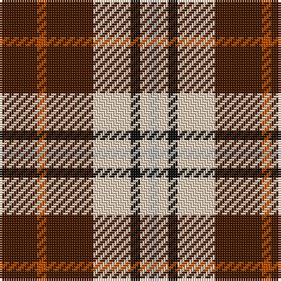

In pattern [BRBWKWY](/patterns/brbwkwy/).

This was sourced from register-of-tartans.  It is a [7 stripes tartan](/stripes/stripes7/).

Original link https://www.tartanregister.gov.uk/tartanDetails.aspx?ref=1096

## Thread count
DR/16 DO4 DR20 LR16 K4 LR4 N/4

## Palette
Each colour and its ΔE from the base-6 reference it is a variant of.

| Colour | Shade | Base | ΔE (OKLab) |
|---|---|---|---|
| DO | <code style="background-color:#B84C00;">#B84C00</code> `#B84C00` | R <code style="background-color:#CC0000;">#CC0000</code> | 0.08 |
| DR | <code style="background-color:#441800;">#441800</code> `#441800` | B <code style="background-color:#2A418A;">#2A418A</code> | 0.23 |
| K | <code style="background-color:#101010;">#101010</code> `#101010` | K <code style="background-color:#000000;">#000000</code> | 0.17 |
| LR | <code style="background-color:#E8CCB8;">#E8CCB8</code> `#E8CCB8` | W <code style="background-color:#F7F7F7;">#F7F7F7</code> | 0.12 |
| N | <code style="background-color:#B8B8B8;">#B8B8B8</code> `#B8B8B8` | Y <code style="background-color:#F2BF00;">#F2BF00</code> | 0.17 |

# Sample pattern

## Nearest tartans

The nearest existing variants by ΔTartan distance.

1. [Ryan/Fehder (Personal)](/setts/s6/w8r14y10b26r36g6-b1474b4-g006818-r880000-wfcfcfc-ybc8c00/) — ΔT 1.15
1. [Dogrobes](/setts/s9/r6w4r18b30w4b30wa18r4wa6-b1c1c1c-rdc0000-wffffff-wac0c0c0/) — ΔT 1.33
1. [Hoffman Texas German](/setts/s7/k46r54b6r10w6k28y12-b0000cd-k1c1714-rca2625-wffffff-yffe700/) — ΔT 1.36
1. [MacTavish](/setts/s7/r24g4r24b4g12k12g12-b304080-g008000-k000000-rc00000/) — ΔT 1.42
1. [Mangles, Peter and Annette (Personal)](/setts/s7/r80k20g20r20w20b12g12-b686468-g00643c-k000000-re01c18-we8e8e8/) — ΔT 1.42
1. [Malliou, Despina (Personal)](/setts/s8/k16r14w8k16g10r14k36wa4-g008b00-k101010-re3170d-wffff7e-wa82cffd/) — ΔT 1.44
1. [Mangles, Peter and Annette (Personal](/setts/s7/r80k20g20r20w20ra12g12-g285800-k101010-rc80000-ra888888-wfcfcfc/) — ΔT 1.46
1. [Ikelman No 2](/setts/s5/g52k20r20y20g6-g808080-k000000-rc00000-yf0c000/) — ΔT 1.53
1. [Royal Stuart/Stewart](/setts/s8/r14b4k4y2k4r4k2w2-b2c4084-k101010-rdc0000-we0e0e0-ye8c000/) — ΔT 1.55
1. [Strathblane](/setts/s5/r24k8w4g12ra6-g808080-k000000-r806050-rac00000-we0e0e0/) — ΔT 1.55

## Neighbour map

Every grey dot is one of 15726 variants placed by the first two principal components of the ΔTartan feature space (44% of its variance). Red is this tartan; blue dots are its nearest — click one to open its page.

<svg viewBox="0 0 640 380" role="img" style="max-width:100%;height:auto;border:1px solid #e0e0e0;border-radius:4px;display:block" xmlns="http://www.w3.org/2000/svg"><image href="/nn/cloud.v1.png" width="640" height="380"/><a href="/setts/s6/w8r14y10b26r36g6-b1474b4-g006818-r880000-wfcfcfc-ybc8c00/"><circle cx="196.8" cy="215.9" r="4" fill="#3465a4"><title>Ryan/Fehder (Personal)</title></circle></a><a href="/setts/s9/r6w4r18b30w4b30wa18r4wa6-b1c1c1c-rdc0000-wffffff-wac0c0c0/"><circle cx="204.2" cy="185.5" r="4" fill="#3465a4"><title>Dogrobes</title></circle></a><a href="/setts/s7/k46r54b6r10w6k28y12-b0000cd-k1c1714-rca2625-wffffff-yffe700/"><circle cx="206.5" cy="175.4" r="4" fill="#3465a4"><title>Hoffman Texas German</title></circle></a><a href="/setts/s7/r24g4r24b4g12k12g12-b304080-g008000-k000000-rc00000/"><circle cx="224.5" cy="232.5" r="4" fill="#3465a4"><title>MacTavish</title></circle></a><a href="/setts/s7/r80k20g20r20w20b12g12-b686468-g00643c-k000000-re01c18-we8e8e8/"><circle cx="222.9" cy="173.9" r="4" fill="#3465a4"><title>Mangles, Peter and Annette (Personal)</title></circle></a><a href="/setts/s8/k16r14w8k16g10r14k36wa4-g008b00-k101010-re3170d-wffff7e-wa82cffd/"><circle cx="226.3" cy="194.7" r="4" fill="#3465a4"><title>Malliou, Despina (Personal)</title></circle></a><a href="/setts/s7/r80k20g20r20w20ra12g12-g285800-k101010-rc80000-ra888888-wfcfcfc/"><circle cx="231.3" cy="178.0" r="4" fill="#3465a4"><title>Mangles, Peter and Annette (Personal</title></circle></a><a href="/setts/s5/g52k20r20y20g6-g808080-k000000-rc00000-yf0c000/"><circle cx="200.0" cy="217.9" r="4" fill="#3465a4"><title>Ikelman No 2</title></circle></a><a href="/setts/s8/r14b4k4y2k4r4k2w2-b2c4084-k101010-rdc0000-we0e0e0-ye8c000/"><circle cx="208.1" cy="171.4" r="4" fill="#3465a4"><title>Royal Stuart/Stewart</title></circle></a><a href="/setts/s5/r24k8w4g12ra6-g808080-k000000-r806050-rac00000-we0e0e0/"><circle cx="157.1" cy="222.1" r="4" fill="#3465a4"><title>Strathblane</title></circle></a><circle cx="191.5" cy="204.6" r="5" fill="#c00000"/></svg>

ID: /setts/s7/b16r4b20w16k4w4y4-b441800-k101010-rb84c00-we8ccb8-yb8b8b8/
