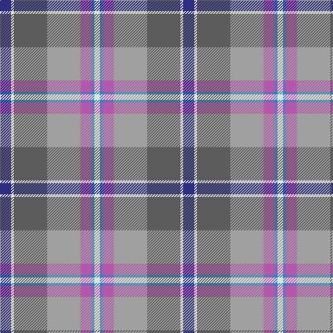

In pattern [BWBYRBW](/patterns/bwbyrbw/).

This was sourced from register-of-tartans.  It is a [7 stripes tartan](/stripes/stripes7/).

Original link https://www.tartanregister.gov.uk/tartanDetails.aspx?ref=11358

## Thread count
DB/16 LN4 N48 Na48 P16 B4 LN/8

## Palette
Each colour and its ΔE from the base-6 reference it is a variant of.

| Colour | Shade | Base | ΔE (OKLab) |
|---|---|---|---|
| B | <code style="background-color:#2888C4;">#2888C4</code> `#2888C4` | B <code style="background-color:#2A418A;">#2A418A</code> | 0.21 |
| DB | <code style="background-color:#2C2C80;">#2C2C80</code> `#2C2C80` | B <code style="background-color:#2A418A;">#2A418A</code> | 0.06 |
| LN | <code style="background-color:#E0E0E0;">#E0E0E0</code> `#E0E0E0` | W <code style="background-color:#F7F7F7;">#F7F7F7</code> | 0.07 |
| N | <code style="background-color:#5C5C5C;">#5C5C5C</code> `#5C5C5C` | B <code style="background-color:#2A418A;">#2A418A</code> | 0.15 |
| Na | <code style="background-color:#A0A0A0;">#A0A0A0</code> `#A0A0A0` | Y <code style="background-color:#F2BF00;">#F2BF00</code> | 0.21 |
| P | <code style="background-color:#B458AC;">#B458AC</code> `#B458AC` | R <code style="background-color:#CC0000;">#CC0000</code> | 0.20 |

# Sample pattern

## Nearest tartans

The nearest existing variants by ΔTartan distance.

1. [Glen Lyon (Fashion)](/setts/s7/r12b4r44w4k20ba56y12-b1c1c50-ba206084-k101010-r888888-wfcfcfc-ybc8c00/) — ΔT 1.22
1. [Allman-Jones (Personal)](/setts/s7/r6w4ra14b50k16ra30g4-b5c5c5c-g003820-k101010-rc80000-ra888888-wfcfcfc/) — ΔT 1.29
1. [Balfour](/setts/s6/b60y6g22y6ga66r12-b2c4084-g503c14-ga808080-rdc0000-ye8c000/) — ΔT 1.29
1. [Deeside Plaid (Taobh Dhi) (District)](/setts/s7/y8b44g8r48ba12r8w6-b3850c8-ba780078-g006818-r888888-wfcfcfc-ye8c000/) — ΔT 1.30
1. [Balfour](/setts/s6/b60y6r22y6g66ra12-b304080-g808080-r806050-rac00000-yf0c000/) — ΔT 1.31
1. [Thousand Islands](/setts/s10/b40ba16y10k12ba8r6ba6g60r4ba6-b2c2c80-ba2888c4-g74846c-k101010-rc80000-yd87c00/) — ΔT 1.31
1. [State Seal of Michigan (Fashion)](/setts/s6/r8b54y12ba38bb76w8-b441800-ba5c5c5c-bb1474b4-r880000-we8ccb8-ya08858/) — ΔT 1.32
1. [Commonwealth Games 1998 (Corporate)](/setts/s11/g20r4g4ra8g32b32ra4ba36y4ba16ra6-b780078-ba788cb4-g006818-rb42864-raa00048-yc88c00/) — ΔT 1.35
1. [Curd (2013)](/setts/s8/b4y36w12ya12b36ya4g4r4-b5f749c-g649848-rc82828-we0e0e0-yafb8bb-yaf8e38c/) — ΔT 1.38
1. [Washington DC (Fashion)](/setts/s8/w10b64r10g12r10ra32r78y10-b1474b4-g006818-r888888-ra880000-we8ccb8-ybc8c00/) — ΔT 1.43

## Neighbour map

Every grey dot is one of 15726 variants placed by the first two principal components of the ΔTartan feature space (44% of its variance). Red is this tartan; blue dots are its nearest — click one to open its page.

<svg viewBox="0 0 640 380" role="img" style="max-width:100%;height:auto;border:1px solid #e0e0e0;border-radius:4px;display:block" xmlns="http://www.w3.org/2000/svg"><image href="/nn/cloud.v1.png" width="640" height="380"/><a href="/setts/s7/r12b4r44w4k20ba56y12-b1c1c50-ba206084-k101010-r888888-wfcfcfc-ybc8c00/"><circle cx="176.9" cy="160.5" r="4" fill="#3465a4"><title>Glen Lyon (Fashion)</title></circle></a><a href="/setts/s7/r6w4ra14b50k16ra30g4-b5c5c5c-g003820-k101010-rc80000-ra888888-wfcfcfc/"><circle cx="202.4" cy="164.7" r="4" fill="#3465a4"><title>Allman-Jones (Personal)</title></circle></a><a href="/setts/s6/b60y6g22y6ga66r12-b2c4084-g503c14-ga808080-rdc0000-ye8c000/"><circle cx="211.0" cy="193.2" r="4" fill="#3465a4"><title>Balfour</title></circle></a><a href="/setts/s7/y8b44g8r48ba12r8w6-b3850c8-ba780078-g006818-r888888-wfcfcfc-ye8c000/"><circle cx="175.4" cy="173.1" r="4" fill="#3465a4"><title>Deeside Plaid (Taobh Dhi) (District)</title></circle></a><a href="/setts/s6/b60y6r22y6g66ra12-b304080-g808080-r806050-rac00000-yf0c000/"><circle cx="225.9" cy="199.3" r="4" fill="#3465a4"><title>Balfour</title></circle></a><a href="/setts/s10/b40ba16y10k12ba8r6ba6g60r4ba6-b2c2c80-ba2888c4-g74846c-k101010-rc80000-yd87c00/"><circle cx="166.3" cy="129.7" r="4" fill="#3465a4"><title>Thousand Islands</title></circle></a><a href="/setts/s6/r8b54y12ba38bb76w8-b441800-ba5c5c5c-bb1474b4-r880000-we8ccb8-ya08858/"><circle cx="169.7" cy="191.4" r="4" fill="#3465a4"><title>State Seal of Michigan (Fashion)</title></circle></a><a href="/setts/s11/g20r4g4ra8g32b32ra4ba36y4ba16ra6-b780078-ba788cb4-g006818-rb42864-raa00048-yc88c00/"><circle cx="137.8" cy="160.6" r="4" fill="#3465a4"><title>Commonwealth Games 1998 (Corporate)</title></circle></a><a href="/setts/s8/b4y36w12ya12b36ya4g4r4-b5f749c-g649848-rc82828-we0e0e0-yafb8bb-yaf8e38c/"><circle cx="161.0" cy="159.1" r="4" fill="#3465a4"><title>Curd (2013)</title></circle></a><a href="/setts/s8/w10b64r10g12r10ra32r78y10-b1474b4-g006818-r888888-ra880000-we8ccb8-ybc8c00/"><circle cx="212.1" cy="182.1" r="4" fill="#3465a4"><title>Washington DC (Fashion)</title></circle></a><circle cx="159.9" cy="162.9" r="5" fill="#c00000"/></svg>

ID: /setts/s7/b16w4ba48y48r16bb4w8-b2c2c80-ba5c5c5c-bb2888c4-rb458ac-we0e0e0-ya0a0a0/
