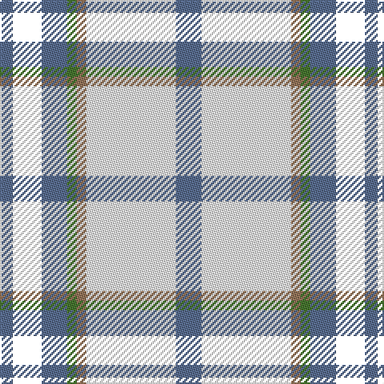

In pattern [BKBGRWB](/patterns/bkbgrwb/).

This was sourced from house-of-tartan.  It is a [7 stripes tartan](/stripes/stripes7/).

Original link http://www.house-of-tartan.scotland.net/house/TartanViewjs.asp?colr=Def&tnam=10731

## Thread count
B/8 K18 B16 G6 LT6 W56 B/16

## Palette
Each colour and its ΔE from the base-6 reference it is a variant of.

| Colour | Shade | Base | ΔE (OKLab) |
|---|---|---|---|
| B | <code style="background-color:#5A6E90;">#5A6E90</code> `#5A6E90` | B <code style="background-color:#2C4084;">#2C4084</code> | 0.15 |
| G | <code style="background-color:#487731;">#487731</code> `#487731` | G <code style="background-color:#006400;">#006400</code> | 0.09 |
| LT | <code style="background-color:#95765B;">#95765B</code> `#95765B` | R <code style="background-color:#C80000;">#C80000</code> | 0.18 |
| W | <code style="background-color:#FFFFFF;">#FFFFFF</code> `#FFFFFF` | W <code style="background-color:#F4F4F0;">#F4F4F0</code> | 0.03 |

# Sample pattern

ID: /setts/s7/b16w56r6g6b16k18b8-b5a6e90-g487731-k000000-r95765b-wffffff/
